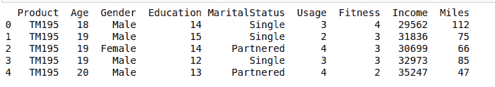

# 使用 CSV 文件创建数据框

> 原文:[https://www . geesforgeks . org/creating-a-data frame-using-CSV-files/](https://www.geeksforgeeks.org/creating-a-dataframe-using-csv-files/)

**CSV 文件**是“**逗号分隔值**，这些值用逗号分隔，这个文件可以像 excel 文件一样查看。在 Python 中，熊猫是数据科学中最重要的库。我们需要在分析数据的同时处理庞大的数据集，通常可以得到 CSV 文件格式的数据。使用 CSV 文件创建熊猫数据框可以通过多种方式实现。

**注意:**从[这里获取下面例子中使用的 csv 文件。](https://www.kaggle.com/saurav9786/cardiogoodfitness)

**方法#1:** 使用`**read_csv()**`方法:`**read_csv()**`是熊猫读取 csv 文件并对其进行操作的重要功能。

**例**:

```
# Python program to illustrate
# creating a data frame using CSV files

# import pandas module
import pandas as pd

# creating a data frame
df = pd.read_csv("CardioGoodFitness.csv")
print(df.head())
```

**输出**:



**方法#2:** 使用`**read_table()**`方法:`**read_table()**`是 pandas 读取 csv 文件并从中创建数据框的另一个重要功能。

**例**:

```
# Python program to illustrate
# creating a data frame using CSV files

# import pandas module
import pandas as pd

# creating a data frame
df = pd.read_table("CardioGoodFitness.csv", delimiter =", ")
print(df.head())
```

**输出**:


**方法 3:** 使用`**csv**`模块:可以使用 csv 模块直接导入 csv 文件，然后使用该 csv 文件创建数据框。

**例**:

```
# Python program to illustrate
# creating a data frame using CSV files

# import pandas module
import pandas as pd
# import csv module
import csv

with open("CardioGoodFitness.csv") as csv_file:
    # read the csv file
    csv_reader = csv.reader(csv_file)

    # now we can use this csv files into the pandas
    df = pd.DataFrame([csv_reader], index = None)

# iterating values of first column 
for val in list(df[1]):
    print(val)
```

**输出**:

```
['TM195', '18', 'Male', '14', 'Single', '3', '4', '29562', '112']

```