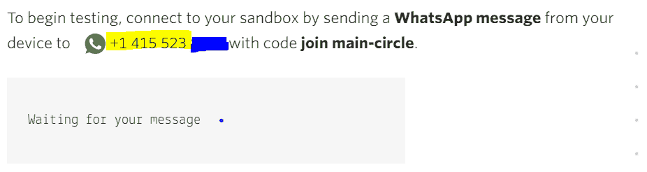
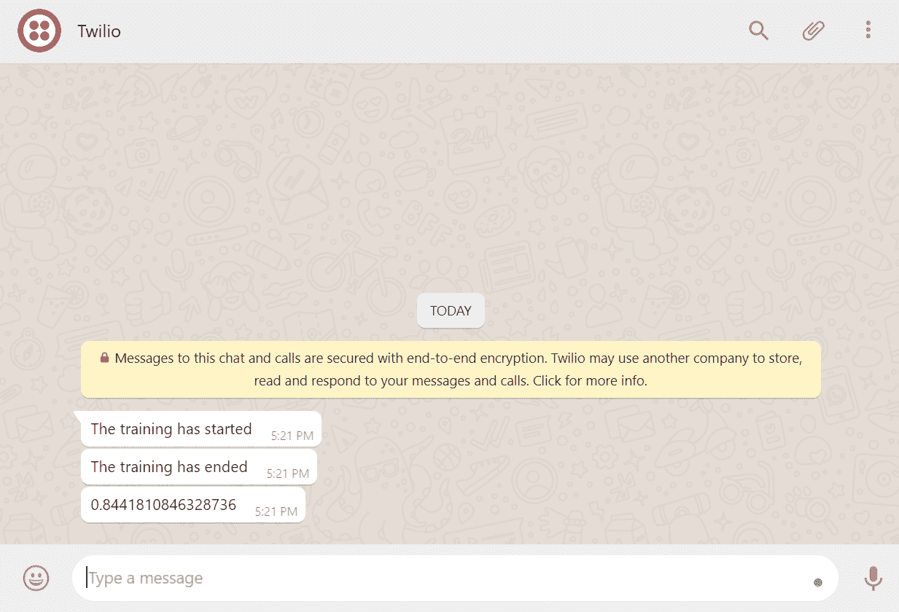

# 创建一个 Keras 回调在 WhatsApp 上发送通知

> 原文:[https://www . geeksforgeeks . org/creating-a-keras-callback-to-sent-notifications-on-whatsapp/](https://www.geeksforgeeks.org/creating-a-keras-callback-to-send-notifications-on-whatsapp/)

无论何时，在研究项目中，训练神经网络都需要很长时间。因此，我们开始培训过程，让笔记本电脑安静地呆一段时间。很多时候，由于网络错误或任何其他问题，该过程会在两者之间停止。在这些情况下，一旦训练过程停止(由于一个错误或在完成指定数量的时期之后)，人们将希望被告知，以便人们可以以最小的时间浪费采取相应的后续步骤。

在本教程中，我们将创建一个 Keras 回调，在您的 WhatsApp 上发送关于您的深度学习模型的通知。本教程大致分为 3 个部分–

*   [使用 Python 向 WhatsApp 发送消息](#sending-messages)
*   [创建一个 Keras 回调并了解它是如何工作的](#create-keras)
*   [把它们绑在一起](#tying)

## 使用 Python 向 WhatsApp 发送消息

有许多方法可以将 WhatsApp messenger 与 python 连接起来。不过最简单的是使用 [Twilio](https://www.twilio.com/) 的。Twilio 是一个通信平台，允许开发人员在不同的平台上发送通知，例如普通的文本短信、WhatsApp 甚至语音通话。它为连接 WhatsApp 和 python 提供了一个非常干净简洁的 API。

**第一步。**前往[此链接](https://www.twilio.com/docs/whatsapp/quickstart/python)并注册 Twilio。

**第二步。**点击此链接激活 WhatsApp 的 Twilio 沙盒。您将能够看到如下所示的界面。您可以通过将此号码(高亮显示)保存为手机上的联系人并向保存的联系人发送消息“加入主圈子”来激活沙盒。等待界面向您显示确认消息。



**第三步。**点击屏幕左上角的 Twilio 徽标或点击此链接，前往您的 Twilio 控制台。在这里，您可以找到在 Python 中设置 Twilio 客户端时需要的帐户标识和授权令牌。


**第四步。**用 Python 设置 Twilio 客户端，发送第一条消息。打开一个代码编辑器，将下面的代码粘贴到 python 文件中。在下面的代码片段中，`account_sid`和`auth_token`是从控制台获得的令牌，如步骤 3 所示。“Your_whatsapp_number”是您想要接收文本通知的号码。最后，“发件人号码”是您在步骤 2 中为 WhatsApp 设置 Twilio 沙盒时遇到的电话号码。注意-在数字中包括国家代码。例如，如果您的电话号码是 112233445，国家代码是+91，您必须在“您的 whatsapp_number”字段中输入+91112233445。

```
from twilio.rest import Client

account_sid = '<YOUR-ACC-ID-HERE>8' # Obtained from Step-3
auth_token = 'your_auth_token' # Obtained from Step-3

Your_whatsapp_number = ‘+911234567899’ # Include the country code
From_number = ‘+1488*****’ # Obtained from Step 2

client = Client(account_sid, auth_token)

message = client.messages.create(
                             body ='Hello there !',
                             from_= From_number,
                             to = Your_whatsapp_number
                         )
print(message.sid)
```

执行此脚本后，您将在手机上看到步骤 2 中获得的号码的 WhatsApp 通知。

## 创建 Keras 回调并了解其工作原理

根据[官方 Keras 文档](https://keras.io/callbacks/)，“回调是在训练过程的给定阶段应用的一组函数。您可以在训练期间使用回调来查看模型的内部状态和统计信息”。
在训练你的深层神经网络时，你可能会遇到这样的情况:你想要记录不同的指标，例如准确性、文件丢失或随着时代改变学习速率(自适应学习速率)。在这些情况下，我们使用一个名为回调的类的对象，它允许您在训练、测试或评估过程的不同阶段检索、设置不同模型参数的值。[官方 TensorFlow 指南](https://www.tensorflow.org/guide/keras/custom_callback)是学习如何创建自己的回调的绝佳资源。

TensorFlow 团队在回调类中命名方法方面做得很好，这使得理解每个函数打算做什么/能够做什么变得非常简单。使用的命名约定以 on _ { train/test/batch/epoch } _ { begin/end }的形式命名每个函数。

对于我们的任务，我们想知道模型何时停止训练。该信息可以从函数 on_train_end()获得。因此，我们可以创建一个类“WhatappCallBack”，它扩展了 Keras 的回调类。在这个类中，我们将重载 on_train_end()函数，以便了解所需的信息。

首先，我们将使用 Twilio 发送消息的代码封装在名为“send_message”的函数中。这个函数接受我们想要发送的文本作为参数。

```
# Can be obtained from Twilio Console
account_sid = 'account_ID' 
auth_token = 'auth_token'  
client = Client(account_sid, auth_token)

message = client.messages \
.create(
     from_='whatsapp:+14155238886',
     body = text,
     to ='whatsapp:+918*********'
 )
```

接下来，我们定义回调并重载 on_train_end()函数。

```
class WhatsappCallBack(Callback): 
  def on_train_begin(self, logs = None):
    # Initializing the list of losses
    self.losses = [] 
    # Sending message on whatsapp at the beginning of the training
    send_message("The training has started")

  def on_epoch_begin(self, epoch, logs = None):
    pass

  def on_epoch_end(self, epoch, logs = None):
    self.losses.append(logs['loss'])

  def on_train_end(self, logs = None):
# Sending message on whatsapp at the end of the training
    send_message("The training has ended") 
    send_message(self.losses)
```

正如我们在这里看到的，我们在培训过程的开始和结束都在发送消息。我们还通过回拨发送培训损失。

## 把它们绑在一起

为了测试我们的函数，我们需要定义一个简单的前馈网络并创建一个虚拟数据集。这将在接下来的步骤中演示。

**第一步。**我们使用 sklearn 库的[make _ classing 方法](https://scikit-learn.org/stable/modules/generated/sklearn.datasets.make_classification.html)生成 1000 个随机样本数据点和一个非常简单的 ANN。

```
x, y = make_classification(n_samples = 1000, n_classes = 2, n_features = 20)
x_train, x_test, y_train, y_test = train_test_split(x, y, test_size = 0.3)

def create_model():
  model = Sequential()
  model.add(Dense(60, input_dim = 20, activation ='relu'))
  model.add(Dense(1, activation ='sigmoid'))
  model.compile(loss ='binary_crossentropy', optimizer ='adam', metrics =['accuracy'])

  return model

model = create_model()
```

**第二步。**我们创建一个“WhatappCallBack”类的实例，并在回调参数中传递这个实例，同时拟合我们的模型。

```
cb2 = WhatsappCallBack()
 # Fitting the model
model.fit(x_train, y_train, batch_size = 32, epochs = 20, callbacks =[cb2], verbose = 1)
```

**第三步。**享受结果



以下存储库中的整个工作代码–
[https://github . com/Raman 1121/ML-Practice/blob/master/customcallback . ipynb](https://github.com/Raman1121/ML-Practice/blob/master/CustomCallback.ipynb)

参考文献:

1.[https://keun wochoi . WordPress . com/2016/07/16/keras-callbacks/](https://keunwoochoi.wordpress.com/2016/07/16/keras-callbacks/)T2【2。[https://www . twilio . com/docs/whatsapp/tutorial/send-whatsapp-notification-messages-模板](https://www.twilio.com/docs/whatsapp/tutorial/send-whatsapp-notification-messages-templates)