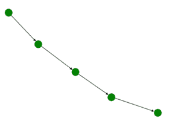

# 使用 Python 中的 Networkx 创建路径图

> 原文:[https://www . geesforgeks . org/creating-a-path-graph-use-networkx-in-python/](https://www.geeksforgeeks.org/creating-a-path-graph-using-networkx-in-python/)

路径图是由 P <sub>n</sub> 表示的连通图，如果它包含 n 个节点。节点在路径图中以直线的形式连接。这里我们将讨论如何使用 networkx 模块的内置 path_graph()函数来生成一个。

#### 路径图的属性:

*   路径图中的节点数(P <sub>n</sub> )为 n
*   路径图(P <sub>n</sub> )的边数为 N-1。
*   路径图的直径(P <sub>n</sub> )即任意一对顶点之间的最大距离是第一个和最后一个节点之间的 N-1。
*   路图的色数是 2。
*   节点被分配了从 0 到 N-1 的标签
*   终端顶点的度数为 1，其他顶点的度数为 2。
*   路径图是连通图。
*   路径图中不包含循环。
*   虽然路径图是连通的，但是移除任何边都会使其不连通，因为路径图中没有循环。
*   这是一个平面图。

## **使用的功能**

我们将使用网络模块来实现路径图。它带有一个内置函数 networkx.path_graph()，可以使用 networkx.draw()方法进行说明。这种方法是使用适当的参数创建所需路径图的简单方法。

> **语法:** path_graph(n，create_using=None)
> 
> **参数:**
> 
> *   **n:** 路径图中我们想要的节点数。
> *   **create_using:** 我们可以简单的通过 None 或者通过 nx。发送 nx 时将 DiGraph()作为该参数的值。有向图()将导致有向路径图的创建。

**进场:**

*   导入模块
*   如上所述，使用 path_graph()函数创建路径图对象。
*   将适当的参数传递给函数
*   显示图

**程序:**

## 蟒蛇 3

```
# import required module
import networkx as nx

# create object
G = nx.path_graph(5, create_using=nx.DiGraph())

# illustrate graph
nx.draw(G, node_color='green')
```

**输出:**

