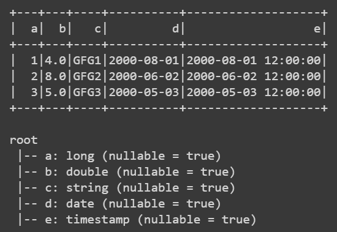

# 创建 PySpark 数据框

> 原文:[https://www.geeksforgeeks.org/creating-a-pyspark-dataframe/](https://www.geeksforgeeks.org/creating-a-pyspark-dataframe/)

在本文中，我们将学习如何创建 PySpark 数据框。PySpark 应用程序从初始化 **SparkSession** 开始，这是 PySpark 的入口点，如下所示。

> #迷你会话初始化
> 
> 从 pyspark.sql 导入 SparkSession
> 
> spark = sparksession . builder . getorcreate()

**注意:** PySpark shell 通过 PySpark 可执行文件，自动为用户创建变量 Spark 内的会话。所以你也可以使用 shell 来运行它。

## 创建 PySpark 数据帧

PySpark 数据帧通常通过**py spark . SQL . sparksession . create data frame**创建。有一些方法可以让我们通过 PySpark . SQL . sparksession . createdata frame 来创建 PySpark 数据框，**PySpark . SQL . sparksession . createdata frame**使用模式参数来指定数据框的模式。当它被省略时，PySpark 通过从数据中提取样本来推断相应的模式。

**语法**

> pyspark.sql.SparkSession.createDataFrame（）
> 
> **参数:**
> 
> *   **数据描述符:**任何一种 SQL 数据表示的 RDD(例如行、元组、整型、布尔型等)。)，或者列表，或者熊猫
> *   **模式:**数据类型字符串或列名列表，默认为无。
> *   **取样比率:**用于推断的行的取样比率
> *   **验证架构:**根据架构验证每行的数据类型。默认情况下启用。
> 
> **返回:**数据帧

以下是创建 PySpark 数据框的不同方法:

### 根据行清单创建 PySpark 数据框

在给定的实现中，我们将使用行清单创建 pyspark dataframe。为此，我们为每行中的每个变量(特性)提供值，并将其添加到 dataframe 对象中。这样做之后，我们将显示数据帧和模式。

## 蟒蛇 3

```
# Need to import to use date time
from datetime import datetime, date

# need to import for working with pandas
import pandas as pd

# need to import to use pyspark
from pyspark.sql import Row

# need to import for session creation
from pyspark.sql import SparkSession

# creating the session
spark = SparkSession.builder.getOrCreate()

# schema creation by passing list
df = spark.createDataFrame([
    Row(a=1, b=4., c='GFG1', d=date(2000, 8, 1),
        e=datetime(2000, 8, 1, 12, 0)),

    Row(a=2, b=8., c='GFG2', d=date(2000, 6, 2),
        e=datetime(2000, 6, 2, 12, 0)),

    Row(a=4, b=5., c='GFG3', d=date(2000, 5, 3),
        e=datetime(2000, 5, 3, 12, 0))
])

# show table
df.show()

# show schema
df.printSchema()
```

**输出:**



### **使用显式模式创建 PySpark 数据框**

在给定的实现中，我们将使用显式模式创建 pyspark dataframe。为此，我们提供了每行中的特征值，并使用变量(特征)模式将它们添加到 dataframe 对象中。这样做之后，我们将显示数据帧和模式。

## 蟒蛇 3

```
# Need to import to use date time
from datetime import datetime, date

# need to import for working with pandas
import pandas as pd

# need to import to use pyspark
from pyspark.sql import Row

# need to import for session creation
from pyspark.sql import SparkSession

# creating the session
spark = SparkSession.builder.getOrCreate()

# PySpark DataFrame with Explicit Schema
df = spark.createDataFrame([
    (1, 4., 'GFG1', date(2000, 8, 1),
     datetime(2000, 8, 1, 12, 0)),

    (2, 8., 'GFG2', date(2000, 6, 2),
     datetime(2000, 6, 2, 12, 0)),

    (3, 5., 'GFG3', date(2000, 5, 3),
     datetime(2000, 5, 3, 12, 0))
], schema='a long, b double, c string, d date, e timestamp')

# show table
df.show()

# show schema
df.printSchema()
```

**输出:**


### **使用熊猫从数据帧创建 PySpark 数据帧**

在给定的实现中，我们将使用熊猫数据帧创建 pyspark 数据帧。为此，我们提供了每个特性的值列表，这些值表示该列相对于每一行的值，并将它们添加到数据框中。这样做之后，我们将显示数据帧和模式。

## 蟒蛇 3

```
# Need to import to use date time
from datetime import datetime, date

# need to import for working with pandas
import pandas as pd

# need to import to use pyspark
from pyspark.sql import Row

# need to import for session creation
from pyspark.sql import SparkSession

# creating the session
spark = SparkSession.builder.getOrCreate()

## PySpark DataFrame from a pandas DataFrame
pandas_df = pd.DataFrame({
    'a': [1, 2, 3],

    'b': [4., 8., 5.],

    'c': ['GFG1', 'GFG2', 'GFG3'],

    'd': [date(2000, 8, 1), date(2000, 6, 2),
          date(2000, 5, 3)],

    'e': [datetime(2000, 8, 1, 12, 0),
          datetime(2000, 6, 2, 12, 0),
          datetime(2000, 5, 3, 12, 0)]
})

df = spark.createDataFrame(pandas_df)
df

# show table
df.show()

# show schema
df.printSchema()
```