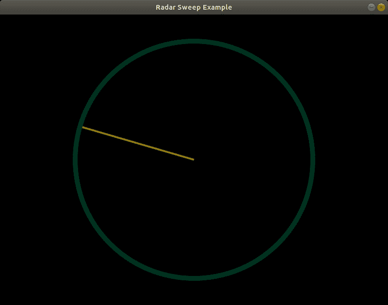

# 使用 Python 中的街机创建雷达扫描动画

> 原文:[https://www . geesforgeks . org/creating-a-radar-sweep-animation-use-arcade-in-python/](https://www.geeksforgeeks.org/creating-a-radar-sweep-animation-using-arcade-in-python/)

雷达扫描用于显示雷达数据的单级扫描，其显示出现在主显示窗口中。借助 Python 的街机模块，可以执行雷达扫描动画。在开始之前，强烈建议修改街机库的概念。

要执行雷达扫描动画，请执行以下步骤

**步骤 1:** 在各自的 Ide 中导入街机以及数学模块。

```py
import arcade
import math
```

**步骤 2:** 指定输出窗口的参数。

```py
# Set up the constants
WIDTH = 800
_HEIGHT = 600
TITLE = "Radar Sweep"
```

**第三步:**这些常数控制着雷达的细节。

```py
CENTER_X = SCREEN_WIDTH // 2
CENTER_Y = SCREEN_HEIGHT // 2
RADIANS_PER_FRAME = 0.02
SWEEP_LENGTH = 250
```

**第 4 步:**定义一个 on_draw 函数，在该函数下移动扫描的角度，并使用数学计算我们雷达扫描的终点。最后画出雷达的轮廓。

```py
def on_draw(_delta_time):
   # Move the angle of the sweep.
   on_draw.angle += RADIANS_PER_FRAME

   # Calculate the end point of our radar sweep. 
   x = SWEEP_LENGTH * math.sin(on_draw.angle) + CENTER_X
   y = SWEEP_LENGTH * math.cos(on_draw.angle) + CENTER_Y

   # Start the render. 
   arcade.start_render()

   # Draw the radar line
   arcade.draw_line(CENTER_X, CENTER_Y, x, y,
    arcade.color.OLIVE, 4)

   # Draw the outline of the radar
   arcade.draw_circle_outline(CENTER_X, CENTER_Y, 
   SWEEP_LENGTH, arcade.color.DARK_GREEN, 10)

# This is a function-specific variable i.e  
# we need to give them initial
# values.
on_draw.angle = 0  
```

**第五步:**定义主功能。

```py
def main():

   # Open up our window
   arcade.open_window(SCREEN_WIDTH, SCREEN_HEIGHT,
    SCREEN_TITLE)
   arcade.set_background_color(arcade.color.BLACK)

   # Tell the computer to call the draw command at
   # the specified interval.
   arcade.schedule(on_draw, 1 / 80)

   # Run the program
   arcade.run()

   #  close the window.
   arcade.close_window()
  main()
```

**雷达扫描将如下所示–**



**完整源代码:**

## 蟒蛇 3

```py
import arcade
import math

# Set up the constants
SCREEN_WIDTH = 800
SCREEN_HEIGHT = 600
SCREEN_TITLE = "Radar Sweep Example"

# These constants control the particulars 
# about the radar
CENTER_X = SCREEN_WIDTH // 2
CENTER_Y = SCREEN_HEIGHT // 2
RADIANS_PER_FRAME = 0.02
SWEEP_LENGTH = 250

def on_draw(_delta_time):

    # Move the angle of the sweep.
    on_draw.angle += RADIANS_PER_FRAME

    # Calculate the end point of our radar sweep. Using math.
    x = SWEEP_LENGTH * math.sin(on_draw.angle) + CENTER_X
    y = SWEEP_LENGTH * math.cos(on_draw.angle) + CENTER_Y

    # Start the render.
    arcade.start_render()

    # Draw the radar line
    arcade.draw_line(CENTER_X, CENTER_Y, x, y, arcade.color.OLIVE, 4)

    # Draw the outline of the radar
    arcade.draw_circle_outline(CENTER_X, CENTER_Y, SWEEP_LENGTH,
                               arcade.color.DARK_GREEN, 10)

on_draw.angle = 0

def main():

    # Open up our window
    arcade.open_window(SCREEN_WIDTH, SCREEN_HEIGHT, SCREEN_TITLE)
    arcade.set_background_color(arcade.color.BLACK)

    # Tell the computer to call the draw command at the specified interval.
    arcade.schedule(on_draw, 1 / 80)

    # Run the program
    arcade.run()

    # close the window.
    arcade.close_window()

main()
```

**输出:**

<video class="wp-video-shortcode" id="video-497514-1" width="665" height="374" preload="metadata" controls=""><source type="video/webm" src="https://media.geeksforgeeks.org/wp-content/cdn-uploads/20201012183412/radar-sweep-python.webm?_=1">[https://media.geeksforgeeks.org/wp-content/cdn-uploads/20201012183412/radar-sweep-python.webm](https://media.geeksforgeeks.org/wp-content/cdn-uploads/20201012183412/radar-sweep-python.webm)</video>