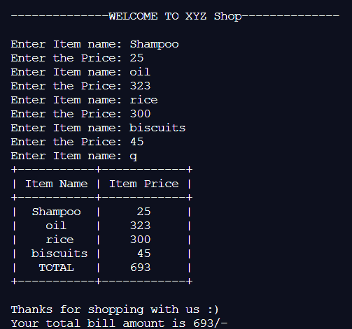

# 使用 Python 创建收据计算器

> 原文:[https://www . geeksforgeeks . org/creating-a-receive-calculator-use-python/](https://www.geeksforgeeks.org/creating-a-receipt-calculator-using-python/)

收据计算器通常是一张单据，其中提到了发票总额及其名称。我们将使用**可修改库**中的类 [**可修改的**](https://www.geeksforgeeks.org/creating-tables-with-prettytable-library-python/) 来制作收据计算器。

## **什么是好看？**

它是一个存在于漂亮的库中的类，帮助我们用 Python 制作关系表。

**安装库:**

```
pip install prettytable
```

**生成可修改:**

```
Initialisation :
<table name> = PrettyTable(['<column1>','<column2>',....])

To add a row :
add_row(['<row1>','<row2>',....])
```

**进场:**

将有两列:项目名称和项目价格。

我们将继续获取项目名称和项目价格(在新行)
直到用户输入‘q’并将价格存储在初始化为 0 的另一个变量名‘total’中。当用户
输入‘q’时，程序将停止输入，并将表格连同末尾指定的总金额一起返回。

**下面是实现:**

## 蟒蛇 3

```
from prettytable import PrettyTable

print('--------------WELCOME TO XYZ Shop--------------\n')
table = PrettyTable(['Item Name', 'Item Price'])
total = 0

while(1):
    name = input('Enter Item name:')

    # 'q' to exit and print the table
    if(name != 'q'):
        price = int(input('Enter the Price:'))

        # store all the prices in 'total'
        total += price
        table.add_row([name, price])
        continue

    elif(name == 'q'):
        break

table.add_row(['TOTAL', total])
print(table)
print('\nThanks for shopping with us :)')
print('Your total bill amount is ', total, '/-')
```

**输出:**



**注意:**你可以在除了 python2 之外的任何 python 版本上运行这个程序，你只需要改变 print()的语法。