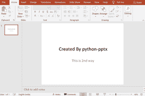
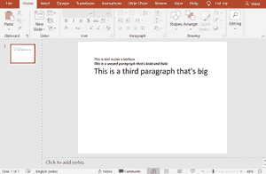
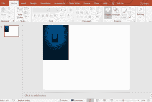
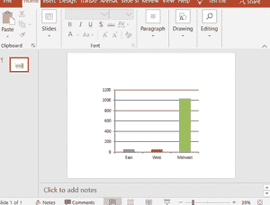
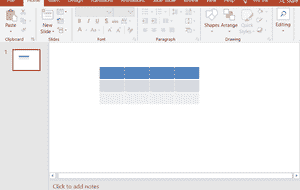

# 使用 Python 创建和更新 PowerPoint 演示文稿–pptx

> 原文:[https://www . geesforgeks . org/creating-and-update-PowerPoint-presentations-in-python-use-python-pptx/](https://www.geeksforgeeks.org/creating-and-updating-powerpoint-presentations-in-python-using-python-pptx/)

**python-pptx** 是用于创建/编辑 **PowerPoint** (。pptx)文件。这在 MS office 2003 和以前的版本上不起作用。我们可以使用这个库添加形状、段落、文本和幻灯片以及更多的东西。

**安装:**打开系统上的命令提示符，写下下面给出的命令:

```py
pip install python-pptx

```

让我们看看它的一些用法:

**示例 1:** 创建带有标题和字幕幻灯片的新 PowerPoint 文件。

## 蟒蛇 3

```py
# import Presentation class
# from pptx library
from pptx import Presentation     

# Creating presentation object
root = Presentation()

# Creating slide layout
first_slide_layout = root.slide_layouts[0] 

""" Ref for slide types: 
0 ->  title and subtitle
1 ->  title and content
2 ->  section header
3 ->  two content
4 ->  Comparison
5 ->  Title only 
6 ->  Blank
7 ->  Content with caption
8 ->  Pic with caption
"""

# Creating slide object to add 
# in ppt i.e. Attaching slides 
# with Presentation i.e. ppt
slide = root.slides.add_slide(first_slide_layout)

# Adding title and subtitle in 
# slide i.e. first page of slide 
slide.shapes.title.text = " Created By python-pptx"

# We have different formats of 
# subtitles in ppts, for simple
# subtitle this method should 
# implemented, you can change
# 0 to 1 for different design
slide.placeholders[1].text = " This is 2nd way"

# Saving file
root.save("Output.pptx")

print("done")
```

**输出:**



**示例 2:** 在 PowerPoint 中添加文本框。

## 蟒蛇 3

```py
# import required things
from pptx import Presentation 
from pptx.util import Inches, Pt

# Creating Object
ppt = Presentation() 

# To create blank slide layout
# We have to use 6 as an argument
# of slide_layouts  
blank_slide_layout = ppt.slide_layouts[6] 

# Attaching slide obj to slide
slide = ppt.slides.add_slide(blank_slide_layout)

# For adjusting the  Margins in inches 
left = top = width = height = Inches(1) 

# creating textBox
txBox = slide.shapes.add_textbox(left, top,
                                 width, height)

# creating textFrames
tf = txBox.text_frame
tf.text = "This is text inside a textbox"

# adding Paragraphs
p = tf.add_paragraph() 

# adding text
p.text = "This is a second paragraph that's bold and italic" 

# font 
p.font.bold = True
p.font.italic = True

p = tf.add_paragraph()
p.text = "This is a third paragraph that's big " 
p.font.size = Pt(40)

# save file
ppt.save('test_2.pptx')

print("done")
```

**输出:**



**示例 3:** PowerPoint(。pptx)文件转换为文本(。txt)文件转换。

## 蟒蛇 3

```py
# import Presentation class
# from pptx library
from pptx import Presentation

# creating an object
ppt = Presentation("sample.pptx")

# open file in write mode
File_to_write_data = open("File_To_Extract_ppt.txt", "w")

# write text from powerpoint
# file into .txt file
for slide in ppt.slides: 
    for shape in slide.shapes: 
        if not shape.has_text_frame: 
            continue 
        for paragraph in shape.text_frame.paragraphs: 
            for run in paragraph.runs: 
                File_to_write_data.write(run.text)

# close the file               
File_to_write_data.close()

print("Done")
```

**输出:**


**示例 4:** 将图像插入到 PowerPoint 文件中。

## 蟒蛇 3

```py
from pptx import Presentation 
from pptx.util import Inches 

# Giving Image path 
img_path = 'bg_bg.png' 

# Creating an Presentation object
ppt = Presentation() 

# Selecting blank slide
blank_slide_layout = ppt.slide_layouts[6] 

# Attaching slide to ppt
slide = ppt.slides.add_slide(blank_slide_layout) 

# For margins
left = top = Inches(1) 

# adding images
pic = slide.shapes.add_picture(img_path,
                               left, top)

left = Inches(1) 
height = Inches(1) 

pic = slide.shapes.add_picture(img_path, left,
                               top, height = height)
# save file
ppt.save('test_4.pptx')

print("Done")
```

**输出:**



**示例 5:** 向 PowerPoint 文件添加图表。

## 蟒蛇 3

```py
# import required classes/functions/method
from pptx import Presentation 
from pptx.chart.data import CategoryChartData 
from pptx.enum.chart import XL_CHART_TYPE 
from pptx.util import Inches

# Create presentation object
ppt = Presentation() 

# Adding slide with specific layout
slide = ppt.slides.add_slide(ppt.slide_layouts[6])

# Define chart data 
# Creating object of chart
chart_data = CategoryChartData() 

# Adding categories to chart
chart_data.categories = ['East', 'West', 'Midwest']  

# Adding series
chart_data.add_series('Series 1', 
                      (int(input("Enter Value:")), 
                        int(input("Enter Value:")),
                        int(input("Enter Value:")))) 

x, y, cx, cy = Inches(2), Inches(2), Inches(6), Inches(4.5) 

slide.shapes.add_chart( XL_CHART_TYPE.COLUMN_CLUSTERED, x,
                       y, cx, cy, chart_data )

# Saving file
ppt.save('chart-Tutorial.pptx')

print("done")
```

**输出:**



**示例 6:** 向 PowerPoint 文件添加表格。

## 蟒蛇 3

```py
# importing
from pptx import Presentation 
from pptx.util import Inches

# create a Presentation object
ppt = Presentation() 

# Adding a blank slide in out ppt
slide = ppt.slides.add_slide(ppt.slide_layouts[6])

# Adjusting the width !  
x, y, cx, cy = Inches(2), Inches(2), Inches(4), Inches(1.5) 

# Adding tables
shape = slide.shapes.add_table(3, 4, x, 
                               y, cx, cy)

# Saving the file
ppt.save("Tabel_Tutorial.pptx")

print("done")
```

**输出:**

