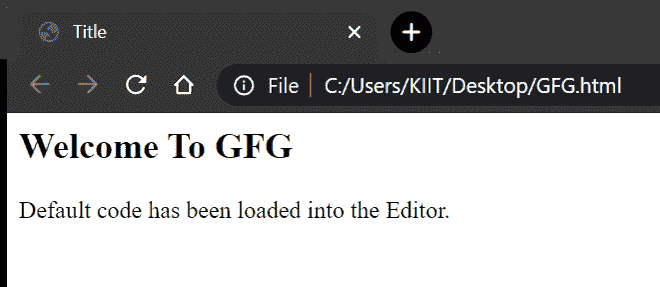
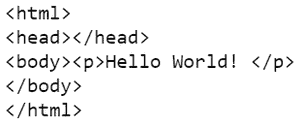

# 使用 Python 创建和查看 HTML 文件

> 原文:[https://www . geesforgeks . org/用 python 创建和查看 html 文件/](https://www.geeksforgeeks.org/creating-and-viewing-html-files-with-python/)

Python 是最通用的编程语言之一。它通过大量使用空白来强调代码的可读性。它得到了为各种目的服务的大量库的支持，使我们的编程体验更加流畅和愉快。

**Python 程序用于:**

*   连接数据库并执行后端开发。
*   制作网络应用程序。
*   编写有效的系统脚本。
*   尤其是在数据科学和人工智能领域。

说到这里，让我们看看如何使用 python 程序生成 HTML 文件作为输出。这对于那些自动创建超链接和图形实体的程序非常有效。

## 用 python 创建一个 HTML 文件

我们将在一个多行 Python 字符串中存储 HTML 标签，并将内容保存到一个新文件中。该文件将以. html 扩展名而不是. txt 扩展名保存。

**注:**我们将省略标准的<！DOCTYPE HTML >申报！

## 蟒蛇 3

```
# to open/create a new html file in the write mode
f = open('GFG.html', 'w')

# the html code which will go in the file GFG.html
html_template = """<html>
<head>
<title>Title</title>
</head>
<body>
<h2>Welcome To GFG</h2>

<p>Default code has been loaded into the Editor.</p>

</body>
</html>
"""

# writing the code into the file
f.write(html_template)

# close the file
f.close()
```

上面的程序将创建一个 HTML 文件:



## 查看 HTML 源文件

为了将 HTML 文件显示为 python 输出，我们将使用*编解码器*库。该库用于打开具有特定编码的文件。它采用参数*编码*，这使得它不同于内置的 open()函数。open()函数不包含任何指定文件编码的参数，大多数情况下，这使得查看不是 ASCII 而是 UTF-8 的文件变得困难。

## 蟒蛇 3

```
# import module
import codecs

# to open/create a new html file in the write mode
f = open('GFG.html', 'w')

# the html code which will go in the file GFG.html
html_template = """
<html>
<head></head>
<body>
<p>Hello World! </p>

</body>
</html>
"""

# writing the code into the file
f.write(html_template)

# close the file
f.close()

# viewing html files
# below code creates a 
# codecs.StreamReaderWriter object
file = codecs.open("GFG.html", 'r', "utf-8")

# using .read method to view the html 
# code from our object
print(file.read())
```

**输出:**



## 查看网页文件

在 Python 中，[网络浏览器](https://www.geeksforgeeks.org/python-launch-a-web-browser-using-webbrowser-module/)模块提供了一个高级界面，允许向用户显示基于网络的文档。*网络浏览器*模块可以独立于平台启动浏览器，如下图所示:

## 蟒蛇 3

```
# import module
import webbrowser

# open html file
webbrowser.open('GFG.html') 
```

**输出:**

```
True
```

