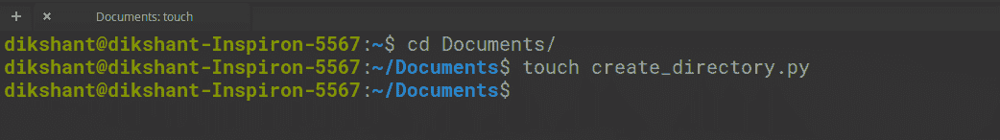
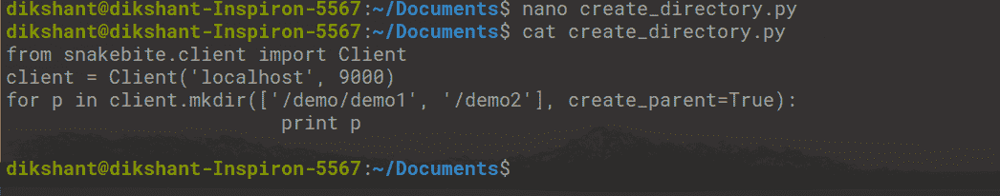
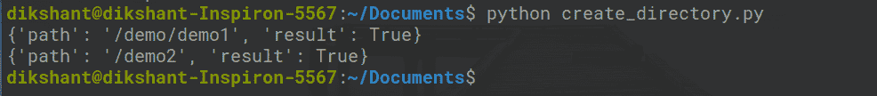
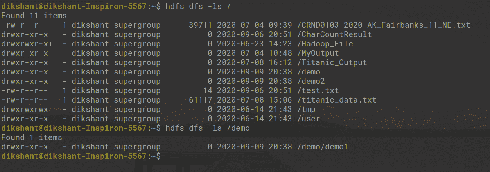

# 使用蟒蛇咬伤在 HDFS 创建文件

> 原文:[https://www . geesforgeks . org/creating-files-in-HDFS-using-python-snake bite/](https://www.geeksforgeeks.org/creating-files-in-hdfs-using-python-snakebite/)

[Hadoop](https://www.geeksforgeeks.org/hadoop-an-introduction/) 是一个流行的用 Java 编写的大数据框架。但是在 Hadoop 上工作并不需要使用 [Java](https://www.geeksforgeeks.org/java/) 。也可以使用其他一些编程语言，比如 [Python](https://www.geeksforgeeks.org/python-programming-language/) 、 [C++](https://www.geeksforgeeks.org/c-plus-plus/) 。我们可以使用管道 API 或 Hadoop 管道为 Hadoop 编写 C++代码。Hadoop 管道在套接字的帮助下启用任务跟踪器。

**Python** 也可以用来为 Hadoop 写代码。蛇咬图书馆是用来与 [HDFS](https://www.geeksforgeeks.org/hadoop-hdfs-hadoop-distributed-file-system/) 建立联系的热门图书馆之一。使用蛇咬包提供的 python 客户端库，我们可以轻松编写适用于 HDFS 的 python 代码。它使用**原型**消息直接与名称节点通信。python 客户端库直接与 HDFS 一起工作，无需对 **hdfs dfs** 进行系统调用。

**先决条件:**应安装蛇咬库。

确保 Hadoop 正在运行，如果没有，则使用以下命令启动所有守护程序。

```py
start-dfs.sh             // start your namenode datanode and secondary namenode

start-yarn.sh            // start resourcemanager and nodemanager

```


**任务:**使用 **mkdir()** 方法使用蛇咬包在 HDFS 创建目录。

**步骤 1:** 在您的本地目录中创建一个文件，名称为 **create_directory.py** 在所需的位置**。**

```py
cd Documents/        # Changing directory to Documents(You can choose as per your requirement)

touch create_directory.py      # touch command is used to create file in linux enviournment.       

```



**第二步:**在**create _ directory . py**python 文件中编写下面的代码。

## 计算机编程语言

```py
# importing the package
from snakebite.client import Client

# the below line create client connection to the HDFS NameNode
client = Client('localhost', 9000)

# create directories mentioned in mkdir() methods first argument i.e. in List format
for p in client.mkdir(['/demo/demo1', '/demo2'], create_parent=True):
            print p
```

**mkdir()** 列出了我们想要创建的目录路径。 **create_parent=True** 确保如果没有创建父目录，应该首先创建它。在我们的例子中，首先创建演示目录，然后在其中创建 demo1。



**第三步:**运行 **create_directory.py** 文件，观察结果。

```py
python create_directory.py   // this will create directory's as mentioned in mkdir() argument.

```



上图**“结果”:True** 表示我们已经成功创建了目录。

**步骤 4:** 我们可以手动或使用下面的命令检查目录是否已创建。

```py
hdfs dfs -ls /       // list all the directory's in root folder

hdfs dfs -ls /demo   // list all the directory's present in demo folder

```



在上图中，我们可以观察到我们已经成功创建了所有目录。