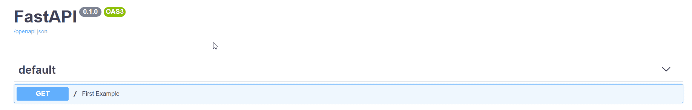
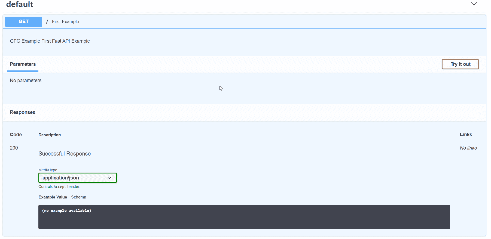
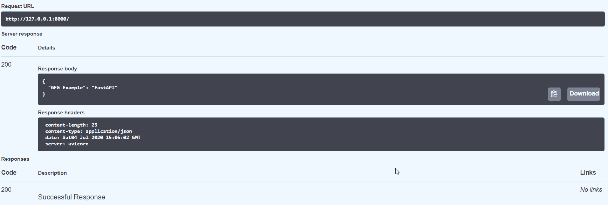

# 使用 FastAPI 创建第一个 REST 应用编程接口

> 原文:[https://www . geesforgeks . org/creating-first-rest-API-with-fastapi/](https://www.geeksforgeeks.org/creating-first-rest-api-with-fastapi/)

**FastAPI :**
FastAPI 是现代 Web 框架。它用于构建 API，非常容易学习。

**FastAPI 的特点:**

*   比很多 Web 框架高性能，比 Node.js 快等等。
*   易于开发的应用编程接口
*   生产就绪
*   快速学习代码的文档
*   霸气用户界面形成应用编程接口文档
*   避免代码冗余
*   简单测试
*   支持 GraphQL、后台获取、依赖注入

**使用 FastAPI 创建 REST 应用编程接口:**

*   [根据你的操作系统安装 Python 3 和 pip/pip 3](https://www.geeksforgeeks.org/download-and-install-python-3-latest-version/)
*   现在，使用 pip 或 pip3 安装 fastapi:

    ```
       pip install fastapi

    ```

*   使用

    ```
      pip install uvicorn

    ```

    为您的服务器安装异步网关接口
*   现在创建一个 main.py 文件并导入 fastapi，同时创建一个服务器

    ```
      from fastapi import FastAPI
      app = FastAPI()

    ```

*   现在，让我们添加示例获取请求的代码，如下所示:

    ```
     @app.get("/")
     def read_root():
        return {"Hello": "World"}

    ```

*   因此，主. py 文件看起来像:

    ```
    from fastapi import FastAPI
    app = FastAPI()

    @app.get("/")
    def first_example():
        """
           GFG Example First Fast API Example 
        """
       return {"GFG Example": "FastAPI"}
    ```

*   现在，使用

    ```
    uvicorn main:app --reload

    ```

    启动服务器
*   现在打开浏览器，打开 http://localhost:8000/docs 或 http://127.0.0.1:8000/docs
    你会看到如下的 Swagger UI 主页:
    
*   展开“第一个例子”:
    
*   现在尝试执行应用编程接口，您将获得 200 个代码的成功状态。
    响应将为{“GFG 示例”:“FastAPI”}如下所示:
    