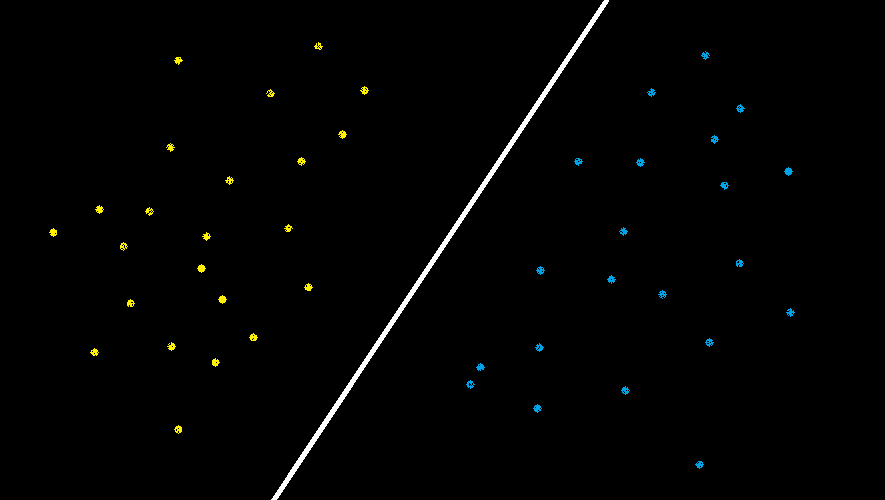
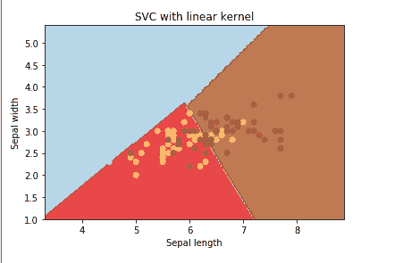

# 在 Python 中创建线性核 SVM

> 原文:[https://www . geesforgeks . org/creating-linear-kernel-SVM-in-python/](https://www.geeksforgeeks.org/creating-linear-kernel-svm-in-python/)

**先决条件:**T2】SVM

让我们使用 Python 的 sklearn 库和可以在 Python 的数据集库中找到的**虹膜数据集**来创建一个**线性核 SVM** 。

**线性核**在数据是线性可分的时候使用，也就是说可以用一条线来分开。它是最常用的内核之一。它主要用于特定数据集中有大量要素的情况。有很多特性的例子之一是**文本分类**，因为每个字母表都是一个新特性。所以我们在文本分类中主要使用线性核。

**注意**:运行下面的代码时互联网连接一定要稳定，因为涉及到下载数据。
[](https://media.geeksforgeeks.org/wp-content/uploads/gfglinear.png)

在上图中，有两组特征“**蓝色**特征和“**黄色**特征”。因为这些可以很容易地分离，或者换句话说，它们是线性可分离的，所以这里可以使用线性核。

**使用线性核的优势**:

1.用线性核训练 SVM 比用任何其他核都要快。

2.当用线性核训练 SVM 时，只需要优化 **C 正则化**参数。另一方面，当使用其他内核进行训练时，需要优化 ***γ*** 参数，这意味着执行网格搜索通常需要更多时间。

```py
# Import the Libraries
import numpy as np
import matplotlib.pyplot as plt
from sklearn import svm, datasets

# Import some Data from the iris Data Set
iris = datasets.load_iris()

# Take only the first two features of Data.
# To avoid the slicing, Two-Dim Dataset can be used

X = iris.data[:, :2]
y = iris.target

# C is the SVM regularization parameter
C = 1.0 

# Create an Instance of SVM and Fit out the data.
# Data is not scaled so as to be able to plot the support vectors
svc = svm.SVC(kernel ='linear', C = 1).fit(X, y)

# create a mesh to plot
x_min, x_max = X[:, 0].min() - 1, X[:, 0].max() + 1
y_min, y_max = X[:, 1].min() - 1, X[:, 1].max() + 1
h = (x_max / x_min)/100
xx, yy = np.meshgrid(np.arange(x_min, x_max, h),
         np.arange(y_min, y_max, h))

# Plot the data for Proper Visual Representation
plt.subplot(1, 1, 1)

# Predict the result by giving Data to the model
Z = svc.predict(np.c_[xx.ravel(), yy.ravel()])
Z = Z.reshape(xx.shape)
plt.contourf(xx, yy, Z, cmap = plt.cm.Paired, alpha = 0.8)

plt.scatter(X[:, 0], X[:, 1], c = y, cmap = plt.cm.Paired)
plt.xlabel('Sepal length')
plt.ylabel('Sepal width')
plt.xlim(xx.min(), xx.max())
plt.title('SVC with linear kernel')

# Output the Plot
plt.show()
```

**输出:**
[](https://media.geeksforgeeks.org/wp-content/uploads/Capture-112.png) 
这里所有的特征都是用简单的线条分开的，这样就代表了线性核。