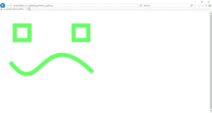

# 使用 PyCairo 创建 SVG 图像

> 原文:[https://www . geesforgeks . org/creating-SVG-image-using-py cairo/](https://www.geeksforgeeks.org/creating-svg-image-using-pycairo/)

在本文中，我们将看到如何使用 Python 中的 *PyCairo* 创建 SVG 文件。

**SVG:**SVG 文件是使用二维图形矢量格式的图形文件，该格式使用基于 XML 的文本格式定义图像。作为在网络上显示矢量图形的标准格式，SVG 文件被开发出来。

**PyCairo :** 它是一个 Python 模块，为 *cairo* 图形库提供绑定。这个库用于创建 SVG，即 python 中的矢量文件。为了安装 *pycairo* 模块，我们将使用下面给出的命令

**安装:**

```py
pip install pycairo

```

**打开 SVG 文件:**打开 SVG 文件进行查看(只读)最简单快捷的方法是使用 Chrome、Firefox、Edge 或 Internet Explorer 等现代网络浏览器——几乎所有这些浏览器都应该为 SVG 格式提供某种渲染支持。

**循序渐进法:**
1。导入 *cairo* 模块。
2。创建一个 SVG 表面并向其添加上下文。
3。为了创建一个小脸，为眼睛添加两个矩形。
4。为微笑添加一条曲线。
5。设置上下文的颜色和宽度。

**以下是基于上述方法的完整程序:**

## 蟒蛇 3

```py
# importing pycairo
import cairo

# creating a SVG surface
# here geek is file name & 700, 700 is dimension
with cairo.SVGSurface("geek.svg", 700, 700) as surface:

    # creating a cairo context object
    context = cairo.Context(surface)

    # creating a rectangle(square) for left eye
    context.rectangle(100, 100, 100, 100)

    # creating a rectangle(square) for right eye
    context.rectangle(500, 100, 100, 100)

    # creating position for the curves
    x, y, x1, y1 = 0.1, 0.5, 0.4, 0.9
    x2, y2, x3, y3 = 0.4, 0.1, 0.9, 0.6

    # setting scale of the context
    context.scale(700, 700)

    # setting line width of the context
    context.set_line_width(0.04)

    # move the context to x,y position
    context.move_to(x, y)

    # draw the curve for smile
    context.curve_to(x1, y1, x2, y2, x3, y3)

    # setting color of the context
    context.set_source_rgba(0.4, 1, 0.4, 1)

    # stroke out the color and width property
    context.stroke()

# printing message when file is saved
print("File Saved")
```

**输出:**

