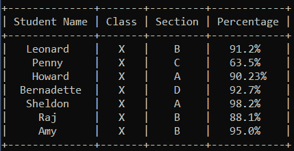

# 使用可编辑库创建表格–Python

> 原文:[https://www . geeksforgeeks . org/creating-table-with-prettable-library-python/](https://www.geeksforgeeks.org/creating-tables-with-prettytable-library-python/)

**prettable**类位于 prettable 库中，用于在 Python 中创建关系表。例如，下表是使用此库在 Windows 的命令提示符下创建的。



**安装库:**

```py
pip install prettytable

```

让我们使用 Python 中的可移植库来创建示例表。

**创建表格:逐行**

## 蟒蛇 3

```py
from prettytable import PrettyTable

# Specify the Column Names while initializing the Table
myTable = PrettyTable(["Student Name", "Class", "Section", "Percentage"])

# Add rows
myTable.add_row(["Leanord", "X", "B", "91.2 %"])
myTable.add_row(["Penny", "X", "C", "63.5 %"])
myTable.add_row(["Howard", "X", "A", "90.23 %"])
myTable.add_row(["Bernadette", "X", "D", "92.7 %"])
myTable.add_row(["Sheldon", "X", "A", "98.2 %"])
myTable.add_row(["Raj", "X", "B", "88.1 %"])
myTable.add_row(["Amy", "X", "B", "95.0 %"])

print(myTable)
```

**Output**

```py
+--------------+-------+---------+------------+
| Student Name | Class | Section | Percentage |
+--------------+-------+---------+------------+
|   Leanord    |   X   |    B    |   91.2%    |
|    Penny     |   X   |    C    |   63.5%    |
|    Howard    |   X   |    A    |   90.23%   |
|  Bernadette  |   X   |    D    |   92.7%    |
|   Sheldon    |   X   |    A    |   98.2%    |
|     Raj      |   X   |    B    |   88.1%    |
|     Amy      |   X   |    B    |   95.0%    |
+--------------+-------+---------+------------+

```

**创建表格:列方式**

## 蟒蛇 3

```py
from prettytable import PrettyTable

columns = ["Student Name", "Class", "Section", "Percentage"]

myTable = PrettyTable()

# Add Columns
myTable.add_column(columns[0], ["Leanord", "Penny", "Howard",
                       "Bernadette", "Sheldon", "Raj", "Amy"])
myTable.add_column(columns[1], ["X", "X", "X", "X", "X", "X", "X"])
myTable.add_column(columns[2], ["B", "C", "A", "D", "A", "B", "B"])
myTable.add_column(columns[3], ["91.2 %", "63.5 %", "90.23 %", "92.7 %", 
                                          "98.2 %", "88.1 %", "95.0 %"])

print(myTable)
```

**Output**

```py
+--------------+-------+---------+------------+
| Student Name | Class | Section | Percentage |
+--------------+-------+---------+------------+
|   Leanord    |   X   |    B    |   91.2%    |
|    Penny     |   X   |    C    |   63.5%    |
|    Howard    |   X   |    A    |   90.23%   |
|  Bernadette  |   X   |    D    |   92.7%    |
|   Sheldon    |   X   |    A    |   98.2%    |
|     Raj      |   X   |    B    |   88.1%    |
|     Amy      |   X   |    B    |   95.0%    |
+--------------+-------+---------+------------+

```

**删除行**

```py
myTable.del_row(0)
```

这将从表中删除第一行，即，这些行遵循从索引 0 开始的标准索引。

**清台**

```py
myTable.clear_rows()
```

这将清除整个表(仅保留列名)。

有许多高级功能与这些表格相关联，比如将这些表格转换为 HTML 或将 CSV 转换为可编辑表格。这些职能将在单独的一条中涉及。