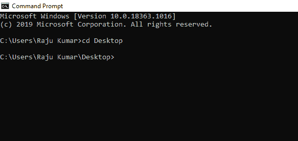
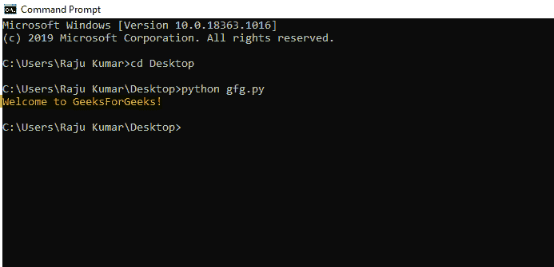
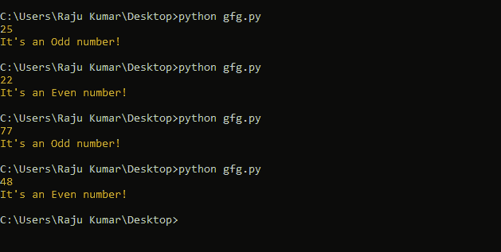
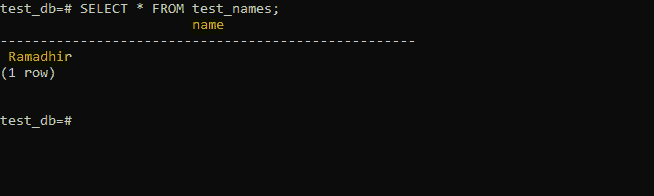

# 用 Python 创建您的第一个应用程序

> 原文:[https://www . geesforgeks . org/creating-your-first-in-application-python/](https://www.geeksforgeeks.org/creating-your-first-application-in-python/)

Python 是目前最简单的编程语言之一。事实上，开发它的唯一目的是简化学习编程语言的过程，并让初学者接触编程的概念。在本文中，我们将构建一个 Python 应用程序。不要担心它不会是什么花哨或复杂的东西。但是在我们开始之前，让自己熟悉这些 Python 概念:

*   [压痕](https://www.geeksforgeeks.org/python-programming-language/python-tutorial/#indentation)
*   [变量](https://www.geeksforgeeks.org/python-programming-language/python-tutorial/#variables)
*   [操作员](https://www.geeksforgeeks.org/python-programming-language/python-tutorial/#operators)
*   [数据类型](https://www.geeksforgeeks.org/python-programming-language/python-tutorial/#data)
*   [控制流程(循环)](https://www.geeksforgeeks.org/python-programming-language/python-tutorial/#control)
*   [功能](https://www.geeksforgeeks.org/python-programming-language/python-tutorial/#functions)

一旦你熟悉了以上概念，本文其余部分的内容就很容易掌握了。现在，让我们继续构建应用程序。为了简单起见，我们将构建一个以“欢迎来到极客博客”迎接用户的应用程序执行时的消息。

为此，请遵循以下步骤:

*   **第一步:**打开自己选择的编辑器，编写 Python 代码。在这里，我们将简单地使用记事本，但这完全取决于你喜欢什么。
*   **第二步:**现在在编辑器中编写下面的代码:

## 蟒蛇 3

```py
# code
print("Welcome to GeeksForGeeks!")
```

*   **步骤 3:** 现在我们已经完成了代码，将其保存为**gfg . py**(gfg 只是我们给 python 文件取的一个名字)
*   **第四步:**现在是时候运行 python 代码了，所以打开你的 OS 提供的终端，移动到保存文件的目录(这里是在 Desktop 上)。这里我们将使用**命令提示符**。



*   **步骤 5:** 现在从 *cmd* 调用 python 解释器，运行 *gfg* 应用程序，如下所示:

```py
python gfg.py
```

这将导致 Python 执行 *gfg.py* 文件中的代码，如下所示:



恭喜你！！您已经成功地构建了您的第一个 Python 应用程序，它用“欢迎来到极客论坛！”执行时的消息。

现在让我们加快一点。如果您希望让您的 Python 应用程序更具交互性，该怎么办。假设您希望 Python 应用程序找出给定的数字是奇数还是偶数？让我们按照以下步骤来完成:

*   **步骤 1:** 我们将需要一个变量来存储我们要给它测试的数字。让我们声明一个变量(比如 num)，如下所示:

```py
num = int(input())
```

这里我们有一个名为 ***num*** 的[变量](https://www.geeksforgeeks.org/python-programming-language/python-tutorial/#variables)，它等于**输入()** [函数](https://www.geeksforgeeks.org/python-programming-language/python-tutorial/#functions)接收到的数字，并且是一个**整数** [数据类型。](https://www.geeksforgeeks.org/python-programming-language/python-tutorial/#data)

*   **第二步:**当 *num* 变量接收到数字时，我们将使用条件语句来检查 *num* 变量中的数字是否能被 2 整除。为此，请使用下面的代码片段:

```py
if num%2 == 0:
    print("It's an Even number!")
else:
    print("It's an Odd number!")   
```

在上面的代码中，我们使用模数(%) [运算符](https://www.geeksforgeeks.org/python-programming-language/python-tutorial/#operators)将 *num* 变量中的值除以 2，根据运算符返回的内容，我们将决定给定的数字是奇数还是偶数。如果它返回的商是 0，那它就是一个偶数，否则它就是奇数。

*   **第 3 步:**现在将上述代码片段聚合并保存到 *gfg.py* 文件中，如下所示:

## 蟒蛇 3

```py
num = int(input())

if num%2 == 0:
    print("It's an Even number!")
else:
    print("It's an Odd number!")
```

*   **步骤 4:** 现在运行文件，类似于我们在 cmd 中运行它的方式，行为如预期:



现在，我们有了一个成功构建的交互式 python 应用程序。

现在让我们再往前走一点。由于每个应用程序或多或少都需要一个稳定的数据库来运行，让我们来探索一下将应用程序与数据库连接起来的过程。出于演示的目的，我们将构建一个应用程序，将用户提供的某种信息存储在 [PostgreSQL](https://www.geeksforgeeks.org/what-is-postgresql-introduction/) 数据库中。要在您的 [Windows](https://www.geeksforgeeks.org/install-postgresql-on-windows/) 、 [Mac](https://www.geeksforgeeks.org/install-postgresql-on-mac/) 、[、](https://www.geeksforgeeks.org/install-postgresql-on-mac/)或 [Linux](https://www.postgresql.org/download/linux/redhat/) 中安装 PostgreSQL，请访问相应的链接。

让我们构建一个应用程序，从用户那里获取信息(比如名字)并存储在数据库中。为此，请遵循以下步骤:

*   **步骤 1:** 由于 **psycopg2 模块**为 Python 提供了与数据库交互的应用编程接口，因此使用以下命令安装相同的应用编程接口:

```py
pip install psycopg2
```

*   **步骤 2:** 现在打开 **psql shell** 填写您的凭据，并使用以下语句创建一个数据库(比如 test_db):

```py
CREATE DATABASE test_db;
```

*   **步骤 3:** 要建立与数据库的连接，请使用以下代码:

```py
db_conn = psycopg2.connect("dbname=test_db user=postgres password=postgres")
```

*   **第 4 步:**所有的都设置好了，但是我们还需要一个表(比如 test_name)，使用下面的语句:

```py
CREATE TABLE department_employee(
    test_names CHAR(50)
);
```

*   **第五步:**现在我们已经建立了数据库和表，让我们完成 *gfg.py* 脚本来连接数据库，并执行 INSERT 语句来将数据插入表中:

## 蟒蛇 3

```py
#!/usr/bin/python
import psycopg2 

# Establish the connection to PostgreSQL
db_conn = psycopg2.connect("host=localhost dbname=test_db user=postgres password=5555")

#create a cursor object from connection module
cursor_object = db_conn.cursor()

# Add data into the test_names table of test_db
cursor_object.execute("INSERT INTO test_names (name) VALUES ('Ramadhir')")

# Save the changes to database
db_conn.commit()
```

*   **步骤 6:** 现在执行上面的 gfg.py，对数据库进行如下更改:

```py
python gfg.py
```

*   **步骤 7:** 现在在 psql shell 中使用下面的命令验证更改:

```py
SELECT * FROM test_names;
```

这将导致以下输出:



瓦拉。！！此时，我们已经成功地向 PostgreSQL 数据库添加了数据。

### 结论:

至此，我们已经设法创建了利用变量、循环、函数、条件语句、用户输入和数据库的应用程序。您可以探索 GeeksforGeeks 上提供的大量 Python 模块，以扩展您的应用程序并根据您的需求进行设计。

要探索 Python 概念，请访问极客博客的 [Python 教程](https://www.geeksforgeeks.org/python-programming-language/python-tutorial/)部分。