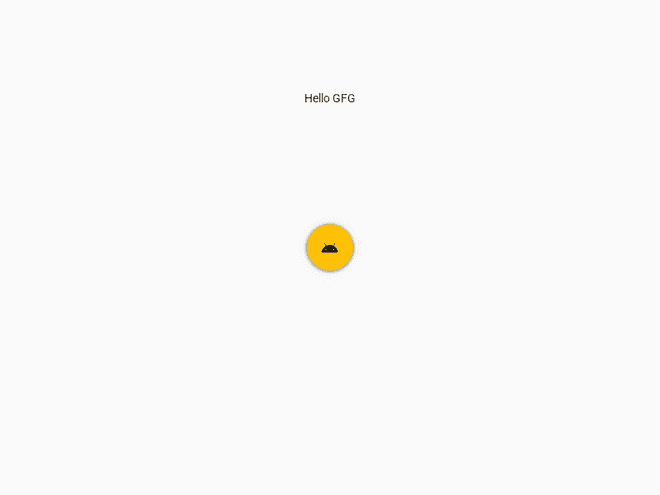

# 使用 Kivy

创建您的第一个应用程序

> 原文:[https://www . geesforgeks . org/creating-your-first-application-use-kivy/](https://www.geeksforgeeks.org/creating-your-first-application-using-kivy/)

**先决条件:** [基维入门](https://www.geeksforgeeks.org/introduction-to-kivy/)**[基维的 Hello World](https://www.geeksforgeeks.org/hello-world-in-kivy/)**

**Kivymd 是基于 kivy 的 python 图形用户界面库，允许您在 Windows、MacOS、Android、iOS、Linux 和 Pi 上开发多平台应用程序。kivy 最好的一点是，它的性能比 HTML5 跨平台替代品更好。与 kivy 相比，Kivymd 需要更少的代码行。Kivymd 是使用 kivy 库用 python 编写的。**

**为了启动 KivyMD，您必须首先在计算机上安装 Kivy 框架。一旦安装了 Kivy，就可以安装 KivyMD 了。**

### ****安装****

```
pip install kivymd
```

**如果您想从主分支安装开发版本，您应该指定一个指向 zip 存档的链接:**

```
pip install https://github.com/kivymd/KivyMD/archive/master.zip
```

### ****按钮****

*   ****mdfloatingactionbutton:t1】****

**要更改 *MDFloatingActionButton* 背景，请使用 *md_bg_color* 参数:**

```
MDFloatingActionButton:
   icon: "android"
   md_bg_color: app.theme_cls.primary_color
```

**阴影的长度由*高程 _ 法线*参数控制:**

```
MDFloatingActionButton:
    icon: "android"
    elevation_normal: 12
```

*   ****mdflat 按钮:****

**要更改类别*的文本颜色，请使用*文本颜色*参数:***

```
MDFlatButton:
   text: "MDFLATBUTTON"
   text_color: 0, 0, 1, 1
```

### **逐步方法:**

**使用 kivymd 创建应用程序有三个步骤-**

*   **继承 Kivymd 的应用程序类，它代表了我们小部件的窗口**
*   **创建 *build()* 方法，该方法将显示小部件的内容。**
*   **最后调用 *run()* 方法。**

**代码块:**

*   ****文字:**你想在屏幕上显示的文字。**
*   ****粗体:**文本对齐。**
*   ****pos_hint:** 从文本左侧和顶部开始的位置(center_x =0.5，center_y=0.5 代表中心。屏幕的一部分)。**
*   ****图标:**您必须为按钮给出的图标类型。**

****下面是我们如何使用 kivy 创建简单应用程序的示例:****

## **蟒蛇 3**

```
# import required modules
from kivymd.app import MDApp
from kivymd.uix.button import MDFloatingActionButton, MDFlatButton
from kivymd.uix.screen import Screen
from kivymd.icon_definitions import md_icons

class DemoApp(MDApp):
    def build(self):

        # create screen object
        screen = Screen()

        # create buttons
        btn1 = MDFlatButton(text='Hello GFG', pos_hint={'center_x': 0.5,
                                                        'center_y': 0.8})
        btn = MDFloatingActionButton(icon="android",
                                     pos_hint={'center_x': 0.5,
                                               'center_y': 0.5},
                                     )

        # add buttons
        screen.add_widget(btn1)
        screen.add_widget(btn)

        return screen

# run application
DemoApp().run()
```

****输出:****

****