# 克里斯蒂安算法

> 原文:[https://www.geeksforgeeks.org/cristians-algorithm/](https://www.geeksforgeeks.org/cristians-algorithm/)

**Cristian 的算法**是一种时钟同步算法，用于客户端进程与时间服务器同步时间。该算法在低延迟网络中运行良好，其中[往返时间](https://en.wikipedia.org/wiki/Round-trip_delay_time)与准确性相比较短，而容易出现冗余的分布式系统/应用程序与该算法不同步。这里的往返时间是指请求开始和相应响应结束之间的持续时间。
下面是一个模仿克里斯蒂安算法工作的插图:


**算法:**
1)客户端机器上的进程在时间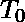向时钟服务器发送获取时钟时间(服务器上的时间)的请求。
2)时钟服务器监听客户端进程发出的请求，并以时钟服务器时间的形式返回响应。
3)客户端进程在时间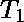从时钟服务器获取响应，并使用下面给出的公式计算同步的客户端时钟时间。

![\[ T_{CLIENT} = T_{SERVER} + (T_1 - T_0)/2 \]    ](img/9363fffee6bc8058ec9be6d006b56bba.png "Rendered by QuickLaTeX.com")

其中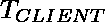指的是同步时钟时间，
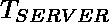指的是服务器返回的时钟时间，
指的是客户端进程发送请求的时间，
指的是客户端进程收到响应的时间
**工作/可靠性上式:**
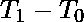指的是网络和服务器将请求传输到服务器，处理请求所花费的综合时间， 并将响应返回给客户端进程，假设网络延迟和大致相等。
客户端的时间与实际时间最多相差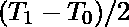秒。利用上面的说法我们可以得出一个结论，同步的误差最多可以是秒。
因此，

![\[ error\, \epsilon\, [-(T_1 - T_0)/2, \, (T_1 - T_0)/2] \]    ](img/08ca2db76894eb6f35e4192a493e1784.png "Rendered by QuickLaTeX.com")

下面的 Python 代码说明了 Cristian 算法的工作原理:
下面的代码用于在本地机器上启动时钟服务器的原型:

## 蟒蛇 3

```
# Python3 program imitating a clock server

import socket
import datetime

# function used to initiate the Clock Server
def initiateClockServer():

    s = socket.socket()
    print("Socket successfully created")

    # Server port
    port = 8000

    s.bind(('', port))

    # Start listening to requests
    s.listen(5)     
    print("Socket is listening...")

    # Clock Server Running forever
    while True:

       # Establish connection with client
       connection, address = s.accept()     
       print('Server connected to', address)

       # Respond the client with server clock time
       connection.send(str(
                    datetime.datetime.now()).encode())

       # Close the connection with the client process
       connection.close()

# Driver function
if __name__ == '__main__':

    # Trigger the Clock Server   
    initiateClockServer()
```

**输出:**

```
Socket successfully created
Socket is listening...
```

下面的代码用于在本地机器上启动客户端进程的原型:

## 蟒蛇 3

```
# Python3 program imitating a client process

import socket
import datetime
from dateutil import parser
from timeit import default_timer as timer

# function used to Synchronize client process time
def synchronizeTime():

    s = socket.socket()         

    # Server port
    port = 8000    

    # connect to the clock server on local computer
    s.connect(('127.0.0.1', port))

    request_time = timer()

    # receive data from the server
    server_time = parser.parse(s.recv(1024).decode())
    response_time = timer()
    actual_time = datetime.datetime.now()

    print("Time returned by server: " + str(server_time))

    process_delay_latency = response_time - request_time

    print("Process Delay latency: " \
          + str(process_delay_latency) \
          + " seconds")

    print("Actual clock time at client side: " \
          + str(actual_time))

    # synchronize process client clock time
    client_time = server_time \
                      + datetime.timedelta(seconds = \
                               (process_delay_latency) / 2)

    print("Synchronized process client time: " \
                                        + str(client_time))

    # calculate synchronization error
    error = actual_time - client_time
    print("Synchronization error : "
                 + str(error.total_seconds()) + " seconds")

    s.close()       

# Driver function
if __name__ == '__main__':

    # synchronize time using clock server
    synchronizeTime()
```

**输出:**

```
Time returned by server: 2018-11-07 17:56:43.302379
Process Delay latency: 0.0005150819997652434 seconds
Actual clock time at client side: 2018-11-07 17:56:43.302756
Synchronized process client time: 2018-11-07 17:56:43.302637
Synchronization error : 0.000119 seconds
```

**时钟同步中的即兴发挥:**
使用网络上的迭代测试，我们可以定义最小传输时间，使用该时间我们可以制定改进的同步时钟时间(更少的同步误差)。
这里通过定义一个最小传输时间，可以很有把握的说，服务器时间
总是在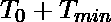之后生成，总是在之前生成，其中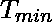是最小传输时间，也就是几次迭代测试中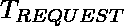和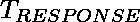的最小值。这里，同步误差可以表述如下:

![\[ error\, \epsilon\, [-((T_1 - T_0)/2 - T_{min}), \, ((T_1 - T_0)/2 - T_{min})] \]    ](img/81e190a06b4f206191a80d7069606cb3.png "Rendered by QuickLaTeX.com")

同样，如果和相差相当长的时间，我们可以用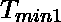和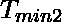代替，其中是最小观察到的请求时间，是指网络上最小观察到的响应时间。
这种情况下的同步时钟时间可以计算为:

![\[ T_{CLIENT} = T_{SERVER} + (T_1 - T_0)/2 + (T_{min2} - T_{min1})/2 \]    ](img/4cad308232c5e6c58c238b6e7a8fc7eb.png "Rendered by QuickLaTeX.com")

因此，通过引入响应时间和请求时间作为单独的时间延迟，我们可以改善时钟时间的同步，从而降低整体同步误差。要运行的大量迭代测试取决于观察到的整体[时钟漂移](https://en.wikipedia.org/wiki/Clock_drift)。
**参考文献:**
1)[https://en.wikipedia.org/wiki/Cristian%27s_algorithm](https://en.wikipedia.org/wiki/Cristian%27s_algorithm)T8】2)[https://en.wikipedia.org/wiki/Round-trip_delay_time](https://en.wikipedia.org/wiki/Round-trip_delay_time)T11】3)[https://www.geeksforgeeks.org/socket-programming-python](https://www.geeksforgeeks.org/socket-programming-python)T14】4)[https://en.wikipedia.org/wiki/Clock_drift](https://en.wikipedia.org/wiki/Clock_drift)T17】