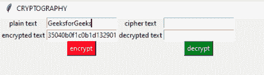
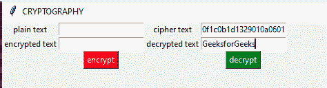

# 使用 python 的加密图形用户界面

> 原文:[https://www . geesforgeks . org/密码学-GUI-use-python/](https://www.geeksforgeeks.org/cryptography-gui-using-python/)

使用加密技术，我们可以为不容易预测的纯文本生成密钥。我们使用密码学来确保数据从一个来源安全可靠地流向另一个来源，而不会被恶意用户访问。

> **先决条件:**
> 
> **所用语言**–[蟒蛇](https://www.geeksforgeeks.org/python-programming-language/)。
> **Tkinter**–该模块用于使用 python 语言制作 GUI。要了解更多关于 tkinter [的信息，请点击此处](https://www.geeksforgeeks.org/python-gui-tkinter/)。
> **密码学基础知识**–密码学用于安全通信。
> 
> *   加密–以只有授权方才能访问的方式对消息或信息进行编码的过程。*   解密–获取编码或加密文本或其他数据并将其转换回文本的过程。

#### 使用的算法

**一次性 PAD**
`one-time pad`是一种无法破解的加密方式。一次性 pad 将生成一个密钥，该密钥由用户共享，因此它既加密又解密。所使用的密钥是随机生成的，并且该密钥与明文相结合以形成密文。我们可以使用不同的算法来生成密文，如`modular addition`、 `modular XOR`等。由于每次生成的密钥都是唯一的，所以不可能破解。

**示例:**

在这个例子中，我们使用了模加法。信息的每一个字母都有相关的数值。该数值与密钥的对应字母进行映射，通过模加运算生成密文。如果值超过 26，结果将是值与 26 的模。在这里，“极客”作为一个简单的信息，“DFSTL”作为一次性的键盘键。

```
      G     E      E       K      S      message
   6 (G)   4 (E)  4 (E)   10 (K)  18 (S) message
+  3 (D)   5 (F)  18 (S)  19 (T)  11 (L) key
=  9       9      22      29      29     message + key
=  9 (J)   9 (J)  22 (W)  3 (D)   3 (D) (message + key) mod 26
      J       J       W      D       D  ? ciphertext

```

因为我们使用模加法来生成密文。为了得到原始信息，我们必须执行模减法。如果该值为负，我们将在该值上加上 26，得到的数值将生成原始消息。

```
       J       J       W       D       D  ciphertext
    9 (J)   9 (J)   22 (W)  3 (D)   3 (D) ciphertext
-   3 (D)   5 (F)  18 (S)  19 (T)  11 (L) key
=   6       4       4     -16      -8     ciphertext – key
=   6 (G)   4 (E)  4 (E)  10(K)    18 (S) ciphertext – key (mod 26)
       G       E       E      K       S  ? message

```

下面是实现。

```
# python module for one-timepad
import onetimepad   
# python module to create GUI        
from tkinter import * 

root = Tk()
root.title("CRYPTOGRAPHY")
root.geometry("800x600")

def encryptMessage():                      
    pt = e1.get()

    # inbuilt function to encrypt a message
    ct = onetimepad.encrypt(pt, 'random')
    e2.insert(0, ct)

def decryptMessage():                     
    ct1 = e3.get()

    # inbuilt function to decrypt a message
    pt1 = onetimepad.decrypt(ct1, 'random')
    e4.insert(0, pt1)

# creating labels and positioning them on the grid
label1 = Label(root, text ='plain text')               
label1.grid(row = 10, column = 1)
label2 = Label(root, text ='encrypted text')
label2.grid(row = 11, column = 1)
l3 = Label(root, text ="cipher text")
l3.grid(row = 10, column = 10)
l4 = Label(root, text ="decrypted text")
l4.grid(row = 11, column = 10)

# creating entries and positioning them on the grid
e1 = Entry(root)
e1.grid(row = 10, column = 2)
e2 = Entry(root)
e2.grid(row = 11, column = 2)
e3 = Entry(root)
e3.grid(row = 10, column = 11)
e4 = Entry(root)
e4.grid(row = 11, column = 11)

# creating encryption button to produce the output
ent = Button(root, text = "encrypt", bg ="red", fg ="white", command = encryptMessage)
ent.grid(row = 13, column = 2)

# creating decryption button to produce the output
b2 = Button(root, text = "decrypt", bg ="green", fg ="white", command = decryptMessage)
b2.grid(row = 13, column = 11)

root.mainloop()
```

**输出**
为加密:


用于解密:


**注意:**模块使用的默认技术与给定示例中的不同。我们可以应用不同的公式来生成密文，但是，基本原理保持不变。