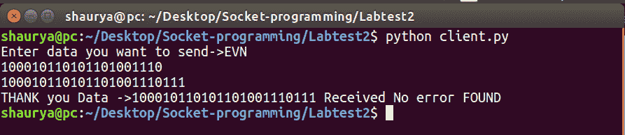
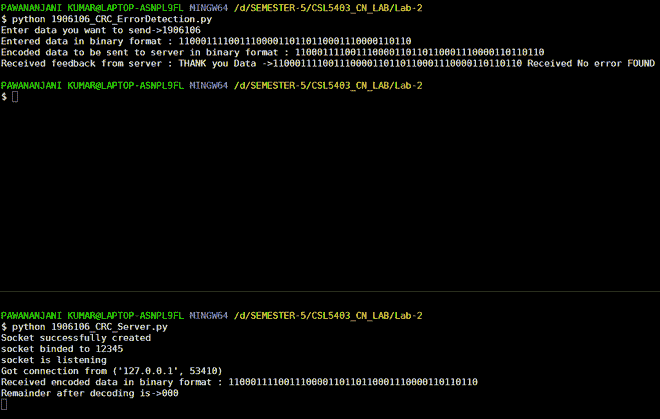

# Python 中的循环冗余校验

> 原文:[https://www . geesforgeks . org/循环冗余校验-python/](https://www.geeksforgeeks.org/cyclic-redundancy-check-python/)

**先决条件:** [了解循环冗余](https://www.geeksforgeeks.org/modulo-2-binary-division/)[套接字编程](https://www.geeksforgeeks.org/socket-programming-python/)

**什么是 CRC？**
循环冗余校验是一种检测通信信道中意外变化/错误的方法。
循环冗余校验使用发送方和接收方均可用的生成多项式。一个示例生成多项式是 x^3 + 1 的形式。这个生成多项式表示密钥 1001。另一个例子是代表键 110 的 x^2 + x。

**例:**
让数据发送的是“EVN”
我们把一个字符串转换成二进制字符串数据。

## 计算机编程语言

```py
input_string = "EVN"

# CONVERT string data to binary string data
data = (''.join(format(ord(x), 'b') for x in input_string))
print (data)
```

**Output**

```py
100010110101101001110
```

CRC 密钥:1001
代码:CRC 密钥长度-1 - > 000 附加在数据末尾。

```py
New data: 100010110101101001110000
Key:1001
```

现在我们在发送方和接收方的套接字编程 python 中应用 CRC。

**发送方**

1.任务是将字符串数据发送到服务器/接收器端。
2。发送者发送一个字符串让我们说“EVN”。
3。首先，这个字符串被转换成二进制字符串“100010110101101001110”密钥是发送方和接收方都知道的，这里使用的密钥是 1001。
4。使用客户端/发送端的密钥，使用循环冗余码对该数据进行编码。
5。该编码数据被发送到接收器。
6。接收器随后解码编码的数据串，以验证是否有任何错误。

## 蟒蛇 3

```py
# Import socket module
import socket           

def xor(a, b):

    # initialize result
    result = []

    # Traverse all bits, if bits are
    # same, then XOR is 0, else 1
    for i in range(1, len(b)):
        if a[i] == b[i]:
            result.append('0')
        else:
            result.append('1')

    return ''.join(result)

# Performs Modulo-2 division
def mod2div(divident, divisor):

    # Number of bits to be XORed at a time.
    pick = len(divisor)

    # Slicing the divident to appropriate
    # length for particular step
    tmp = divident[0 : pick]

    while pick < len(divident):

        if tmp[0] == '1':

            # replace the divident by the result
            # of XOR and pull 1 bit down
            tmp = xor(divisor, tmp) + divident[pick]

        else: # If leftmost bit is '0'

            # If the leftmost bit of the dividend (or the
            # part used in each step) is 0, the step cannot
            # use the regular divisor; we need to use an
            # all-0s divisor.
            tmp = xor('0'*pick, tmp) + divident[pick]

        # increment pick to move further
        pick += 1

    # For the last n bits, we have to carry it out
    # normally as increased value of pick will cause
    # Index Out of Bounds.
    if tmp[0] == '1':
        tmp = xor(divisor, tmp)
    else:
        tmp = xor('0'*pick, tmp)

    checkword = tmp
    return checkword

# Function used at the sender side to encode
# data by appending remainder of modular division
# at the end of data.
def encodeData(data, key):

    l_key = len(key)

    # Appends n-1 zeroes at end of data
    appended_data = data + '0'*(l_key-1)
    remainder = mod2div(appended_data, key)

    # Append remainder in the original data
    codeword = data + remainder
    return codeword   

# Create a socket object
s = socket.socket()       

# Define the port on which you want to connect
port = 12345           

# connect to the server on local computer
s.connect(('127.0.0.1', port))

# Send data to server 'Hello world'

## s.sendall('Hello World')

input_string = input("Enter data you want to send->")
#s.sendall(input_string)
data =(''.join(format(ord(x), 'b') for x in input_string))
print("Entered data in binary format :",data)
key = "1001"

ans = encodeData(data,key)
print("Encoded data to be sent to server in binary format :",ans)
s.sendto(ans.encode(),('127.0.0.1', 12345))

# receive data from the server
print("Received feedback from server :",s.recv(1024).decode())

# close the connection
s.close()
```



**接收器端**

1.接收方从发送方接收编码数据串。
2。接收器在密钥的帮助下解码数据并找出余数。
3。如果余数为零，则意味着发送方发送给接收方的数据没有错误。
4。如果余数为非零，则表示存在错误，并向发送方发送否定确认。然后，发送方重新发送数据，直到接收方收到正确的数据。

## 蟒蛇 3

```py
# First of all import the socket library
import socket

def xor(a, b):

    # initialize result
    result = []

    # Traverse all bits, if bits are
    # same, then XOR is 0, else 1
    for i in range(1, len(b)):
        if a[i] == b[i]:
            result.append('0')
        else:
            result.append('1')

    return ''.join(result)

# Performs Modulo-2 division
def mod2div(divident, divisor):

    # Number of bits to be XORed at a time.
    pick = len(divisor)

    # Slicing the divident to appropriate
    # length for particular step
    tmp = divident[0: pick]

    while pick < len(divident):

        if tmp[0] == '1':

            # replace the divident by the result
            # of XOR and pull 1 bit down
            tmp = xor(divisor, tmp) + divident[pick]

        else:  # If leftmost bit is '0'
            # If the leftmost bit of the dividend (or the
            # part used in each step) is 0, the step cannot
            # use the regular divisor; we need to use an
            # all-0s divisor.
            tmp = xor('0'*pick, tmp) + divident[pick]

        # increment pick to move further
        pick += 1

    # For the last n bits, we have to carry it out
    # normally as increased value of pick will cause
    # Index Out of Bounds.
    if tmp[0] == '1':
        tmp = xor(divisor, tmp)
    else:
        tmp = xor('0'*pick, tmp)

    checkword = tmp
    return checkword

# Function used at the receiver side to decode
# data received by sender

def decodeData(data, key):

    l_key = len(key)

    # Appends n-1 zeroes at end of data
    appended_data = data.decode() + '0'*(l_key-1)
    remainder = mod2div(appended_data, key)

    return remainder

# Creating Socket
s = socket.socket()
print("Socket successfully created")

# reserve a port on your computer in our
# case it is 12345 but it can be anything
port = 12345

s.bind(('', port))
print("socket binded to %s" % (port))
# put the socket into listening mode
s.listen(5)
print("socket is listening")

while True:
    # Establish connection with client.
    c, addr = s.accept()
    print('Got connection from', addr)

    # Get data from client
    data = c.recv(1024)

    print("Received encoded data in binary format :", data.decode())

    if not data:
        break

    key = "1001"

    ans = decodeData(data, key)
    print("Remainder after decoding is->"+ans)

    # If remainder is all zeros then no error occured
    temp = "0" * (len(key) - 1)
    if ans == temp:
        c.sendto(("THANK you Data ->"+data.decode() +
                  " Received No error FOUND").encode(), ('127.0.0.1', 12345))
    else:
        c.sendto(("Error in data").encode(), ('127.0.0.1', 12345))

    c.close()
```


注:
如何运行程序:
1。你应该有一个套接字编程库。

2.首先运行服务器程序，然后运行客户端程序。

3.复制粘贴代码时可能会出现缩进错误，因此复制时要小心。

4.您将在您的拆分终端中看到以下输出。

