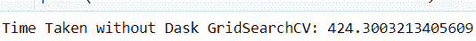
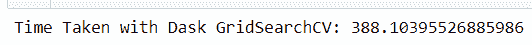

# DaskGridSearchcv–GridSearchcv 的竞争对手

> 原文:[https://www . geeksforgeeks . org/daskgridsearchcv-a-竞争对手-for-gridsearchcv/](https://www.geeksforgeeks.org/daskgridsearchcv-a-competitor-for-gridsearchcv/)

近年来，机器学习、人工智能和深度学习等数据科学领域的流行语在互联网上出现的次数最多。每个人都想尝试机器学习和深度学习的不同模式，并获得尽可能好的结果。某些模型存在一些计算限制。为了获得机器学习中的最佳模型，有一种叫做超参数调整的方法。
[**【超参数调整】**](https://www.geeksforgeeks.org/hyperparameter-tuning/) 基本上是获取为一个模型选择的最佳参数集。对此有两种常见的方法: **GridSearchCV** 和**随机化搜索 CV** 。
GridSearchCV 在寻找最佳参数时，基本上是考虑候选的所有组合。当有大量参数及其值需要调整时，这又需要很长时间。有一种方法可以加快这个过程。这是机器学习中占据大部分时间的主要事情。在进入方法部分之前，让我们浏览一下 GridSearchCV 和并行计算概念的基础知识。

**什么是网格搜索？**

GridSearchCV 是一种从给定的参数网格集中搜索最佳参数值的技术。基本上是交叉验证的方法。需要输入模型和参数。提取最佳参数值，然后进行预测。

**代码:解释 GridSearchCV 工作原理的 Python 代码:**

## 蟒蛇 3

```py
# Importing the libraries needed
pip install pandas
import pandas as pd
from sklearn.linear_model import LogisticRegression
from sklearn.svm import SVC
from sklearn.model_selection import GridSearchCV

# Loading the Dataset
# A standard dataset here is taken for better understanding.
iris = pd.read_csv('https://raw.githubusercontent.com/pranavkotak8/Datasets/master/Iris.csv')
target=iris['Species']
iris.drop(columns={'Id','Species'},inplace=True)

# Assigning the parameters and its values which need to be tuned.
parameters = {'kernel': ['linear', 'rbf'], 'C':[1,2,3,6]}

# Fitting the SVM model
modelsvc = SVC()

# Performing the GridSearchCV
clf = GridSearchCV(modelsvc, parameters)
clf.fit(iris, target)
```

**输出:**


因此，在上面的代码中，我们看到了如何实现 GridSearchCV。在上面的代码中，它是 SVM 模型，同样，其他模型也可以使用。差别在于参数，它们的值会改变。在这里，我采用了 2 个参数，所以速度更快，但是如果我们有更多的参数或复杂的模型来拟合呢？让我们直截了当地回答这个问题。

**我们可以通过任何方式加快 GridSearchCV 的进程吗？**

所以，答案是肯定的，我们可以提高 GridSearchCV 的速度。好吧，你一定很好奇。因此，让我们深入了解一下 GridSearchCV 实际上是如何工作的。

**GridSearchCV 的工作:**

GridSearchCV 是一个针对 python 的机器学习库。我们对估计量的指定参数值进行了详尽的搜索。一个评估对象需要提供一个基本的评分函数，否则任何类型的评分都必须通过。有两种主要的方法可以在 GridSearchcv 上实现，它们是拟合和预测。还有其他预测函数、决策函数等。但是提到的两个是经常使用的。根据用于手头数据集分析的算法类型，它有自己不同的参数。用户需要为重要参数给出一组不同的值。通过交叉验证，Gridsearchcv 将找出上述参数的最佳值。也可以考虑为参数设置默认值。

【GridSearchCV 背后的直觉:

每个从事模型工作的数据科学家都需要最好的模型来进行最终的结论性分析。为此，GridSearchCV 可以帮助构建它。这里的程序被告知运行带有交叉验证的网格搜索。GridSearchCV 中遵循的交叉验证是 k 倍交叉验证方法。所以基本上在 k 倍交叉验证中，给定的数据被分成 k 倍，这取决于分析师的需要，其中在其他时间点的每一倍都被用于测试。例如，如果 K=3，则在第一次迭代中，第一个折叠用于测试模型，其余折叠用于训练模型。在第二次迭代中，第二次折叠用于测试模型，第一次和第三次折叠用于训练模型。除非每个折叠都用于测试，否则会重复这一过程。像这样评估网格搜索会考虑所有参数组合，并为特定问题中使用的算法找到最佳可能模型。
下面列出了不同的方法及其用途:

**方法:**

一些主要方法包括如下:

*   **拟合()**–该方法采用输入数据，拟合所有超参数值。
*   **预测(X)**–对给定数据 X 进行预测，同时考虑通过拟合方法找到的最佳参数。
*   **score()**–它给出了我们在最佳参数上评估数据后的得分。
*   **get _ params()**–它为我们提供了最佳参数及其值的列表。

你可以从[链接](https://github.com/pranavkotak8/Datasets/blob/master/smartphone_activity_dataset.zip?raw=true)
下载数据

**代码:**

## 蟒蛇 3

```py
# Importing the libraries which are required:
import pandas as pd
import numpy as np
from sklearn.model_selection import train_test_split
from sklearn.preprocessing import MinMaxScaler
from sklearn.feature_selection import SelectKBest
from sklearn import svm
from sklearn.model_selection import RandomizedSearchCV,GridSearchCV
import warnings
warnings.filterwarnings('ignore')
import seaborn as sns
import matplotlib.pyplot as plt

# Reading the train data
train = pd.read_csv('C:\\Users\\prana\\Downloads\\smartphone_activity_dataset.csv')

# Dropping the target column
train.drop(columns={'activity'},inplace=True)

# Scaling the data
from sklearn.preprocessing import MinMaxScaler
t = MinMaxScaler()
train_f = t.fit_transform(train)
train_f = pd.DataFrame(train_f)

# Splitting into train and test set
X_train,X_test,y_train,y_test=train_test_split(train_f,
            target, test_size = 0.8, random_state = 100)

# Importing the DaskGridSearchCV, importing time
# and also running the gridsearchcv
# So here we are using DaskGridSearchCV.
from dask_ml.model_selection import GridSearchCV as DaskGridSearchCV
start=time.time()

parameters={
              'C': [0.1, 1,5, 10,15,20,100,500], 
              'gamma': [0.5,0.80,1, 0.1],
              'kernel': ['rbf','linear','sigmoid']}

modelsvc=SVC()

gscv = DaskGridSearchCV(modelsvc, param_grid = parameters, cv = 5, n_jobs = -1)

grid_results = gscv.fit(X_train, y_train)
end = time.time()
print("Time Taken with Dask GridSearchCV:", end-start)

# Importing the GridSearchCV, importing time and
# also running the gridsearchcv
# So here we are using the normal GridSearchCV method to implement
# the same algorithm and same parameters with the same set of values.
# This is merely done to compare and measure the computational time for both the methods.
start = time.time()
gscv = GridSearchCV(svm.SVC(),  {
              'C': [0.1, 1,5, 10,15,20,100,500], 
              'gamma': [0.5,0.80,1, 0.1],
              'kernel': ['rbf','linear','sigmoid']
},cv = 5,return_train_score = False,n_jobs = -1)

grid_results = gscv.fit(X_train, y_train)
end = time.time()
print("Time Taken without Dask GridSearchCV:", end-start)
```

**输出:**

 

**Scikit-learn 版和 Dask 版 GridSearchCV 的比较:**

<figure class="table">

| **Scikit-学习版本所用时间(秒)** | Four hundred and twenty-four point three |
| **Dask 版本时间(秒)** | Three hundred and eighty-eight point one zero three |

</figure>

**结论:**

从输出中可以明显看出，DaskGridSearchCV 比普通的 GridSearchCV 快 1.09 倍。反过来，我们减少了搜索最佳参数值的时间。这可以应用于其他算法，也可以应用于更多的参数集。
以下是应用 Dask-SearchCV 时需要考虑的一些要点:

*   如果模型有管道，并且早期步骤成本很高，那么您将继承性能优势。
*   您试图适应的数据已经在一个集群上，那么 Dask-SearchCV 将表现得更好，因为它在远程数据上运行良好。
*   如果你的数据非常大，那么这不会有太大帮助。它用于调度适合中小规模数据的 Scikit-Learn 估计器。

**参考文献:** [sklearn.model_selection。GridSearchCV.html](https://scikit-learn.org/stable/modules/generated/sklearn.model_selection.GridSearchCV.html)