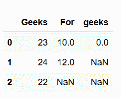
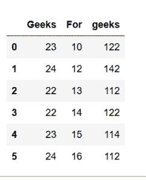

# 使用 Python 进行数据分析和可视化|第 2 集

> 原文:[https://www . geesforgeks . org/data-analysis-visualization-python-set-2/](https://www.geeksforgeeks.org/data-analysis-visualization-python-set-2/)

先决条件:[Python 中的 NumPy](https://www.geeksforgeeks.org/numpy-in-python-set-1-introduction/)、[Python 数据分析可视化|集合 1](https://www.geeksforgeeks.org/data-analysis-visualization-python/)

**1。以 CSV 格式存储数据帧:**

**熊猫**提供 **`to.csv('filename', index = "False|True")`** 功能将 DataFrame 写入 CSV 文件。这里 *`filename`* 是您想要创建的 CSV 文件的名称， *`index`* 告诉数据帧的索引(如果默认)是否应该被覆盖。如果我们设置 **`index = False`** ，那么索引不会被覆盖。默认情况下，索引值为 **`TRUE`** ，则索引被覆盖。

**示例:**

```py
import pandas as pd

# assigning three series to s1, s2, s3
s1 = pd.Series([0, 4, 8])
s2 = pd.Series([1, 5, 9])
s3 = pd.Series([2, 6, 10])

# taking index and column values
dframe = pd.DataFrame([s1, s2, s3])

# assign column name
dframe.columns =['Geeks', 'For', 'Geeks']

# write data to csv file
dframe.to_csv('geeksforgeeks.csv', index = False)  
dframe.to_csv('geeksforgeeks1.csv', index = True)
```

输出:

```py
geeksforgeeks1.csv

geeksforgeeks2.csv

```

**2。处理缺失数据**

数据分析阶段还包括处理数据集中缺失数据的能力，熊猫也达到了这一预期也就不足为奇了。这就是`dropna`和/或`fillna`方法发挥作用的地方。在处理缺失数据时，作为数据分析师，您应该删除包含 **NaN 值** (dropna 方法)的列，或者用整个列条目的平均值或模式(fillna 方法)填充缺失数据，这一决定意义重大，取决于数据和对我们结果的影响。

*   **Drop the missing Data :**
    Consider this is the DataFrame generated by below code :
    

    ```py
    import pandas as pd

    # Create a DataFrame
    dframe = pd.DataFrame({'Geeks': [23, 24, 22], 
                           'For': [10, 12, np.nan],
                           'geeks': [0, np.nan, np.nan]},
                           columns =['Geeks', 'For', 'geeks'])

    # This will remove all the
    # rows with NAN values

    # If axis is not defined then
    # it is along rows i.e. axis = 0
    dframe.dropna(inplace = True)
    print(dframe)

    # if axis is equal to 1
    dframe.dropna(axis = 1, inplace = True)

    print(dframe)
    ```

    输出:

    ```py
    axis=0

    axis=1

    ```

*   **Fill the missing values :**
    Now, to replace any **NaN** value with mean or mode of the data, `fillna` is used, which could replace all the NaN values from a particular column or even in whole **DataFrame** as per the requirement.

    ```py
    import numpy as np
    import pandas as pd

    # Create a DataFrame
    dframe = pd.DataFrame({'Geeks': [23, 24, 22], 
                            'For': [10, 12, np.nan],
                            'geeks': [0, np.nan, np.nan]},
                            columns = ['Geeks', 'For', 'geeks'])

    # Use fillna of complete Dataframe 

    # value function will be applied on every column
    dframe.fillna(value = dframe.mean(), inplace = True)
    print(dframe)

    # filling value of one column
    dframe['For'].fillna(value = dframe['For'].mean(),
                                        inplace = True)
    print(dframe)
    ```

    输出:

**3。分组方法(汇总):**

groupby 方法允许我们基于任何行或列将数据分组在一起，因此我们可以进一步应用聚合函数来分析我们的数据。使用映射器(dict 或 key 函数，将给定函数应用于组，将结果作为系列返回)或通过一系列列对系列进行分组。

考虑这是下面代码生成的数据帧:


```py
import pandas as pd
import numpy as np

# create DataFrame
dframe = pd.DataFrame({'Geeks': [23, 24, 22, 22, 23, 24], 
                        'For': [10, 12, 13, 14, 15, 16],
                        'geeks': [122, 142, 112, 122, 114, 112]},
                        columns = ['Geeks', 'For', 'geeks']) 

# Apply groupby and aggregate function
# max to find max value of column 

# &quot;For&quot; and column &quot;geeks&quot; for every
# different value of column &quot;Geeks&quot;.

print(dframe.groupby(['Geeks']).max())
```

输出: