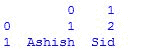
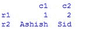
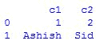
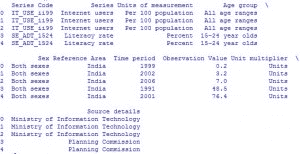
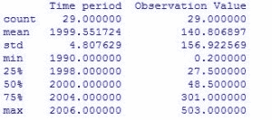
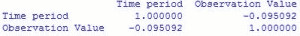
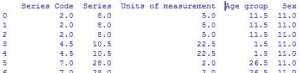
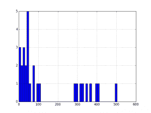
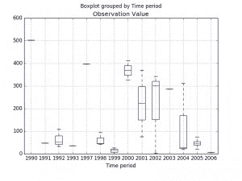
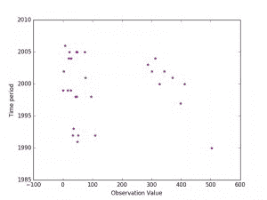

# 用 Python 进行数据分析和可视化

> 原文:[https://www . geesforgeks . org/data-analysis-visualization-python/](https://www.geeksforgeeks.org/data-analysis-visualization-python/)

Python 是进行数据分析的优秀语言，主要是因为以数据为中心的 Python 包的奇妙生态系统。**熊猫**就是其中的一个包，让导入和分析数据变得容易多了。在这篇文章中，我使用熊猫来分析来自一个受欢迎的网站的联合国公共数据集的国家数据. csv 文件上的数据。
由于我已经分析了印度国家数据，我已经介绍了熊猫的关键概念如下。在阅读本文之前，先从 [matplotlib](https://www.geeksforgeeks.org/graph-plotting-in-python-set-1/) 和 [csv](https://www.geeksforgeeks.org/working-csv-files-python/) 中大致了解一下基础知识。

**安装**
安装熊猫最简单的方法就是使用 pip:

```
pip install pandas
```

或者，从[这里](https://pypi.python.org/pypi/pandas/#downloads)下载

**在熊猫中创建数据框**

数据框的创建是通过使用 **pd 将多个系列传递到数据框类中来完成的。系列**法。这里，它在两个 Series 对象中传递，s1 作为第一行，s2 作为第二行。
例:

```
# assigning two series to s1 and s2
s1 = pd.Series([1,2])
s2 = pd.Series(["Ashish", "Sid"])
# framing series objects into data
df = pd.DataFrame([s1,s2])
# show the data frame
df

# data framing in another way
# taking index and column values
dframe = pd.DataFrame([[1,2],["Ashish", "Sid"]],
        index=["r1", "r2"],
        columns=["c1", "c2"])
dframe

# framing in another way 
# dict-like container
dframe = pd.DataFrame({
        "c1": [1, "Ashish"],
        "c2": [2, "Sid"]})
dframe
```

输出:

```
    

```

**用熊猫导入数据**

第一步是读取数据。数据存储为逗号分隔值(或 csv)文件，其中每行由新行分隔，每列由逗号(，)分隔。为了能够用 Python 处理数据，需要将 csv 文件读入熊猫数据帧。数据框是表示和处理表格数据的一种方式。表格数据有行有列，就像这个 [csv 文件](http://data.un.org/countryData/Data/ShowDetail/IND)(点击下载)。
例:

```
# Import the pandas library, renamed as pd
import pandas as pd

# Read IND_data.csv into a DataFrame, assigned to df
df = pd.read_csv("IND_data.csv")

# Prints the first 5 rows of a DataFrame as default
df.head()

# Prints no. of rows and columns of a DataFrame
df.shape
```

输出:

```


```

```
29,10

```

**用熊猫索引数据帧**

使用**熊猫可以进行索引。DataFrame.iloc** 方法。iloc 方法允许按位置检索尽可能多的行和列。
**例:**

```
# prints first 5 rows and every column which replicates df.head()
df.iloc[0:5,:]
# prints entire rows and columns
df.iloc[:,:]
# prints from 5th rows and first 5 columns
df.iloc[5:,:5]
```

**在熊猫中使用标签进行索引**

使用**熊猫可以对标签进行索引。DataFrame.loc** 方法，允许使用标签而不是位置进行索引。
例子:

```
# prints first five rows including 5th index and every columns of df
df.loc[0:5,:]
# prints from 5th rows onwards and entire columns
df = df.loc[5:,:]
```

上述内容实际上看起来与 df.iloc[0:5，]没有太大区别。这是因为虽然行标签可以采用任何值，但我们的行标签与位置完全匹配。但是当处理数据时，列标签可以使事情变得容易得多。示例:

```
# Prints the first 5 rows of Time period
# value 
df.loc[:5,"Time period"]
```

```


```

**熊猫数据框数学**

数据帧的计算可以通过熊猫工具的统计功能来完成。
示例:

```
# computes various summary statistics, excluding NaN values
df.describe()
# for computing correlations
df.corr()
# computes numerical data ranks
df.rank()
```

```


 



```

**熊猫出图**

这些例子中的情节是使用标准惯例参考 matplotlib API 制作的，matplotlib API 提供了熊猫的基本知识，可以轻松创建好看的情节。
示例:

```
# import the required module 
import matplotlib.pyplot as plt
# plot a histogram 
df['Observation Value'].hist(bins=10)

# shows presence of a lot of outliers/extreme values
df.boxplot(column='Observation Value', by = 'Time period')

# plotting points as a scatter plot
x = df["Observation Value"]
y = df["Time period"]
plt.scatter(x, y, label= "stars", color= "m", 
            marker= "*", s=30)
# x-axis label
plt.xlabel('Observation Value')
# frequency label
plt.ylabel('Time period')
# function to show the plot
plt.show()
```

```




```

[使用 Python 进行数据分析和可视化|第 2 集](https://www.geeksforgeeks.org/data-analysis-visualization-python-set-2/)

**参考:**

*   [http://pandas.pydata.org/pandas-docs/stable/tutorials.html](http://pandas.pydata.org/pandas-docs/stable/tutorials.html)
*   [https://www.datacamp.com](https://www.datacamp.com)

本文由 **Afzal_Saan** 供稿。如果你喜欢 GeeksforGeeks 并想投稿，你也可以使用[contribute.geeksforgeeks.org](http://www.contribute.geeksforgeeks.org)写一篇文章或者把你的文章邮寄到 contribute@geeksforgeeks.org。看到你的文章出现在极客博客主页上，帮助其他极客。

如果你发现任何不正确的地方，或者你想分享更多关于上面讨论的话题的信息，请写评论。