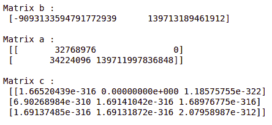

# 用 Python 进行数据分析

> 原文:[https://www.geeksforgeeks.org/data-analysis-with-python/](https://www.geeksforgeeks.org/data-analysis-with-python/)

**数据分析**是收集、转换和组织数据以做出未来预测，并做出明智的数据驱动决策的技术。这也有助于为业务问题找到可能的解决方案。数据分析有六个步骤。它们是:

*   询问或指定数据要求
*   准备或收集数据
*   清洁和加工
*   分析
*   分享
*   行动还是报告

每个步骤都有自己的流程和工具，可以根据数据得出整体结论。

**注意:**要了解更多这些步骤，请参考我们的[数据分析流程六步](https://www.geeksforgeeks.org/six-steps-of-data-analysis-process/)教程。


在本文中，我们将讨论如何使用 Python 进行数据分析。我们将讨论各种数据分析，即使用 NumPy 分析数值数据、使用 Pandas 分析表格数据、数据可视化 Matplotlib 和探索性数据分析。

## 用数值方法分析数值数据

[NumPy](https://www.geeksforgeeks.org/python-numpy/) 是 Python 中的数组处理包，提供了一个高性能的多维数组对象和处理这些数组的工具。它是使用 Python 进行科学计算的基本包。

### NumPy 中的数组

[NumPy Array](https://www.geeksforgeeks.org/basics-of-numpy-arrays/) 是一个元素表(通常是数字)，都是相同的类型，由一个正整数元组索引。在 Numpy 中，数组的维数称为数组的秩。给出数组沿每个维度的大小的整数元组称为数组的形状。

### 创建数字数组

NumPy 数组可以通过多种方式创建，具有不同的等级。它也可以通过使用不同的数据类型来创建，如列表、元组等。结果数组的类型是从序列中元素的类型推导出来的。NumPy 提供了几个函数来创建带有初始占位符内容的数组。这使得增长阵列的必要性最小化，而增长阵列是一项昂贵的操作。

### 示例 1:使用 [numpy.empty 创建数组(形状，数据类型=浮点，顺序='C')](https://www.geeksforgeeks.org/numpy-empty-python/)

## 蟒蛇 3

```py
import numpy as np

b = np.empty(2, dtype = int)
print("Matrix b : \n", b)

a = np.empty([2, 2], dtype = int)
print("\nMatrix a : \n", a)

c = np.empty([3, 3])
print("\nMatrix c : \n", c)
```

**输出:**



### 示例 2:使用[数字零创建数组(形状，数据类型=无，顺序= 'C')](https://www.geeksforgeeks.org/numpy-zeros-python/)

## 蟒蛇 3

```py
import numpy as np

b = np.zeros(2, dtype = int)
print("Matrix b : \n", b)

a = np.zeros([2, 2], dtype = int)
print("\nMatrix a : \n", a)

c = np.zeros([3, 3])
print("\nMatrix c : \n", c)
```

**输出:**

```py
Matrix b : 
 [0 0]

Matrix a : 
 [[0 0]
 [0 0]]

Matrix c : 
 [[0\. 0\. 0.]
 [0\. 0\. 0.]
 [0\. 0\. 0.]]
```

### Numpy 数组上的运算

**算术运算**

*   **添加:**

## 蟒蛇 3

```py
import numpy as np

# Defining both the matrices
a = np.array([5, 72, 13, 100])
b = np.array([2, 5, 10, 30])

# Performing addition using arithmetic operator
add_ans = a+b
print(add_ans)

# Performing addition using numpy function
add_ans = np.add(a, b)
print(add_ans)

# The same functions and operations can be used for
# multiple matrices
c = np.array([1, 2, 3, 4])
add_ans = a+b+c
print(add_ans)

add_ans = np.add(a, b, c)
print(add_ans)
```

**输出:**

```py
[  7  77  23 130]
[  7  77  23 130]
[  8  79  26 134]
[  7  77  23 130]
```

*   **减法:**

## 蟒蛇 3

```py
import numpy as np

# Defining both the matrices
a = np.array([5, 72, 13, 100])
b = np.array([2, 5, 10, 30])

# Performing subtraction using arithmetic operator
sub_ans = a-b
print(sub_ans)

# Performing subtraction using numpy function
sub_ans = np.subtract(a, b)
print(sub_ans)
```