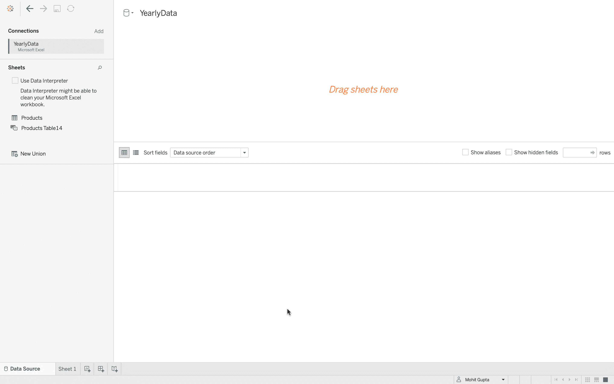
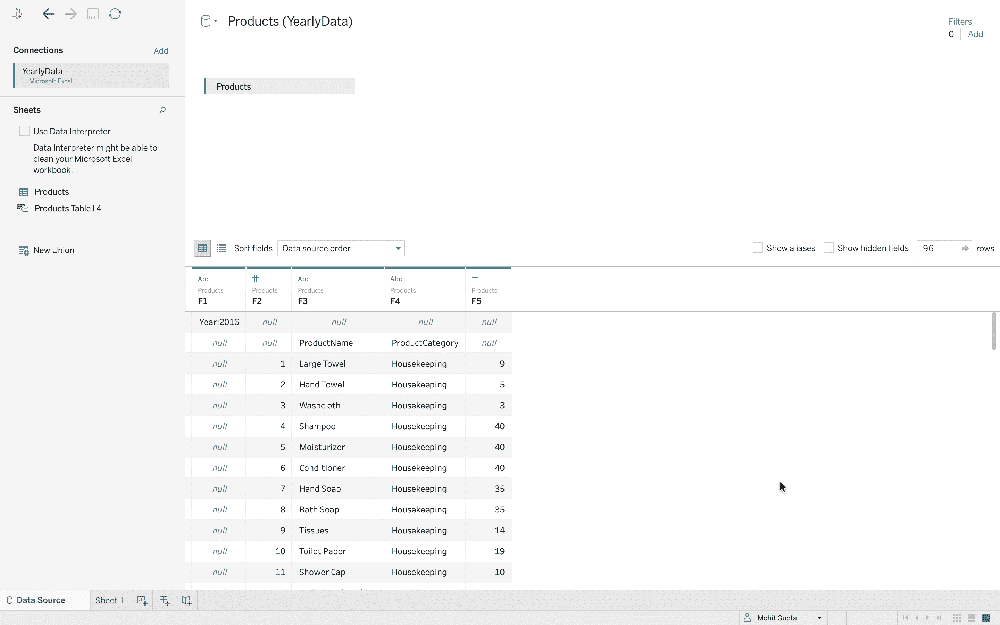
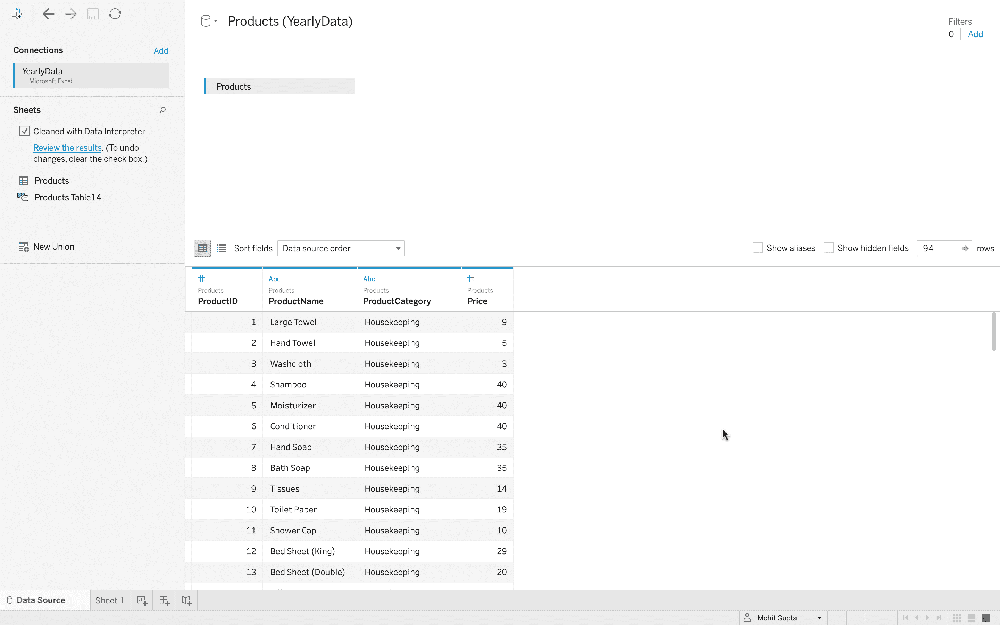
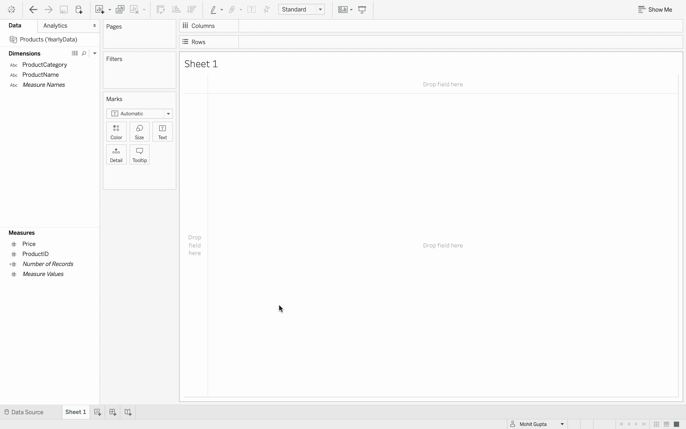
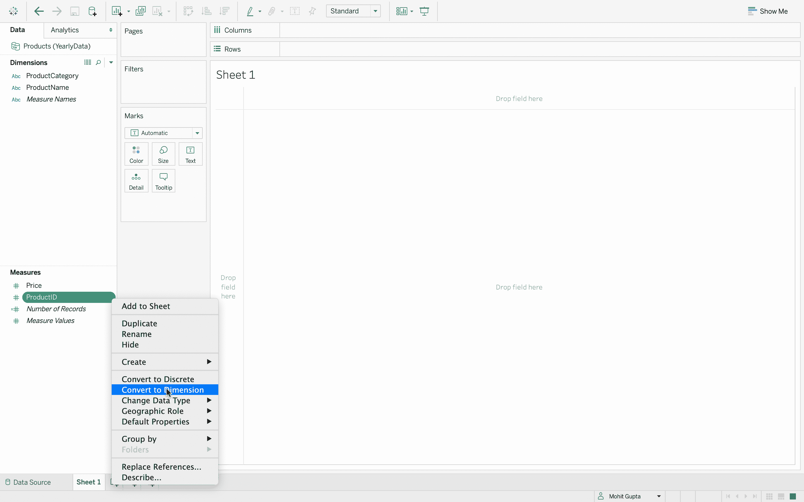

# 表中的数据清理

> 原文:[https://www.geeksforgeeks.org/data-cleaning-in-tableau/](https://www.geeksforgeeks.org/data-cleaning-in-tableau/)

为了在 Tableau 中可视化数据，我们需要一个数据源文件。大多数情况下，数据文件不包含吸管值，可以直接用于可视化。但是可能会出现数据源没有格式化，需要清理的情况。因此，本文旨在学习如何清理 Tableau 中的数据文件。

**后续步骤:**

*   打开 Tableau，添加数据源文件–*年数据*
*   但是这个数据可能有问题。第一个指示可能是显示的消息，说数据解释器可能能够清理我的 Excel 工作簿。
    
*   到目前为止，还不清楚实际问题是什么，所以让我们加载数据–*产品*表。
*   可以清楚地看到，数据上面有一个*2016 年*的杂散值，其中*产品标识*、*产品名称*，以及*产品类别*也存在。
    
*   要清理数据，请转到左侧窗格的工作表部分，并选择*使用数据解释器。这将清理数据，*2016 年*的价值消失了，数据中*的产品标识、产品名称、产品类别和价格*出现了。*
    
*   转到*单*，在维度下有*产品类别*和*产品名称*，在*措施*下有*价格*和*产品标识*。
    
*   *ProductID* 实际上是一个维度而不是度量，所以将鼠标指针悬停在 *ProductID* 上，单击其向下箭头，然后单击*转换为维度*。
    
*   现在， *ProductID* 是一个可搜索和可排序的值，可以在这里使用。
    T3】
*   如果数据源太复杂，数据解释器可能无法提供帮助，但是如果数据中存在一个单独的杂散值，或者可能存在一些不规则的格式，那么使用数据解释器是解决这个问题的好方法