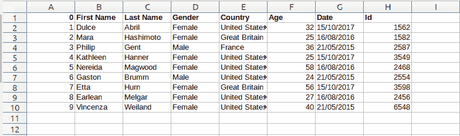
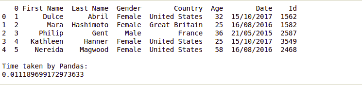
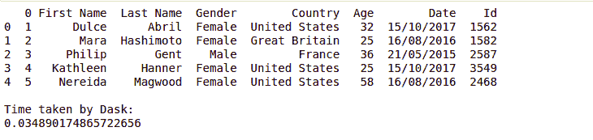

# 通过 Excel 摄取数据:比较运行时

> 原文:[https://www . geesforgeks . org/data-摄取-via-excel-comparison-runtime/](https://www.geeksforgeeks.org/data-ingestion-via-excel-comparing-runtimes/)

数据摄取是获取和导入数据以存储在数据库中的过程。在本文中，我们探讨了用于从 Python 中的 excel 文件提取数据的不同数据摄取技术，并比较了它们的运行时。

让我们假设 excel 文件如下所示–



#### 使用 xlrd 库

使用`xlrd`模块，可以从电子表格中检索信息。例如，读取、写入或修改数据可以在 Python 中完成。此外，用户可能需要浏览各种表单，根据某些标准检索数据，或者修改一些行和列，并做大量工作。

```py
import xlrd
import time

# Time variable for finding the 
# difference
t1 = time.time()

#Open the workbook to read the
# excel file 
workbook = xlrd.open_workbook('excel.xls')

#Get the first sheet in the workbook 
sheet = workbook.sheet_by_index(0)

#Read row data line by line 
for i in range(sheet.nrows):
    row = sheet.row_values(i) 
    print(row)

t2 = time.time()
print("\nTime taken by xlrd:")
print(t2-t1)
```

**输出:**


#### 使用熊猫

Python 数据分析库是数据科学家使用的强大工具。它有助于数据摄取和数据探索。

```py
import pandas as pd 
import time

# Time variable for finding the 
# difference
t1 = time.time()

data = pd.read_excel('excel.xls') 
print(data.head())

t2 = time.time()
print("\nTime taken by xlrd:")
print(t2-t1)
```

**输出:**



#### 使用 dask 数据帧

Dask 数据帧是一个大型并行数据帧，由许多较小的熊猫数据帧组成，沿索引分割。

```py
import dask
import dask.dataframe as dd
import pandas as pd 
from dask.delayed import delayed
import time

# Time variable for finding the 
# difference
t1 = time.time()

parts = dask.delayed(pd.read_excel)('excel.xls', 
                                    sheet_name=0)
df = dd.from_delayed(parts)

print(df.head())

t2 = time.time()
print("\nTime taken by Dask:")
print(t2-t1)
```

**输出:**

