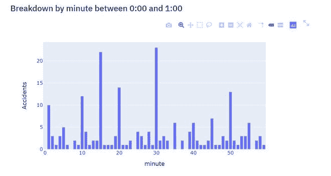
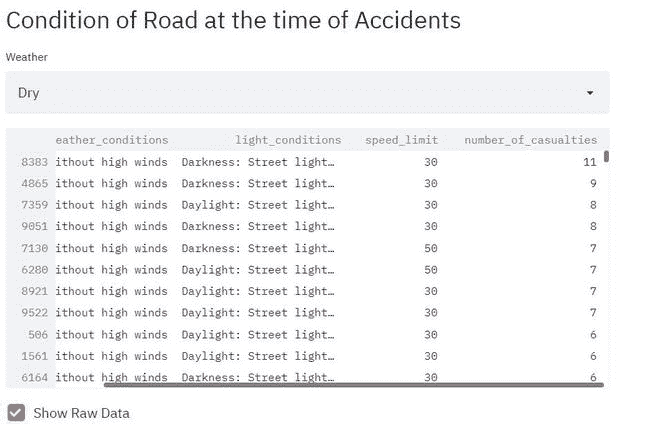

# 使用流线的数据科学应用程序

> 原文:[https://www . geesforgeks . org/data-science-apps-use-stream it/](https://www.geeksforgeeks.org/data-science-apps-using-streamlit/)

数据可视化是数据分析最重要的步骤之一。这是通过交互式图表传达你的研究和数据发现的方式。有许多可用于数据可视化的库，如 matplotlib、seaborn 等。它允许我们可视化各种各样的图表和图表，但是这些库不提供任何功能来以网页或 web 应用程序的形式部署它们。

[Streamlit](https://streamlit.io/) 是一个开源的 Python 库，可以很容易地为机器学习和数据科学构建漂亮的定制网络应用。在这篇文章中，我们将在 streamlit 中构建一个小的演示应用程序，但是首先，我们需要了解一些我们将要使用的重要功能

**重要功能:**

*   **Streamlit.title ():** 此功能允许您添加应用的标题。
*   **streamlit . header()/streamlit . sub header():**这些功能用于设置一个节的头/子头。这些功能也支持降价。
*   **Streamlit.write():** 该功能用于向 web app 添加任何内容，从格式化字符串到 matplotlib 图、阿尔泰图、plotly 图、数据框、Keras 模型等中的图表。
*   **Streamlit.map():** 此功能用于在 web app 中显示地图。但是，它需要纬度和经度的值，这些值不应该为空。
*   流线库中也有常见的 UI 小部件，如`streamlit.button(), streamlit.checkbox(), streamlit.radio(), etc.`

**缓存和性能:**

当您用 streamlit.cache()注释标记一个函数时，它会告诉 streamlit，无论何时调用该函数，它都应该检查三件事:

*   函数的名称
*   组成函数体的实际代码。
*   您用来调用函数的输入参数。

`streamlit.cache()`有以下重要论点:

*   **函数:**我们要缓存的函数。简化函数及其相关代码的散列。
*   **持久化**:此参数用于持久化浏览器中的缓存

**实施:**

*   首先，我们需要将 streamlit 安装到我们的环境中，我们可以通过使用 pip install 来实现。对于这个帖子，我们将使用英国事故数据，可以从[这里](https://data.gov.uk/dataset/053a6529-6c8c-42ac-ae1e-455b2708e535/road-traffic-accidents)下载

```py
pip install streamlit
```

```py
Building wheels for collected packages: blinker, validators, watchdog, pathtools, toolz, pyrsistent, pandocfilters
  Building wheel for blinker (setup.py) ... done
  Created wheel for blinker: filename=blinker-1.4-py3-none-any.whl size=13455 sha256=c16fdce1fa132ddc8aa6bb1551c299f64b0be90e1535383a52e3b3239e77d69c
  Stored in directory: c:\users\prashant\appdata\local\pip\cache\wheels\22\f5\18\df711b66eb25b21325c132757d4314db9ac5e8dabeaf196eab
  Building wheel for validators (setup.py) ... done
  Created wheel for validators: filename=validators-0.16.0-py3-none-any.whl size=18413 sha256=89b31cd7457f24401a146d26a8a2232d5a3e8a8ae7f1a0991dc67edbfe068a24
  Stored in directory: c:\users\prashant\appdata\local\pip\cache\wheels\38\f6\3c\5b82677e8a1b2ca411c2c10ac379dd894207329736f1ec9047
  Building wheel for watchdog (setup.py) ... done
  Created wheel for watchdog: filename=watchdog-0.10.3-py3-none-any.whl size=73875 sha256=51878f9c2c1adbe7f6d8ab6b9239c28b34990d79ee930ed1741cfa7dee0d25a6
  Stored in directory: c:\users\prashant\appdata\local\pip\cache\wheels\27\21\35\9d1e531f9de5335147dbef07e9cc99d312525ba128a93d1225
  Building wheel for pathtools (setup.py) ... done
  Created wheel for pathtools: filename=pathtools-0.1.2-py3-none-any.whl size=8790 sha256=224f8c78887059b6486a0466d5bbdd8e3fe720ebd02a29df9c6bff90445d4f79
  Stored in directory: c:\users\prashant\appdata\local\pip\cache\wheels\3e\31\09\fa59cef12cdcfecc627b3d24273699f390e71828921b2cbba2
  Building wheel for toolz (setup.py) ... done
  Created wheel for toolz: filename=toolz-0.10.0-py3-none-any.whl size=55579 sha256=815091506aeb386e2900d604ffa9803a3b879c90d8be4a5e9f8d38504f91718c
  Stored in directory: c:\users\prashant\appdata\local\pip\cache\wheels\e2\83\7c\248063997a4f9ff6bf145822e620e8c37117a6b4c765584077
  Building wheel for pyrsistent (setup.py) ... done
  Created wheel for pyrsistent: filename=pyrsistent-0.16.0-cp37-cp37m-win_amd64.whl size=70547 sha256=25abb43e1764a4266afe8485ba9476e4dc560069a06fc13cee042de747b2e750
  Stored in directory: c:\users\prashant\appdata\local\pip\cache\wheels\22\52\11\f0920f95c23ed7d2d0b05f2b7b2f4509e87a20cfe8ea43d987
  Building wheel for pandocfilters (setup.py) ... done
  Created wheel for pandocfilters: filename=pandocfilters-1.4.2-py3-none-any.whl size=7860 sha256=138f70f538c3b075a034bc0f1feee6c2868d8b16216d4ecf74987a9c71561f2e
  Stored in directory: c:\users\prashant\appdata\local\pip\cache\wheels\63\99\01\9fe785b86d1e091a6b2a61e06ddb3d8eb1bc9acae5933d4740
Successfully built blinker validators watchdog pathtools toolz pyrsistent pandocfilters
Installing collected packages: toml, urllib3, docutils, jmespath, six, python-dateutil, botocore, blinker, decorator, validators, enum-compat, s3transfer, boto3, pathtools, watchdog, numpy, pyarrow, click, MarkupSafe, jinja2, ipython-genutils, traitlets, tornado, pywin32, jupyter-core, pyzmq, jupyter-client, wcwidth, prompt-toolkit, backcall, pickleshare, pygments, parso, jedi, colorama, ipython, ipykernel, pyrsistent, zipp, importlib-metadata, attrs, jsonschema, nbformat, pywinpty, terminado, testpath, pandocfilters, entrypoints, webencodings, pyparsing, packaging, bleach, mistune, defusedxml, nbconvert, Send2Trash, prometheus-client, notebook, widgetsnbextension, ipywidgets, pydeck, pytz, pandas, toolz, altair, pillow, tzlocal, protobuf, chardet, idna, requests, base58, cachetools, astor, streamlit
Successfully installed MarkupSafe-1.1.1 Send2Trash-1.5.0 altair-4.1.0 astor-0.8.1 attrs-19.3.0 backcall-0.2.0 base58-2.0.1 bleach-3.1.5 blinker-1.4 boto3-1.14.28 botocore-1.17.28 cachetools-4.1.1 chardet-3.0.4 click-7.1.2 colorama-0.4.3 decorator-4.4.2 defusedxml-0.6.0 docutils-0.15.2 entrypoints-0.3 enum-compat-0.0.3 idna-2.10 importlib-metadata-1.7.0 ipykernel-5.3.4 ipython-7.16.1 ipython-genutils-0.2.0 ipywidgets-7.5.1 jedi-0.17.2 jinja2-2.11.2 jmespath-0.10.0 jsonschema-3.2.0 jupyter-client-6.1.6 jupyter-core-4.6.3 mistune-0.8.4 nbconvert-5.6.1 nbformat-5.0.7 notebook-6.0.3 numpy-1.19.1 packaging-20.4 pandas-1.0.5 pandocfilters-1.4.2 parso-0.7.1 pathtools-0.1.2 pickleshare-0.7.5 pillow-7.2.0 prometheus-client-0.8.0 prompt-toolkit-3.0.5 protobuf-3.12.2 pyarrow-1.0.0 
pydeck-0.4.0 pygments-2.6.1 pyparsing-2.4.7 pyrsistent-0.16.0 python-dateutil-2.8.1
 pytz-2020.1 pywin32-228 pywinpty-0.5.7 pyzmq-19.0.1 requests-2.24.0 s3transfer-0.3.3 six-1.15.0 streamlit-0.64.0 
terminado-0.8.3 testpath-0.4.4 toml-0.10.1 toolz-0.10.0 tornado-6.0.4 traitlets-4.3.3 tzlocal-2.1 urllib3-1.25.10 
validators-0.16.0 watchdog-0.10.3 wcwidth-0.2.5 webencodings-0.5.1 widgetsnbextension-3.5.1 zipp-3.1.0

```

*   首先，我们需要导入模块并加载数据，我们将使用流线缓存功能来缓存我们的数据，因此当我们再次重新运行时，我们不需要再次加载数据。之后，我们使用这些数据绘制不同的图和地图。以下是该文件的完整代码。

**代码:**

```py
# import the required modules
import streamlit as st
import pandas as pd
import numpy as np
import pydeck as pdk
import plotly.express as px

# Dataset we need to import
DATA_URL = (
    "accidents_2012_to_2014.csv"
)

# Add title and subtitle of the map.
st.title("Accidents in United Kingdom")
st.markdown("This app analyzes accident data in United Kingdom from 2012-2014")

"""
Here, we define load_data function,
to prevent loading the data everytime we made some changes in the dataset.
We use streamlit's cache notation.
"""

@st.cache(persist = True)
def load_data(nrows):
      # parse date and time columns as date and time
    data = pd.read_csv(DATA_URL, nrows = nrows, parse_dates =[['Date', 'Time']])
    # Drop N / A values in latitude and longitude. soit does not face problem when we use maps
    data.dropna(subset =['Latitude', 'Longitude'], inplace = True)
    lowercase = lambda x: str(x).lower()
    data.rename(lowercase, axis ="columns", inplace = True)
    data.rename(columns ={"date_time": "date / time"}, inplace = True)
    return data
# load first 10000 rows
data = load_data(10000)
# Plot : 1
# plot a streamlit map for accident locations.
st.header("Where are the most people casualties in accidents in UK?")
# plot the slider that selects number of person died
casualties = st.slider("Number of persons died", 1, int(data["number_of_casualties"].max()))
st.map(data.query("number_of_casualties >= @casualties")[["latitude", "longitude"]].dropna(how ="any"))

# Plot : 2
# plot a pydeck 3D map for the number of accident's happen between an hour interval
st.header("How many accidents occur during a given time of day?")
hour = st.slider("Hour to look at", 0, 23)
original_data = data
data = data[data['date / time'].dt.hour == hour]

st.markdown("Vehicle collisions between % i:00 and % i:00" % (hour, (hour + 1) % 24))
midpoint = (np.average(data["latitude"]), np.average(data["longitude"]))

st.write(pdk.Deck(
    map_style ="mapbox://styles / mapbox / light-v9",
    initial_view_state ={
        "latitude": midpoint[0],
        "longitude": midpoint[1],
        "zoom": 11,
        "pitch": 50,
    },
    layers =[
        pdk.Layer(
        "HexagonLayer",
        data = data[['date / time', 'latitude', 'longitude']],
        get_position =["longitude", "latitude"],
        auto_highlight = True,
        radius = 100,
        extruded = True,
        pickable = True,
        elevation_scale = 4,
        elevation_range =[0, 1000],
        ),
    ],
))

# Plot : 3
# plot a histogram for minute of the hour atwhich accident happen
st.subheader("Breakdown by minute between % i:00 and % i:00" % (hour, (hour + 1) % 24))
filtered = data[
    (data['date / time'].dt.hour >= hour) & (data['date / time'].dt.hour < (hour + 1))
]
hist = np.histogram(filtered['date / time'].dt.minute, bins = 60, range =(0, 60))[0]
chart_data = pd.DataFrame({"minute": range(60), "Accidents": hist})
fig = px.bar(chart_data, x ='minute', y ='Accidents', hover_data =['minute', 'Accidents'], height = 400)
st.write(fig)

# The code below uses checkbox to show raw data
st.header("Condition of Road at the time of Accidents")
select = st.selectbox('Weather ', ['Dry', 'Wet / Damp', 'Frost / ice', 'Snow', 'Flood (Over 3cm of water)'])

if select == 'Dry':
    st.write(original_data[original_data['road_surface_conditions']=="Dry"][["weather_conditions", "light_conditions", "speed_limit", "number_of_casualties"]].sort_values(by =['number_of_casualties'], ascending = False).dropna(how ="any"))

elif select == 'Wet / Damp':
    st.write(original_data[original_data['road_surface_conditions']=="Wet / Damp"][["weather_conditions", "light_conditions", "speed_limit", "number_of_casualties"]].sort_values(by =['number_of_casualties'], ascending = False).dropna(how ="any"))
elif select == 'Frost / ice':
    st.write(original_data[original_data['road_surface_conditions']=="Frost / ice"][["weather_conditions", "light_conditions", "speed_limit", "number_of_casualties"]].sort_values(by =['number_of_casualties'], ascending = False).dropna(how ="any"))

elif select == 'Snow':
    st.write(original_data[original_data['road_surface_conditions']=="Snow"][["weather_conditions", "light_conditions", "speed_limit", "number_of_casualties"]].sort_values(by =['number_of_casualties'], ascending = False).dropna(how ="any"))

else:
    st.write(original_data[original_data['road_surface_conditions']=="Flood (Over 3cm of water)"][["weather_conditions", "light_conditions", "speed_limit", "number_of_casualties"]].sort_values(by =['number_of_casualties'], ascending = False).dropna(how ="any"))

if st.checkbox("Show Raw Data", False):
    st.subheader('Raw Data')
    st.write(data)
```

*   现在，将此代码保存为*“app . py”*，并将此命令运行为: ***精简运行 app.py** 。*这将打开一个浏览器窗口，加载应用。让我们来看看这个应用的截图。

   

**参考文献:**

*   [简化文档](https://docs.streamlit.io/en/stable/)