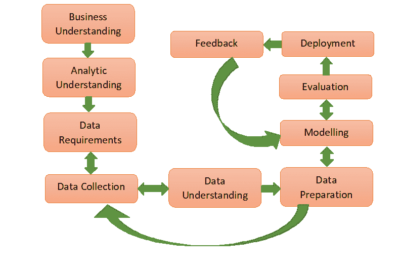

# 数据科学方法和途径

> 原文:[https://www . geesforgeks . org/data-science-method-and-approach/](https://www.geeksforgeeks.org/data-science-methodology-and-approach/)

从事数据科学工作并每天忙于寻找不同问题答案的人遇到了数据科学方法论。数据科学方法论指出了寻找特定问题解决方案的常规方法。这是一个循环过程，经历一个批评行为，引导业务分析师和数据科学家采取相应的行动。

1.  **业务理解:**
    在解决业务领域的任何问题之前，需要正确理解它。业务理解形成了一个具体的基础，这进一步简化了查询的解析。我们应该清楚我们要解决的确切问题是什么。
2.  **分析理解:**
    基于上述业务理解，应该决定要遵循的分析方法。这些方法可以分为四种类型:描述性方法(当前状态和提供的信息)、诊断性方法(也称为统计分析，正在发生什么以及为什么发生)、预测性方法(它预测趋势或未来事件的概率)和说明性方法(问题应该如何实际解决)。
3.  **数据要求:**
    上述选择的分析方法指出了需要收集的必要数据内容、格式和来源。在数据需求的过程中，应该找到“什么”、“在哪里”、“什么时候”、“为什么”、“如何”、“T3”、“谁”等问题的答案。
4.  **数据采集:**
    采集的数据可以任意格式获取。因此，根据所选择的方法和要获得的输出，应该验证收集的数据。因此，如果需要，人们可以收集更多的数据或丢弃不相关的数据。
5.  **数据理解:**
    数据理解回答问题“收集的数据是否代表待解决的问题？”。描述性统计计算应用于数据的度量，以访问内容和内容质量。这一步可能会导致回到上一步进行校正。
6.  **数据准备:**
    我们把这个概念和两个类比联系起来理解一下。一是洗新鲜采摘的蔬菜，二是自助餐时只拿想吃的东西放在盘子里。清洗蔬菜表明从数据中去除了污垢，即不需要的物质。这里完成了噪声去除。如果我们不需要具体的数据，那么我们就不应该考虑进一步的处理。整个过程包括转换、规范化等。
7.  **造型:**
    造型决定为加工准备的数据是否合适或者需要更多的整理和调味。这一阶段的重点是建立预测/描述模型。
8.  **评估:**
    模型评估在模型开发过程中完成。它检查要评估的模型的质量，以及它是否满足业务需求。它经历诊断测量阶段(模型按预期工作，需要修改的地方)和统计显著性测试阶段(确保正确的数据处理和解释)。
9.  **部署:**
    随着模型的有效评估，它已经准备好在商业市场中部署。部署阶段检查模型在外部环境中能承受多大的压力，并与其他模型相比表现优异。
10.  **反馈:**
    反馈是必要的目的，有助于完善模型并评估其性能和影响。反馈中涉及的步骤定义了评审过程，跟踪记录，衡量有效性，并通过改进进行评审。

在成功消除这 10 个步骤后，模型不应被置之不理，而应根据反馈和部署进行适当的更新。随着新技术的出现，应审查新趋势，以便模型持续为解决方案提供价值。