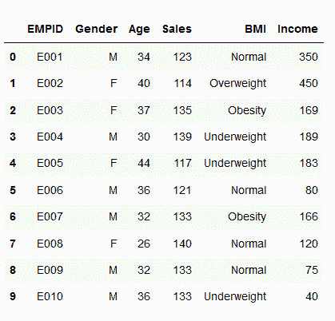
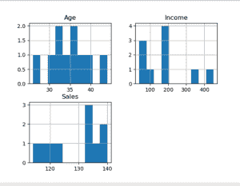
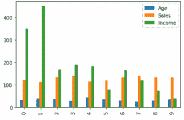
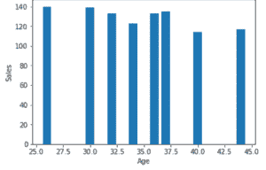
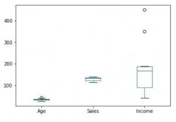
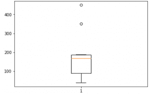
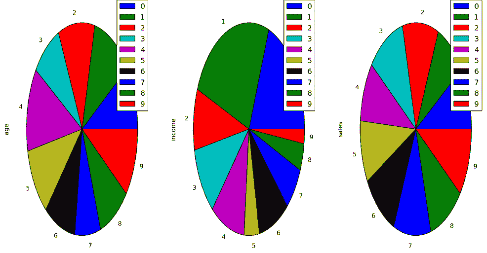
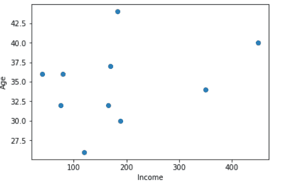

# Python 中不同图表的数据可视化

> 原文:[https://www . geesforgeks . org/data-visualization-different-charts-python/](https://www.geeksforgeeks.org/data-visualization-different-charts-python/)

数据可视化是以图形格式呈现数据。它通过以简单易懂的格式总结和呈现海量数据，帮助人们理解数据的意义，并帮助清晰有效地交流信息。

*考虑这个给定的数据集，我们将为其绘制不同的图表:*


**Different Types of Charts for Analyzing & Presenting Data**

**1。直方图:**
直方图表示特定现象发生的频率，这些现象位于特定的值范围内，并以连续和固定的间隔排列。

在下面的代码中，绘制了`Age, Income, Sales`的直方图。因此，输出中的这些图显示了每个属性的每个唯一值的频率。

```py
# import pandas and matplotlib
import pandas as pd
import matplotlib.pyplot as plt

# create 2D array of table given above
data = [['E001', 'M', 34, 123, 'Normal', 350],
        ['E002', 'F', 40, 114, 'Overweight', 450],
        ['E003', 'F', 37, 135, 'Obesity', 169],
        ['E004', 'M', 30, 139, 'Underweight', 189],
        ['E005', 'F', 44, 117, 'Underweight', 183],
        ['E006', 'M', 36, 121, 'Normal', 80],
        ['E007', 'M', 32, 133, 'Obesity', 166],
        ['E008', 'F', 26, 140, 'Normal', 120],
        ['E009', 'M', 32, 133, 'Normal', 75],
        ['E010', 'M', 36, 133, 'Underweight', 40] ]

# dataframe created with
# the above data array
df = pd.DataFrame(data, columns = ['EMPID', 'Gender', 
                                    'Age', 'Sales',
                                    'BMI', 'Income'] )

# create histogram for numeric data
df.hist()

# show plot
plt.show()
```

**输出:**


**2。柱形图:**
柱形图用于显示不同属性之间的比较，也可以显示项目随时间的比较。

```py
# Dataframe of previous code is used here

# Plot the bar chart for numeric values
# a comparison will be shown between
# all 3 age, income, sales
df.plot.bar()

# plot between 2 attributes
plt.bar(df['Age'], df['Sales'])
plt.xlabel("Age")
plt.ylabel("Sales")
plt.show()
```

**输出:**
 

**3。箱线图:**
箱线图是基于 `minimum, first quartile, median, third quartile, and maximum`的统计数据的图形表示。术语“方框图”来源于这样一个事实，即图表看起来像一个矩形，线条从顶部和底部延伸。因为有延伸线，这种类型的图有时被称为盒须图。关于分位数和中位数，请参考此[分位数和中位数](https://www-users.york.ac.uk/~mb55/intro/quantile.htm)。

```py
# For each numeric attribute of dataframe
df.plot.box()

# individual attribute box plot
plt.boxplot(df['Income'])
plt.show()
```

**输出:**
 

**4。饼图:**
饼图显示了一个静态数字，以及类别如何代表整体的一部分，即某物的组成。饼图以百分比表示数字，所有分段的总和必须等于 100%。

```py
plt.pie(df['Age'], labels = {"A", "B", "C",
                             "D", "E", "F",
                             "G", "H", "I", "J"},

autopct ='% 1.1f %%', shadow = True)
plt.show()

plt.pie(df['Income'], labels = {"A", "B", "C",
                                "D", "E", "F",
                                "G", "H", "I", "J"},

autopct ='% 1.1f %%', shadow = True)
plt.show()

plt.pie(df['Sales'], labels = {"A", "B", "C",
                               "D", "E", "F",
                               "G", "H", "I", "J"},
autopct ='% 1.1f %%', shadow = True)
plt.show()
```

**输出:**


**5。散点图:**
散点图显示两个不同变量之间的关系，可以揭示分布趋势。当有许多不同的数据点，并且您希望突出显示数据集中的相似之处时，应该使用它。这在寻找异常值和了解数据分布时非常有用。

```py
# scatter plot between income and age
plt.scatter(df['income'], df['age'])
plt.show()

# scatter plot between income and sales
plt.scatter(df['income'], df['sales'])
plt.show()

# scatter plot between sales and age
plt.scatter(df['sales'], df['age'])
plt.show()
```

**输出:**
