# 使用 Python 进行数据可视化

> 原文:[https://www . geesforgeks . org/data-visualization-with-python/](https://www.geeksforgeeks.org/data-visualization-with-python/)

在当今世界，大量数据每天都在生成。有时为了分析这些数据的某些趋势，如果数据是原始格式，模式可能会变得困难。为了克服这一点，数据可视化开始发挥作用。数据可视化为数据提供了良好的、有组织的图形表示，使其更容易理解、观察和分析。在本教程中，我们将讨论如何使用 Python 可视化数据。


Python 提供了各种库，这些库具有不同的可视化数据的功能。所有这些库都有不同的特性，可以支持各种类型的图形。在本教程中，我们将讨论四个这样的库。

*   Matplotlib
*   希伯恩
*   Bokeh
*   阴谋地

我们将逐一讨论这些库，并将绘制一些最常用的图表。

**注意:**如果你想深入了解这些库的信息，可以按照他们完整的教程进行。

在深入这些库之前，首先，我们需要一个数据库来绘制数据。我们将使用[提示数据库](https://media.geeksforgeeks.org/wp-content/uploads/tips.csv)来完成本教程。让我们讨论一下这个数据库。

## 使用的数据库

### 提示数据库

小费数据库是 20 世纪 90 年代初顾客在一家餐馆两个半月给小费的记录。它包含总账单、小费、性别、吸烟者、日期、时间、大小等 6 列。

可以从[这里](https://media.geeksforgeeks.org/wp-content/uploads/tips.csv)下载 tips 数据库。

**示例:**

## 蟒蛇 3

```py
import pandas as pd

# reading the database
data = pd.read_csv("tips.csv")

# printing the top 10 rows
display(data.head(10))
```

**输出:**

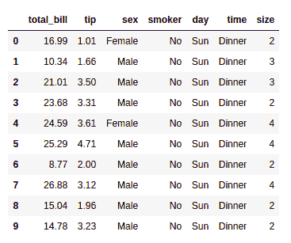

## Matplotlib

Matplotlib 是一个易于使用的低级数据可视化库，构建在 NumPy 数组上。它由散点图、线图、直方图等各种图组成。Matplotlib 提供了很大的灵活性。

要安装此软件，请在终端中键入以下命令。

```py
pip install matplotlib
```

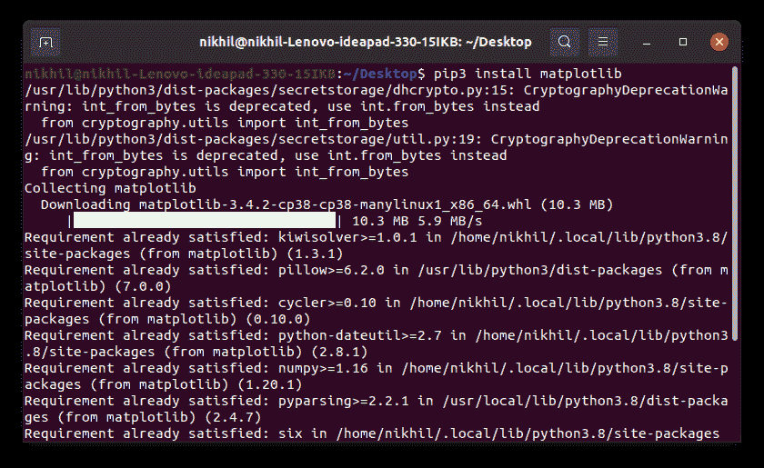

> 参考下面的文章来获得更多关于用 Matplotlib 设置环境的信息。
> 
> *   【Matplotlib 的环境设置
> *   [使用 Matplotlib 搭配 Jupyter 笔记本](https://www.geeksforgeeks.org/using-matplotlib-with-jupyter-notebook/)

安装 Matplotlib 后，让我们看看使用这个库最常用的图。

### 散点图

散点图用于观察变量之间的关系，并使用点来表示变量之间的关系。matplotlib 库中的 [**散点图()**](https://www.geeksforgeeks.org/matplotlib-pyplot-scatter-in-python/) 方法用于绘制散点图。

**示例:**

## 蟒蛇 3

```py
import pandas as pd
import matplotlib.pyplot as plt

# reading the database
data = pd.read_csv("tips.csv")

# Scatter plot with day against tip
plt.scatter(data['day'], data['tip'])

# Adding Title to the Plot
plt.title("Scatter Plot")

# Setting the X and Y labels
plt.xlabel('Day')
plt.ylabel('Tip')

plt.show()
```

**输出:**

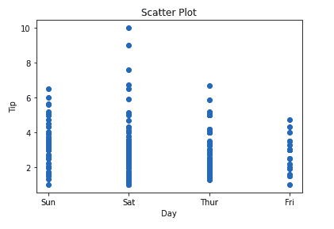

如果我们可以添加颜色并改变点的大小，这个图会更有意义。我们可以分别使用散点函数的 **c 和 s** 参数****来实现。我们也可以使用 [colorbar()](https://www.geeksforgeeks.org/matplotlib-pyplot-colorbar-function-in-python/) 方法显示颜色条。****

******示例:******

## ****蟒蛇 3****

```py
**import pandas as pd
import matplotlib.pyplot as plt

# reading the database
data = pd.read_csv("tips.csv")

# Scatter plot with day against tip
plt.scatter(data['day'], data['tip'], c=data['size'], 
            s=data['total_bill'])

# Adding Title to the Plot
plt.title("Scatter Plot")

# Setting the X and Y labels
plt.xlabel('Day')
plt.ylabel('Tip')

plt.colorbar()

plt.show()**
```

******输出:******

****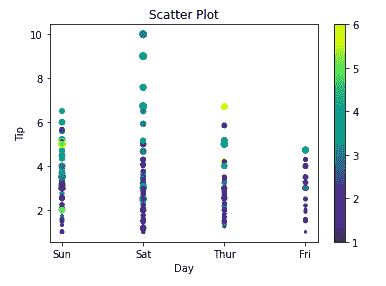****

### ****折线图****

****[折线图](https://www.geeksforgeeks.org/line-chart-in-matplotlib-python/)用于表示不同轴上的两个数据 X 和 Y 之间的关系。使用**绘图()**功能绘制。让我们看看下面的例子。****

******示例:******

## ****蟒蛇 3****

```py
**import pandas as pd
import matplotlib.pyplot as plt

# reading the database
data = pd.read_csv("tips.csv")

# Scatter plot with day against tip
plt.plot(data['tip'])
plt.plot(data['size'])

# Adding Title to the Plot
plt.title("Scatter Plot")

# Setting the X and Y labels
plt.xlabel('Day')
plt.ylabel('Tip')

plt.show()**
```

******输出:******

****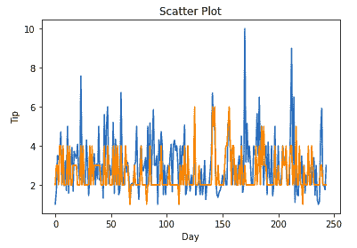****

### ****条形图****

****[条形图](https://www.geeksforgeeks.org/bar-plot-in-matplotlib/)或条形图是一种用矩形条表示数据类别的图形，矩形条的长度和高度与它们所代表的值成比例。可以使用**栏()**方法创建。****

******示例:******

## ****蟒蛇 3****

```py
**import pandas as pd
import matplotlib.pyplot as plt

# reading the database
data = pd.read_csv("tips.csv")

# Bar chart with day against tip
plt.bar(data['day'], data['tip'])

plt.title("Bar Chart")

# Setting the X and Y labels
plt.xlabel('Day')
plt.ylabel('Tip')

# Adding the legends
plt.show()**
```

******输出:******

****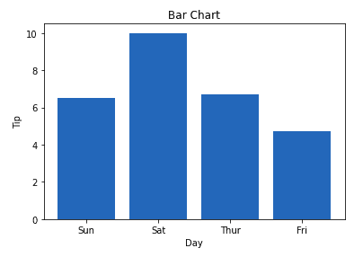****

### ****柱状图****

****A [直方图](https://www.geeksforgeeks.org/plotting-histogram-in-python-using-matplotlib/)基本上是用来表示一些组的形式的数据。这是一种条形图，其中 X 轴表示面元范围，而 Y 轴给出频率信息。 [**hist()**](https://www.geeksforgeeks.org/matplotlib-pyplot-hist-in-python/) 函数用于计算和创建直方图。在直方图中，如果我们传递分类数据，那么它将自动计算该数据的频率，即每个值出现的频率。****

******示例:******

## ****蟒蛇 3****

```py
**import pandas as pd
import matplotlib.pyplot as plt

# reading the database
data = pd.read_csv("tips.csv")

# hostogram of total_bills
plt.hist(data['total_bill'])

plt.title("Histogram")

# Adding the legends
plt.show()**
```

******输出:******

****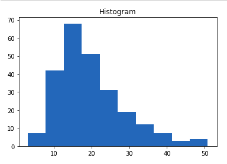****

> ******注意:**完整的 Matplotlib 教程，参考 [Matplotlib 教程](https://www.geeksforgeeks.org/matplotlib-tutorial/)****

## ****希伯恩****

******Seaborn** 是建立在 Matplotlib 之上的高级界面。它提供了漂亮的设计风格和调色板，使图形更具吸引力。****

****要安装 seaborn，请在终端中键入以下命令。****

```py
**pip install seaborn**
```

****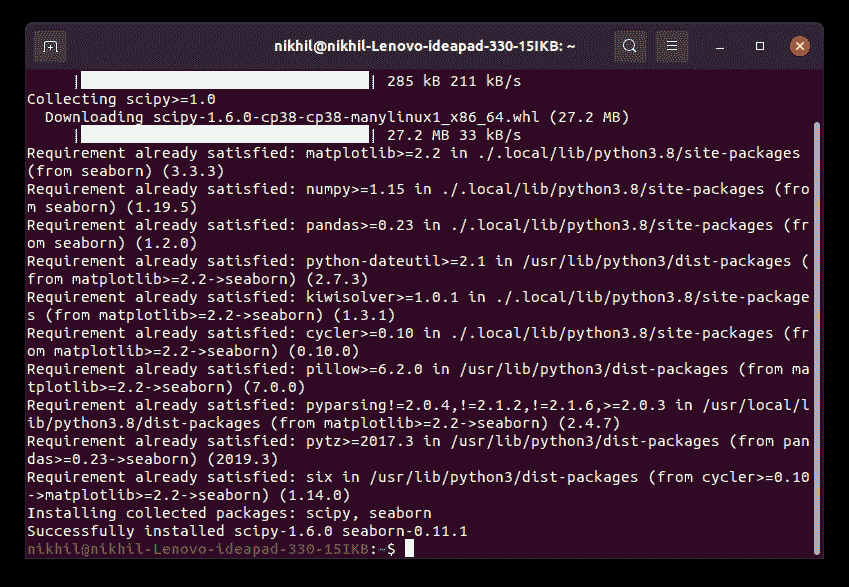****

****Seaborn 建立在 Matplotlib 之上，因此它也可以和 Matplotlib 一起使用。同时使用 Matplotlib 和 Seaborn 是一个非常简单的过程。我们只需要正常调用 Seaborn 标绘功能，然后就可以使用 Matplotlib 的定制功能了。****

******注意:** Seaborn 自带 tips、iris 等数据集。但是为了本教程，我们将使用 Pandas 来加载这些数据集。****

******示例:******

## ****蟒蛇 3****

```py
**# importing packages
import seaborn as sns
import matplotlib.pyplot as plt
import pandas as pd

# reading the database
data = pd.read_csv("tips.csv")

# draw lineplot
sns.lineplot(x="sex", y="total_bill", data=data)

# setting the title using Matplotlib
plt.title('Title using Matplotlib Function')

plt.show()**
```

******输出:******

****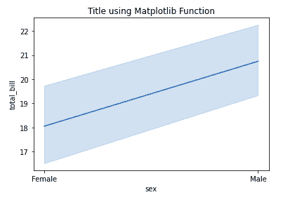****

### ****散点图****

****[散点图](https://www.geeksforgeeks.org/scatterplot-using-seaborn-in-python/)使用**散点图()**方法绘制。这类似于 Matplotlib，但需要额外的参数数据。****

******示例:******

## ****蟒蛇 3****

```py
**# importing packages
import seaborn as sns
import matplotlib.pyplot as plt
import pandas as pd

# reading the database
data = pd.read_csv("tips.csv")

sns.scatterplot(x='day', y='tip', data=data,)
plt.show()**
```

******输出:******

****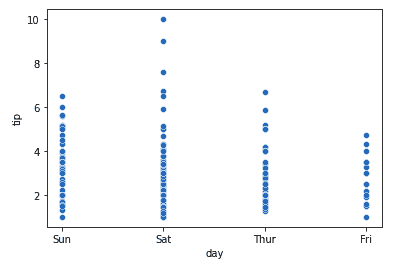****

****你会发现，在使用 Matplotlib 的时候，如果你想根据性别给这个图的每个点上色，会很困难。但是在散点图中，可以借助色调参数来完成。****

******示例:******

## ****蟒蛇 3****

```py
**# importing packages
import seaborn as sns
import matplotlib.pyplot as plt
import pandas as pd

# reading the database
data = pd.read_csv("tips.csv")

sns.scatterplot(x='day', y='tip', data=data,
               hue='sex')
plt.show()**
```

******输出:******

****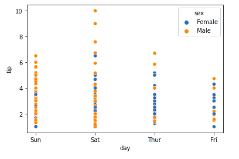****

### ****线图****

****使用 [**线形图()**](https://www.geeksforgeeks.org/seaborn-lineplot-method-in-python/) 方法在锡伯恩绘制线形图。在这种情况下，我们也只能传递数据参数。****

******示例:******

## ****蟒蛇 3****

```py
**# importing packages
import seaborn as sns
import matplotlib.pyplot as plt
import pandas as pd

# reading the database
data = pd.read_csv("tips.csv")

sns.lineplot(x='day', y='tip', data=data)
plt.show()**
```

******输出:******

****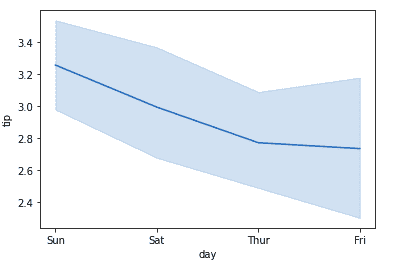****

******例 2:******

## ****蟒蛇 3****

```py
**# importing packages
import seaborn as sns
import matplotlib.pyplot as plt
import pandas as pd

# reading the database
data = pd.read_csv("tips.csv")

# using only data attribute
sns.lineplot(data=data.drop(['total_bill'], axis=1))
plt.show()**
```

******输出:******

****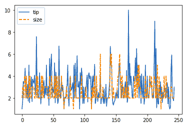****

### ****条形图****

****可以使用 [**barplot()**](https://www.geeksforgeeks.org/seaborn-barplot-method-in-python/) 方法在 Seaborn 中创建 [Bar Plot。](https://www.geeksforgeeks.org/barplot-using-seaborn-in-python/)****

******示例:******

## ****蟒蛇 3****

```py
**# importing packages
import seaborn as sns
import matplotlib.pyplot as plt
import pandas as pd

# reading the database
data = pd.read_csv("tips.csv")

sns.barplot(x='day',y='tip', data=data, 
            hue='sex')

plt.show()**
```

******输出:******

****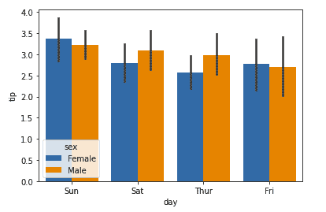****

### ****柱状图****

****可以使用 **histplot()** 功能绘制 Seaborn 中的直方图。****

******示例:******

## ****蟒蛇 3****

```py
**# importing packages
import seaborn as sns
import matplotlib.pyplot as plt
import pandas as pd

# reading the database
data = pd.read_csv("tips.csv")

sns.histplot(x='total_bill', data=data, kde=True, hue='sex')

plt.show()**
```

******输出:******

****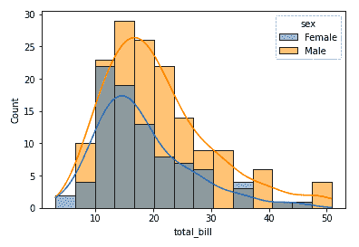****

****看完所有这些图后，你一定注意到使用 Seaborn 定制图比使用 Matplotlib 容易得多。它也建立在 matplotlib 的基础上，我们也可以在使用 Seaborn 的同时使用 matplotlib 函数。****

> ******注意:**关于完整的海博恩教程，请参考[蟒蛇海博恩教程](https://www.geeksforgeeks.org/python-seaborn-tutorial/)****

## ****Bokeh****

****让我们进入我们列表中的第三个库。Bokeh 主要以其交互式图表可视化而闻名。Bokeh 使用 HTML 和 JavaScript 渲染其情节，使用现代网络浏览器呈现优雅、简洁的新颖图形结构，具有高级交互性。****

****要安装此软件，请在终端中键入以下命令。****

```py
**pip install bokeh**
```

****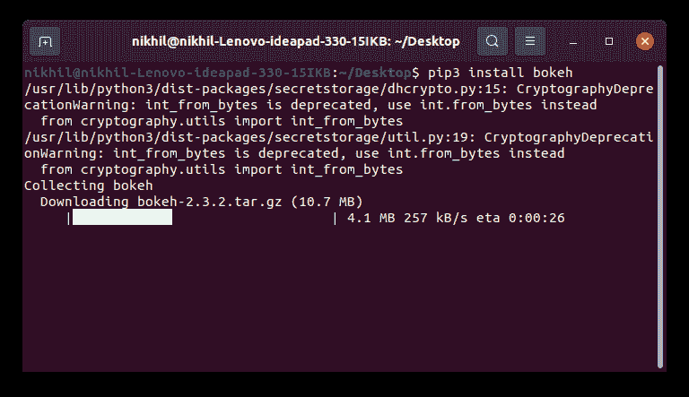****

### ****散点图****

****[可以使用绘图模块的散点图()方法绘制博克的散点图](https://www.geeksforgeeks.org/python-bokeh-plotting-a-scatter-plot-on-a-graph/)。这里分别传递 x 和 y 坐标。****

******示例:******

## ****蟒蛇 3****

```py
**# importing the modules
from bokeh.plotting import figure, output_file, show
from bokeh.palettes import magma
import pandas as pd

# instantiating the figure object
graph = figure(title = "Bokeh Scatter Graph")

# reading the database
data = pd.read_csv("tips.csv")

color = magma(256)

# plotting the graph
graph.scatter(data['total_bill'], data['tip'], color=color)

# displaying the model
show(graph)**
```

******输出:******

****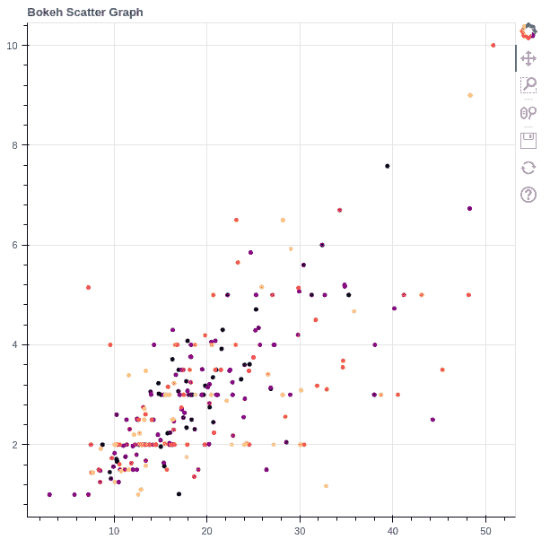****

### ****折线图****

****可以使用绘图模块的 line()方法创建[线图](https://www.geeksforgeeks.org/python-bokeh-plotting-a-line-graph/)。****

******示例:******

## ****蟒蛇 3****

```py
**# importing the modules
from bokeh.plotting import figure, output_file, show
import pandas as pd

# instantiating the figure object
graph = figure(title = "Bokeh Bar Chart")

# reading the database
data = pd.read_csv("tips.csv")

# Count of each unique value of
# tip column
df = data['tip'].value_counts()

# plotting the graph
graph.line(df, data['tip'])

# displaying the model
show(graph)**
```

******输出:******

****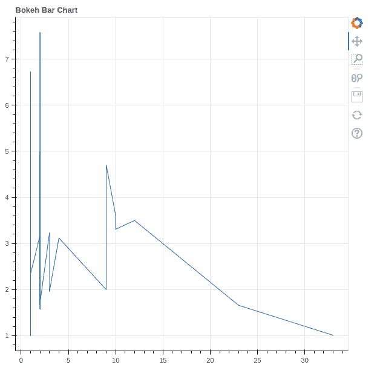****

### ****条形图****

****条形图有两种类型:水平条形图和垂直条形图。每个都可以分别使用绘图界面的 hbar()和 vbar()函数创建。****

******示例:******

## ****蟒蛇 3****

```py
**# importing the modules
from bokeh.plotting import figure, output_file, show
import pandas as pd

# instantiating the figure object
graph = figure(title = "Bokeh Bar Chart")

# reading the database
data = pd.read_csv("tips.csv")

# plotting the graph
graph.vbar(data['total_bill'], top=data['tip'])

# displaying the model
show(graph)**
```

******输出:******

****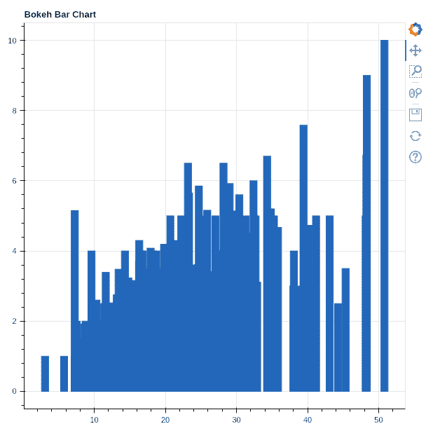****

### ****交互式数据可视化****

****Bokeh 的一个关键特点是为情节增加了互动性。让我们看看可以添加的各种交互。****

#### ****[**互动传说**](https://www.geeksforgeeks.org/python-bokeh-making-interactive-legends/)****

******click_policy** 属性使图例具有交互性。有两种类型的交互性–****

*   ******隐藏:**隐藏字形。****
*   ******静音:**隐藏字形使其完全消失，另一方面，静音字形只是根据参数去强调字形。****

******示例:******

## ****蟒蛇 3****

```py
**# importing the modules
from bokeh.plotting import figure, output_file, show
import pandas as pd

# instantiating the figure object
graph = figure(title = "Bokeh Bar Chart")

# reading the database
data = pd.read_csv("tips.csv")

# plotting the graph
graph.vbar(data['total_bill'], top=data['tip'], 
           legend_label = "Bill VS Tips", color='green')

graph.vbar(data['tip'], top=data['size'], 
           legend_label = "Tips VS Size", color='red')

graph.legend.click_policy = "hide"

# displaying the model
show(graph)**
```

******输出:******

****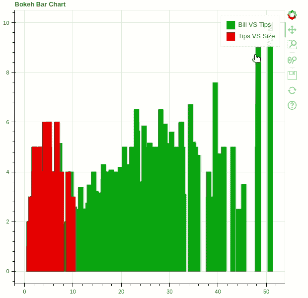****

#### ****添加小部件****

****Bokeh 提供了类似于 HTML 表单的图形用户界面功能，如按钮、滑块、复选框等。这些为绘图提供了交互式界面，允许更改绘图参数、修改绘图数据等。让我们看看如何使用和添加一些常用的小部件。****

*   ******按钮:**这个小部件在图中添加了一个简单的按钮小部件。我们必须向 models 类的 CustomJS()方法传递一个自定义的 JavaScript 函数。****
*   ******复选框组:**向绘图中添加标准复选框。与按钮类似，我们必须将自定义的 JavaScript 函数传递给 models 类的 CustomJS()方法。****
*   ******RadioGroup:** 增加一个简单的单选按钮，接受自定义的 JavaScript 函数。****

******示例:******

## ****蟒蛇 3****

```py
**from bokeh.io import show
from bokeh.models import Button, CheckboxGroup, RadioGroup, CustomJS

button = Button(label="GFG")

button.js_on_click(CustomJS(
    code="console.log('button: click!', this.toString())"))

# Labels for checkbox and radio
# buttons
L = ["First", "Second", "Third"]

# the active parameter sets checks the selected value
# by default
checkbox_group = CheckboxGroup(labels=L, active=[0, 2])

checkbox_group.js_on_click(CustomJS(code="""
    console.log('checkbox_group: active=' + this.active, this.toString())
"""))

# the active parameter sets checks the selected value
# by default
radio_group = RadioGroup(labels=L, active=1)

radio_group.js_on_click(CustomJS(code="""
    console.log('radio_group: active=' + this.active, this.toString())
"""))

show(button)
show(checkbox_group)
show(radio_group)**
```

******输出:******

**** 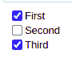 ****

******注意:**所有这些按钮都将在新的选项卡上打开。****

*   ******滑块:**向绘图中添加滑块。它还需要一个自定义的 JavaScript 函数。****

******示例:******

## ****蟒蛇 3****

```py
**from bokeh.io import show
from bokeh.models import CustomJS, Slider

slider = Slider(start=1, end=20, value=1, step=2, title="Slider")

slider.js_on_change("value", CustomJS(code="""
    console.log('slider: value=' + this.value, this.toString())
"""))

show(slider)**
```

******输出:******

****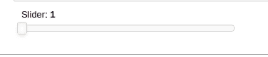****

****类似地，更多的小部件是可用的，比如可以添加下拉菜单或选项卡小部件。****

> ******注意:**完整的 Bokeh 教程，参考 [Python Bokeh 教程-Bokeh 交互数据可视化](https://www.geeksforgeeks.org/python-bokeh-tutorial-interactive-data-visualization-with-bokeh/)****

## ****阴谋地****

****这是我们列表中的最后一个库，你可能想知道为什么。原因如下–****

*   ****Potly 具有悬停工具功能，允许我们检测众多数据点中的任何异常值或异常情况。****
*   ****它允许更多的定制。****
*   ****它使图表在视觉上更有吸引力。****

****要安装它，请在终端中键入以下命令。****

```py
**pip install plotly**
```

********

### ****散点图****

****Plotly 中的[散点图](https://www.geeksforgeeks.org/scatter-plot-using-plotly-in-python/)可以使用 plotly.express 的 [**散点()**](https://www.geeksforgeeks.org/plotly-express-scatter-function-in-python/) 方法创建，和 Seaborn 一样，这里也需要一个额外的数据参数。****

******示例:******

## ****蟒蛇 3****

```py
**import plotly.express as px
import pandas as pd

# reading the database
data = pd.read_csv("tips.csv")

# plotting the scatter chart
fig = px.scatter(data, x="day", y="tip", color='sex')

# showing the plot
fig.show()**
```

******输出:******

****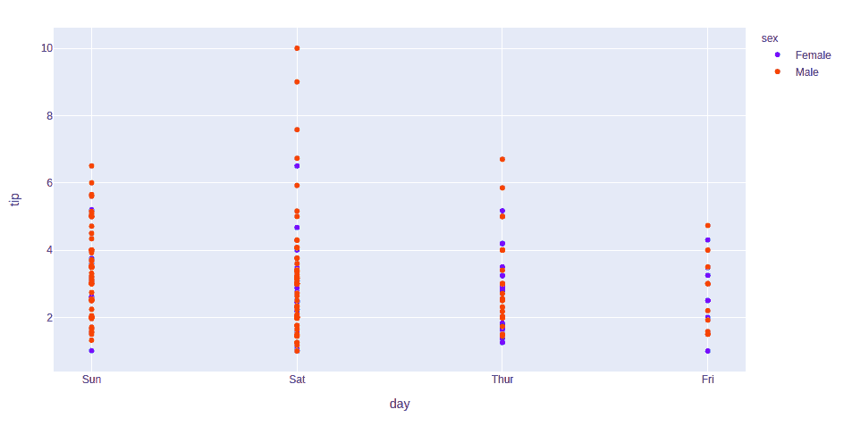****

### ****折线图****

****plotly 中的[线图](https://www.geeksforgeeks.org/line-chart-using-plotly-in-python/)对 Plotly 来说是非常容易访问和显著的补充，它管理各种类型的数据并汇编易于使用的统计数据。用 [**px.line**](https://www.geeksforgeeks.org/plotly-express-line-function-in-python/) 将每个数据位置表示为一个顶点****

******示例:******

## ****蟒蛇 3****

```py
**import plotly.express as px
import pandas as pd

# reading the database
data = pd.read_csv("tips.csv")

# plotting the scatter chart
fig = px.line(data, y='tip', color='sex')

# showing the plot
fig.show()**
```

******输出:******

****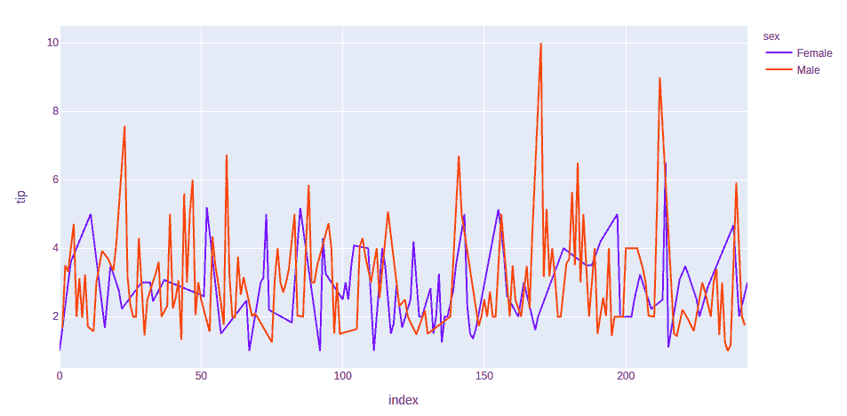****

### ****条形图****

****Plotly 中的条形图可以使用 plotly.express 类的 Bar()方法创建。****

******示例:******

## ****蟒蛇 3****

```py
**import plotly.express as px
import pandas as pd

# reading the database
data = pd.read_csv("tips.csv")

# plotting the scatter chart
fig = px.bar(data, x='day', y='tip', color='sex')

# showing the plot
fig.show()**
```

******输出:******

********

### ****柱状图****

****在 plotly 中，可以使用 plotly.express 类的直方图()函数创建[直方图](https://www.geeksforgeeks.org/histogram-using-plotly-in-python/)。****

******示例:******

## ****蟒蛇 3****

```py
**import plotly.express as px
import pandas as pd

# reading the database
data = pd.read_csv("tips.csv")

# plotting the scatter chart
fig = px.histogram(data, x='total_bill', color='sex')

# showing the plot
fig.show()**
```

******输出:******

****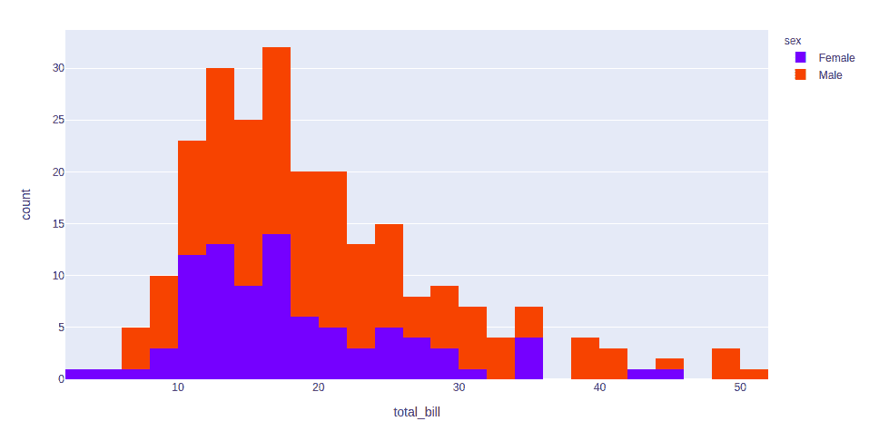****

### ****添加交互****

****就像 Bokeh 一样，plotly 也提供了各种交互。让我们讨论其中的几个。****

****[**创建下拉菜单**](https://www.geeksforgeeks.org/how-to-make-dropdown-menus-in-plotly/) **:下拉菜单是菜单按钮的一部分，一直显示在屏幕上。每个菜单按钮都与一个菜单部件相关联，该部件可以在单击该菜单按钮时显示该菜单按钮的选项。在 plotly 中，使用 updatemenu 方法修改图表有 4 种可能的方法。******

*   ******重新样式:**修改数据或数据属性****
*   ******重新布局:**修改布局属性****
*   ******更新:**修改数据和布局属性****
*   ******动画制作:**开始或暂停动画****

******示例:******

## ****蟒蛇 3****

```py
**import plotly.graph_objects as px
import pandas as pd

# reading the database
data = pd.read_csv("tips.csv")

plot = px.Figure(data=[px.Scatter(
    x=data['day'],
    y=data['tip'],
    mode='markers',)
])

# Add dropdown
plot.update_layout(
    updatemenus=[
        dict(
            buttons=list([
                dict(
                    args=["type", "scatter"],
                    label="Scatter Plot",
                    method="restyle"
                ),
                dict(
                    args=["type", "bar"],
                    label="Bar Chart",
                    method="restyle"
                )
            ]),
            direction="down",
        ),
    ]
)

plot.show()**
```

******输出:******

****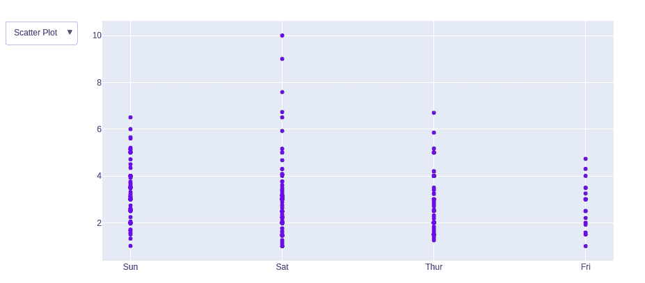****

****[**添加按钮**](https://www.geeksforgeeks.org/how-to-make-custom-buttons-in-plotly/) **:在剧情中，动作自定义按钮用于直接从记录中快速做出动作。自定义按钮可以添加到客户关系管理、市场营销和自定义应用程序的页面布局中。还有 4 种可能的方法可以应用于自定义按钮:******

*   ******重新样式:**修改数据或数据属性****
*   ******重新布局:**修改布局属性****
*   ******更新:**修改数据和布局属性****
*   ******动画制作:**开始或暂停动画****

******示例:******

## ****蟒蛇 3****

```py
**import plotly.graph_objects as px
import pandas as pd

# reading the database
data = pd.read_csv("tips.csv")

plot = px.Figure(data=[px.Scatter(
    x=data['day'],
    y=data['tip'],
    mode='markers',)
])

# Add dropdown
plot.update_layout(
    updatemenus=[
        dict(
            type="buttons",
            direction="left",
            buttons=list([
                dict(
                    args=["type", "scatter"],
                    label="Scatter Plot",
                    method="restyle"
                ),
                dict(
                    args=["type", "bar"],
                    label="Bar Chart",
                    method="restyle"
                )
            ]),
        ),
    ]
)

plot.show()**
```