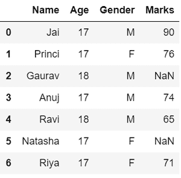

# Python 中的数据角力

> 原文:[https://www.geeksforgeeks.org/data-wrangling-in-python/](https://www.geeksforgeeks.org/data-wrangling-in-python/)

数据争论是收集、收集原始数据并将其转换为另一种格式的过程，以便在更短的时间内更好地理解、决策、访问和分析。数据争论也被称为数据蒙金。


## **数据争论的重要性**

数据争论是非常重要的一步。下面的例子将解释它的重要性:

图书销售网站希望根据用户偏好，展示不同领域的畅销图书。例如，一个新用户搜索励志书籍，然后他们想展示那些销售最多或具有高评价的励志书籍，等等。

但是在他们的网站上，有大量来自不同用户的原始数据。这里使用了数据收集或数据争论的概念。众所周知，数据不会被系统所左右。这个过程是由数据科学家完成的。因此，数据科学家会以这样的方式争论数据，他们会对销量更高或收视率高的励志书籍进行分类，或者用户用这些书籍包购买这本书，等等。在此基础上，新用户将做出选择。这将解释数据争论的重要性。

## **Python 中的数据角力**

数据争论是数据科学和数据分析的一个关键话题。Python 的 Pandas 框架用于数据争论。熊猫是一个专为数据分析和数据科学开发的开源图书馆。数据分类或过滤、数据分组等过程。

python 中的数据争论涉及以下功能:

1.  **数据探索:**在这个过程中，通过数据的可视化表示来研究、分析和理解数据。
2.  **处理缺失值:**大多数具有大量数据的数据集包含 *NaN 的缺失值，需要通过用平均值、模式、列的最频繁值替换它们或者简单地删除具有 *NaN* 值的行来小心**。*
3.  ***重塑数据:**在这个过程中，根据需求对数据进行操作，可以添加新数据，也可以修改已有数据。*
4.  ***过滤数据:**有时数据集包含需要删除或过滤的不需要的行或列*
5.  ***其他:**在处理具有上述功能的原始数据集之后，我们根据我们的需求得到一个高效的数据集，然后它可以用于所需的目的，如数据分析、机器学习、数据可视化、模型训练等。*

#### *下面是一个在原始数据集上实现上述功能的示例:*

*   ***数据探索**，这里我们分配数据，然后我们以表格形式可视化数据。*

## *蟒蛇 3*

```py
*# Import pandas package
import pandas as pd

# Assign data
data = {'Name': ['Jai', 'Princi', 'Gaurav',
                 'Anuj', 'Ravi', 'Natasha', 'Riya'],
        'Age': [17, 17, 18, 17, 18, 17, 17],
        'Gender': ['M', 'F', 'M', 'M', 'M', 'F', 'F'],
        'Marks': [90, 76, 'NaN', 74, 65, 'NaN', 71]}

# Convert into DataFrame
df = pd.DataFrame(data)

# Display data
df*
```

***输出:***

**

*   ***处理缺失值**，从前面的输出中我们可以看到， *MARKS* 列中存在 *NaN* 值，将通过用列平均值替换它们来处理这些值。*

## *蟒蛇 3*

```py
*# Compute average
c = avg = 0
for ele in df['Marks']:
    if str(ele).isnumeric():
        c += 1
        avg += ele
avg /= c

# Replace missing values
df = df.replace(to_replace="NaN",
                value=avg)

# Display data
df*
```