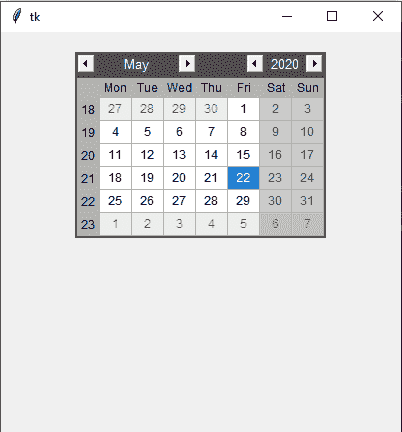
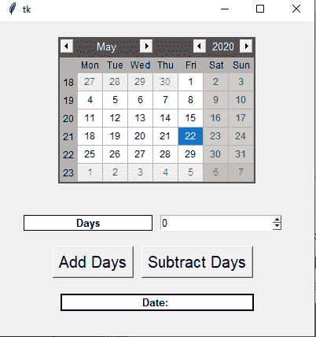

# 使用 Tkinter-Python 加减天数的日期计算器

> 原文:[https://www . geeksforgeeks . org/date-使用-tkinter-python 加减天数计算器/](https://www.geeksforgeeks.org/date-calculator-for-adding-and-subtracting-days-using-tkinter-python/)

**先决条件:**[Tkinter](https://www.geeksforgeeks.org/python-gui-tkinter/)[Tkinter](https://www.geeksforgeeks.org/create-a-date-picker-calendar-tkinter/)中的 tkcalendar，[日期时间](https://www.geeksforgeeks.org/python-datetime-module-with-examples/)

Python 为开发图形用户界面提供了多个选项。在所有的 GUI 方法中，Tkinter 是最常用的方法。它是 Python 附带的 Tk 图形用户界面工具包的标准 Python 接口。Python 搭配 Tkinter 是创建 GUI 应用程序最快最简单的方法。

在本文中，我们将看到如何在 Tkinter 中创建从日期开始的天数计算器，从日期开始的天数计算器用于从所选日期中添加或减去天数，以获得新的日期。这个计算器用来得到给定天数后的确切日期。

让我们了解逐步实现:

**1。创建普通 Tkinter 窗口并添加日历**

## 蟒蛇 3

```
# Import Required Library
from tkinter import *
from tkcalendar import Calendar

# Create Object
root = Tk()

# Set geometry
root.geometry("400x400")

# Add Calendar
cal = Calendar(root, selectmode = 'day',
            year = 2020, month = 5,
            day = 22)

cal.pack(pady = 20)

# Execute Tkinter
root.mainloop()
```

**输出:**



**2。添加按钮和标签**

## 蟒蛇 3

```
# Import Required Library
from tkinter import *
from tkcalendar import Calendar
import datetime

# Create Object
root = Tk()

# Set geometry
root.geometry("400x400")

# Add Calendar
cal = Calendar(root, selectmode='day',
               year=2020, month=5,
               day=22)

cal.pack(pady=20)

frame1 = Frame()
frame2 = Frame()

frame1.pack()
frame2.pack()

# making label
Label(frame1, text="Days", bd=1, bg="white", width=20,
      relief="solid", font="italic 10 bold").pack(side=LEFT)

# input for days
days = Spinbox(frame1, from_=0, to=10000000, font="italic 10")
days.pack(pady=20, padx=10)

# making buttons
Button(frame2, text="Add Days", font="italic 15").pack(side=LEFT)
Button(frame2, text="Subtract Days", font="italic 15").pack(padx=10)

# making label
converted_date = Label(text="Date: ", bd=2, bg="white", relief="solid",
                       font="italic 10 bold", width=30)
converted_date.pack(pady=20)

# Execute Tkinter
root.mainloop()
```

**输出:**



**3。给按钮增加功能**

**步骤:**

*   使用 **get_date()** 方法从日历中抓取所选日期。
*   使用**日期时间**模块中的 **strptime()** 方法将日期转换为不同的时间格式
*   然后我们将从日期中加上/减去天数。

```
def add_days(): 

    date_1 = datetime.datetime.strptime(cal.get_date(), "%m/%d/%y")
    end_date = date_1 + datetime.timedelta(days=int(days.get()))
    converted_date.config(text=f"Date: {end_date.strftime('%m/%d/%Y')}")

def subtract_days(): 

    date_1 = datetime.datetime.strptime(cal.get_date(), "%m/%d/%y")
    end_date = date_1 - datetime.timedelta(days=int(days.get()))
    converted_date.config(text=f"Date: {end_date.strftime('%m/%d/%Y')}")
```

**下面是实现:-**

## 蟒蛇 3

```
# Import Required Library
from tkinter import *
from tkcalendar import Calendar
import datetime

# Create Object
root = Tk()

# Set geometry
root.geometry("400x400")

# Add Calendar
cal = Calendar(root, selectmode = 'day',
            year = 2020, month = 5,
            day = 22)

cal.pack(pady = 20)

# method to add days
def add_days():

    date_1 = datetime.datetime.strptime(cal.get_date(), "%m/%d/%y")

    end_date = date_1 + datetime.timedelta(days=int(days.get()))

    converted_date.config(text=f"Date: {end_date.strftime('%m/%d/%Y')}")

# method to subtract days
def subtract_days():

    date_1 = datetime.datetime.strptime(cal.get_date(), "%m/%d/%y")

    end_date = date_1 - datetime.timedelta(days=int(days.get()))

    converted_date.config(text=f"Date: {end_date.strftime('%m/%d/%Y')}")

frame1 = Frame()
frame2 = Frame()

frame1.pack()
frame2.pack()

# making label
Label(frame1, text="Days", bd=1, bg="white", width=20, relief="solid",
      font="italic 10 bold").pack(side=LEFT)

# making spinbox
days = Spinbox(frame1, from_= 0, to = 10000000, font="italic 10")
days.pack(pady=20,padx=10)

# making buttons
Button(frame2, text = "Add Days",
    command = add_days,font="italic 15").pack(side=LEFT)
Button(frame2, text = "Subtract Days",
    command = subtract_days,font="italic 15").pack(padx=10)

# making label
converted_date = Label(text="Date: ", bd=2, bg="white",relief="solid",
                       font="italic 10 bold", width=30)
converted_date.pack(pady=20)

# Execute Tkinter
root.mainloop()
```

**输出:**

<video class="wp-video-shortcode" id="video-548680-1" width="640" height="360" preload="metadata" controls=""><source type="video/mp4" src="https://media.geeksforgeeks.org/wp-content/uploads/20210126121810/FreeOnlineScreenRecorderProject1.mp4?_=1">[https://media.geeksforgeeks.org/wp-content/uploads/20210126121810/FreeOnlineScreenRecorderProject1.mp4](https://media.geeksforgeeks.org/wp-content/uploads/20210126121810/FreeOnlineScreenRecorderProject1.mp4)</video>