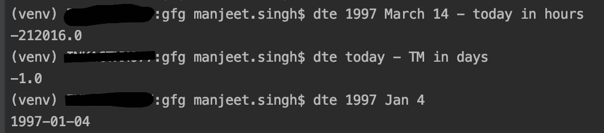
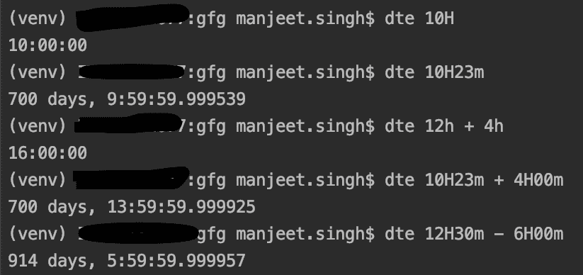
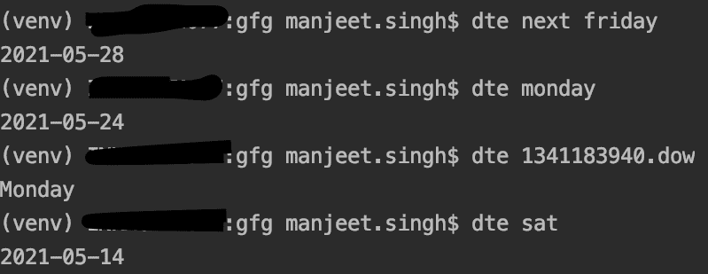
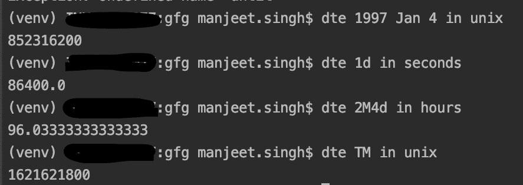
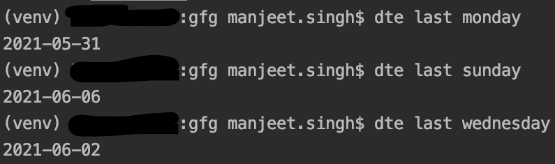
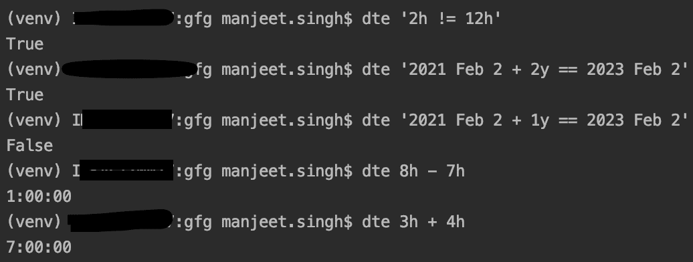
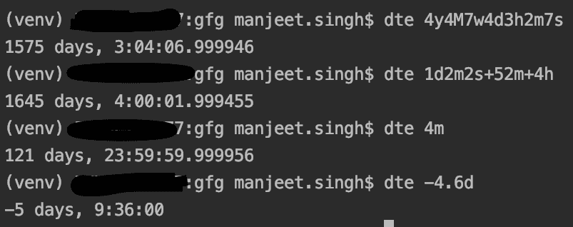

# python 中的日期时间表达式(dte)模块

> 原文:[https://www . geesforgeks . org/date-time-expression-DTE-module-in-python/](https://www.geeksforgeeks.org/date-time-expression-dte-module-in-python/)

在本文中，我们将讨论如何在命令行中使用 Python 处理和处理日期和时间。Python 为此提供了 dte 模块。本模块具有以下功能–

*   它能识别英语的月、周和地区名称。
*   它工作在最先出现的最高单位–2021–12-24(yyyy-MM-DD)。

### 装置

这个模块没有内置 Python。要安装此软件，请在终端中键入以下命令

```py
pip install dte
pip install appdirs
```

**示例 1:使用日期**

*   今天
*   YD:昨天
*   TM:明天
*   现在



使用日期

**例 2:与时间一起工作**



玩弄时间

**示例 3:工作日工作**



展示工作日

**注意:** dow 取 unix 时间戳，返回对应的星期几。

### **在关键字**中

它有两个目的。转换时间格式，如今天的秒。还转换 Unix 时间戳中的时间点。



示例用法–在运算符中

### **处理极端情况**

在这种情况下，我们使用' last '运算符从当前时间获取最后一个工作日的日期。

> **语法:** dte 最后一个[工作日]



最后工作

### **与操作员合作**

dte 库支持日期的加法和减法，甚至一些比较操作，如–

*   **+ :** 添加日期。
*   **–:**取日期差并存储差值。
*   **<、< =、>、==、！= :** 比较两个时间点并返回一个布尔值。

**示例:**



使用运算符的示例

### **使用增量**

delta 是一个时间 delta 对象，由【数+单位】无空格链接在一起而成。

**示例:**



与达美航空合作