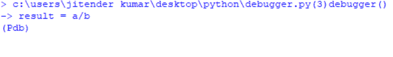
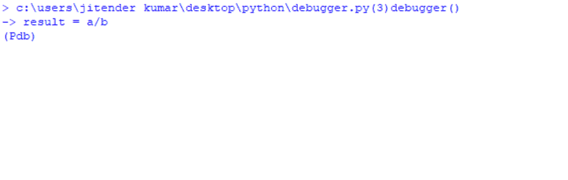
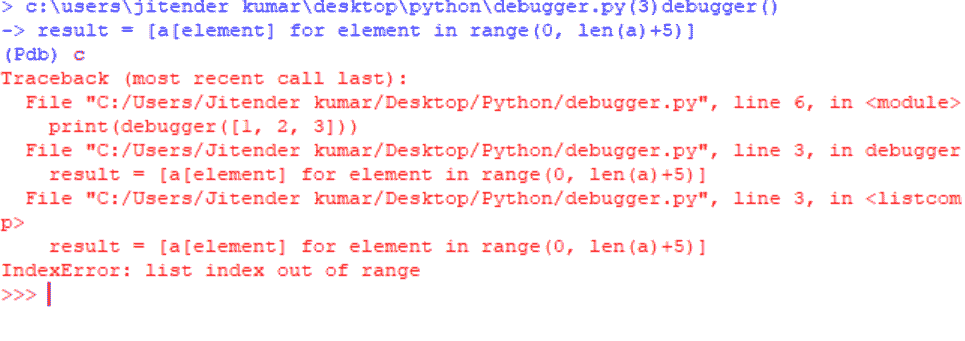

# 使用断点()和 pdb

调试 Python 代码

> 原文:[https://www . geesforgeks . org/debug-python-code-use-breakpoint-and-pdb/](https://www.geeksforgeeks.org/debugging-python-code-using-breakpoint-and-pdb/)

开发应用程序或探索语言的某些特性时，可能需要随时调试代码。因此，有一个调试代码的想法是非常必要的。让我们看看使用内置函数`**breakpoint()**`和 **`pdb module`** 进行调试的一些基础知识。

我们知道，当我们想要在特定的代码行中发现错误时，调试器扮演着重要的角色。在这里，Python 自带最新的内置函数*断点*，其作用与 **Python 3.6** 及以下版本中的`pdb.set_trace()`相同。

调试器在我们添加断点的代码中一行一行地找到 bug，如果发现 bug，那么程序会暂时停止，然后您可以删除错误并重新开始执行代码。

**语法:**

```py
1) breakpoint()           # in Python 3.7 

2) import pdb; pdb.set_trace()   # in Python 3.6 and below

```

**方法#1 :** 使用**断点()**功能
在这个方法中，我们简单介绍一下您有疑问的断点或者您想要检查 bug 或错误的地方。

```py
def debugger(a, b):
    breakpoint()
    result = a / b
    return result

print(debugger(5, 0))
```

**输出:**


要运行调试器，只需键入 **c** 并按回车键。


**调试命令:**

```py
c -> continue execution
q -> quit the debugger/execution
n -> step to next line within the same function
s -> step to next line in this function or a called function

```

**方法#2 :** 使用 **pdb 模块**
同前所述，pdb 的意思是 Python 调试器。要在程序中使用 PDB，我们必须使用它的一种方法`set_trace()`。虽然这将导致相同的结果，但这是在 python 及以下版本中引入调试器的另一种方式。

```py
def debugger(a, b):
    import pdb; pdb.set_trace()
    result = a / b
    return result

print(debugger(5, 0))
```

**输出:**


要运行调试器，只需键入 **c** 并按回车键。
T3】

**示例:**

```py
def debugger(a):
    import pdb; pdb.set_trace()
    result = [a[element] for element in range(0, len(a)+5)]
    return result

print(debugger([1, 2, 3]))
```

**输出:**
