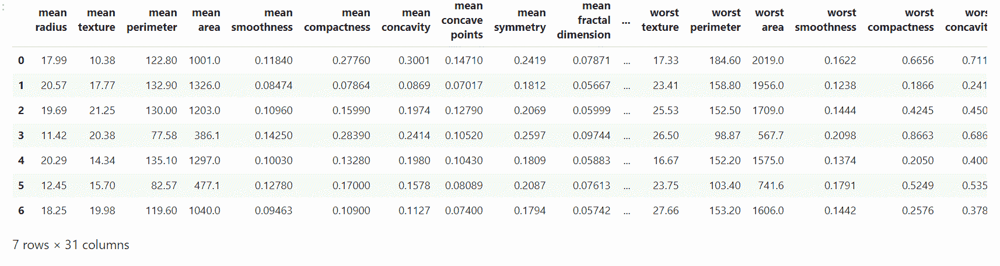
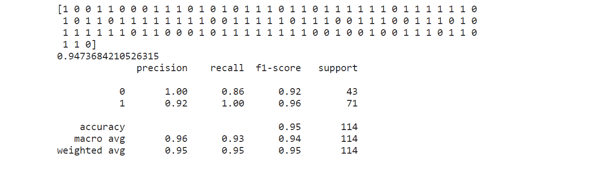

# 机器学习中的决策阈值

> 原文:[https://www . geeksforgeeks . org/机器学习中的决策阈值/](https://www.geeksforgeeks.org/decision-threshold-in-machine-learning/)

**什么是决策阈值？**
sklearn 没有让我们直接设置决策阈值，但是它给了我们访问决策得分(决策函数 o/p)的权限，用于进行预测。我们可以从决策函数输出中选择最佳得分，并将其设置为**决策阈值**值，并将小于该决策阈值的所有决策得分值视为负类(0)，大于该决策阈值的所有决策得分值视为正类(1)。

使用**精度-召回率曲线**对于各种决策阈值，我们可以选择决策阈值的最佳值，使得它分别根据我们的项目是面向精度还是面向召回率给出**高精度**(无影响召回率多)或**高召回率**(无影响精度多)。

这样做的主要目的是根据我们的 ML 项目分别是面向精度的还是面向召回的，得到一个高精度的 ML 模型，或者高召回率的 ML 模型。

**代码:构建高精度 ML 模型的 Python 代码**

```py
# Import required modules.
import pandas as pd
import matplotlib.pyplot as plt
from sklearn import datasets
from sklearn.model_selection import train_test_split
from sklearn.svm import SVC
from sklearn.metrics import classification_report, recall_score, precision_score, accuracy_score

# Get the data.
data_set = datasets.load_breast_cancer()

# Get the data into an array form.
x = data_set.data        # Input feature x.
y = data_set.target      # Input target variable y.

# Get the names of the features.
feature_list = data_set.feature_names

# Convert the data into pandas data frame.
data_frame = pd.DataFrame(x, columns = feature_list)

# To insert an output column in data_frame.
data_frame.insert(30, 'Outcome', y)       # Run this line only once for every new training.

# Data Frame.
data_frame.head(7)
```

**输出:**


**代码:训练模型**

```py
# Train Test Split.
x_train, x_test, y_train, y_test = train_test_split(x, y, test_size = 0.2, random_state = 42)

# Create Classifier Object.
clf = SVC()
clf.fit(x_train, y_train)

# Use decision_function method.
decision_function = clf.decision_function(x_test)
```

**获得的实际分数:**

```py
# Actual obtained results without any manual setting of Decision Threshold.
predict_actual = clf.predict(x_test)       # Predict using classifier.
accuracy_actual = clf.score(x_test, y_test)
classification_report_actual = classification_report(y_test, predict_actual)
print(predict_actual, accuracy_actual, classification_report_actual, sep ='\n')
```

**输出:**


在上面的分类报告中，我们可以看到(1)的模型精度值为 0.92，(1)的召回值为 1.00。由于我们在本文中的目标是在不太影响召回率的情况下建立预测(1)的高精度最大似然模型，因此我们需要从下面的精度-召回率曲线中手动选择决策阈值的最佳值，以便提高该模型的精度。

**代码:**

```py
# Plot Precision-Recall curve using sklearn.
from sklearn.metrics import precision_recall_curve
precision, recall, treshold = precision_recall_curve(y_test, decision_function)

# Plot the output.
plt.plot(treshold, precision[:-1], c ='r', label ='PRECISION')
plt.plot(treshold, recall[:-1], c ='b', label ='RECALL')
plt.grid()
plt.legend()
plt.title('Precision-Recall Curve')
```

**输出:**

<center>
</center>

在上面的图中，我们可以看到，如果我们想要高精度值，那么我们需要增加决策阈值(x 轴)的值，但是这会降低召回值(这是不利的)。因此，我们需要选择决策阈值的值，该值将提高精确度，但不会大大降低召回率。上图中的一个值约为 0.6 决策阈值。

**代码:**

```py
# Implementing main logic.

# Based on analysis of the Precision-Recall curve.
# Let Decision Threshold value be around 0.6... to get high Precision without affecting recall much.
# Desired results.

# Decision Function output for x_test.
df = clf.decision_function(x_test)

# Set the value of decision threshold.
decision_teshold = 0.5914643767268305

# Desired prediction to increase precision value.
desired_predict =[]

# Iterate through each value of decision function output
# and if  decision score is > than Decision threshold then,
# append (1) to the empty list ( desired_prediction) else
# append (0).
for i in df:
    if i<decision_teshold:
        desired_predict.append(0)
    else:
        desired_predict.append(1)
```

**代码:新旧精度值对比。**

```py
# Comparison

# Old Precision Value
print("old precision value:", precision_score(y_test, predict_actual))
# New precision Value  
print("new precision value:", precision_score(y_test, desired_predict))
```

**输出:**

```py
old precision value: 0.922077922077922
new precision value: 0.9714285714285714

```

**观察值:**

*   精度值从 0.92 增加到 0.97。
*   由于精确-召回权衡，召回的价值降低了。

**注:**
以上代码未进行数据预处理(数据清理或特征工程)，这会延长本文的篇幅。这只是一个如何在实践中利用决策阈值的想法。