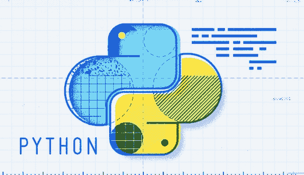
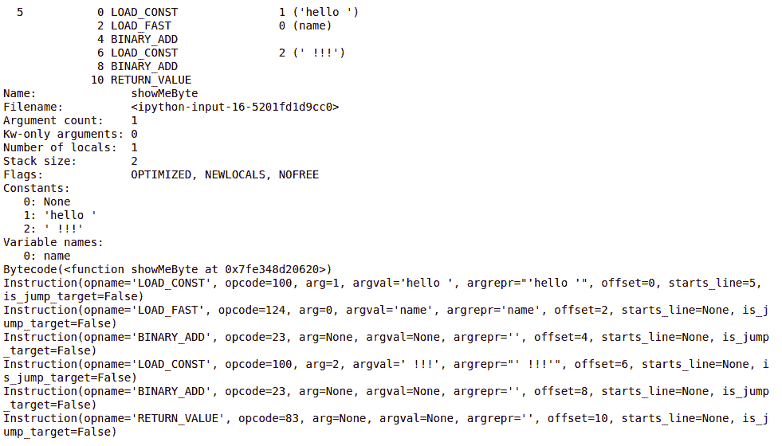

# 解构解释器:理解 Python 字节码的背后

> 原文:[https://www . geesforgeks . org/解构-解释器-理解-python 背后-字节码/](https://www.geeksforgeeks.org/deconstructing-interpreter-understanding-behind-the-python-bytecode/)

当 CPython 解释器执行您的程序时，它首先翻译成字节码指令序列。字节码是 Python 虚拟机的中间语言，用作性能优化。



不是直接执行人类可读的源代码，而是使用紧凑的数字代码、常数和引用来表示编译器解析和语义分析的结果。这为程序或部分程序的重复执行节省了时间和内存。例如，编译步骤产生的字节码缓存在中的磁盘上。pyc 和。pyo 文件，这样第二次执行相同的 Python 文件会更快。所有这些对程序员来说都是完全透明的。您不必知道这个中间翻译步骤是如何发生的，或者 Python 虚拟机是如何处理字节码的。事实上，字节码格式被认为是一个实现细节，不能保证在 Python 版本之间保持稳定或兼容。然而，人们可能会发现，看看香肠是如何制作的，看看 CPython 解释器提供的抽象背后，会很有启发性。了解至少一些内部工作方式可以帮助您编写性能更好的代码。

**示例:**让我们将这个简单的 **showMeByte()** 函数作为实验室示例，并理解 Python 的字节码:

```py
def showMeByte(name):
    return "hello "+name+" !!!"

print(showMeByte("amit kumra"))
```

**输出:**

```py
hello amit kumra !!!
```

CPython 首先将我们的源代码翻译成中间语言，然后再运行它。我们可以看到这个编译步骤的结果。每个函数都有一个`__code__`属性(在 Python 3 中)，我们可以用它来获取 showMeByte 函数使用的虚拟机指令、常数和变量:

**示例:**

```py
def showMeByte(name):
    return "hello "+name+" !!!"

print(showMeByte.__code__.co_code)

print(showMeByte.__code__.co_consts)

print(showMeByte.__code__.co_stacksize)

print(showMeByte.__code__.co_varnames)

print(showMeByte.__code__.co_flags)

print(showMeByte.__code__.co_name)

print(showMeByte.__code__.co_names)
```

**输出:**

```py
b'd\x01|\x00\x17\x00d\x02\x17\x00S\x00'
(None, 'hello ', ' !!!')
2
('name',)
67
showMeByte
()
```

您可以看到 co_consts 包含我们的函数组装的问候字符串的一部分。常量和代码是分开的，以节省内存空间。因此，Python 不是在 co_code 指令流中重复实际的常量值，而是在查找表中单独存储常量。指令流然后可以引用一个常量，该常量带有查找表的索引。存储在 co_varnames 字段中的变量也是如此。CPython 开发人员给了我们另一个叫做反汇编器的工具，让检查字节码变得更容易。Python 的字节码反汇编器存在于作为标准库一部分的 dis 模块中。所以我们可以导入它，并在我们的 greet 函数上调用`dis.dis()`来获得它的字节码的一个稍微容易阅读的表示:

**示例:**

```py
import dis

def showMeByte(name):
    return "hello "+name+" !!!"

dis.dis(showMeByte)
bytecode = dis.code_info(showMeByte)
print(bytecode)

bytecode = dis.Bytecode(showMeByte)
print(bytecode)

for i in bytecode:
    print(i)
```

**输出:**



可执行指令或简单指令告诉处理器做什么。每个指令由操作码组成。每个可执行指令生成一条机器语言指令。反汇编所做的主要事情是分割指令流，并给其中的每个操作码一个人类可读的名称，如 LOAD_CONST。您还可以看到常量和变量引用现在是如何与字节码交织在一起并完整打印出来的，从而使我们不必再做 co_const 和 co_varnames 表查找这样的脑力体操。

它首先检索索引 1 处的常量(“Hello”)，并将其放入堆栈中。然后，它加载名称变量的内容，并将它们放入堆栈。堆栈是用作虚拟机内部工作存储的数据结构。虚拟机有不同的类别，其中一种称为堆叠机。CPython 的虚拟机就是这样一个栈机的实现。CPython 的虚拟机就是这样一个栈机的实现。让我们假设堆栈开始是空的。执行前两个操作码后，虚拟机的内容是这样的(0 是最上面的元素):

```py
0: ’amit kumra’(contents of “name”)
1: ‘hello ‘
```

**BINARY_ADD** 指令将两个字符串值从堆栈中弹出，串联起来，然后将结果再次推送到堆栈上:

```py
0: ‘hello amit kumra’
```

然后还有另一个 LOAD_CONST 来获取堆栈上的感叹号字符串:

```py
0 : ‘ !!!’
1:’Hello amit kumra’
```

下一个 BINARY_ADD 操作码再次将两者结合起来生成最终的问候字符串:

```py
0: ‘hello amit kumra !!!’
```

最后一个字节码指令是 **RETURN_VALUE** ，它告诉虚拟机当前在堆栈顶部的是这个函数的返回值，所以它可以被传递给调用者。所以，最后，我们追溯了我们的`showMeCode()`函数是如何被 CPython 虚拟机内部执行的。