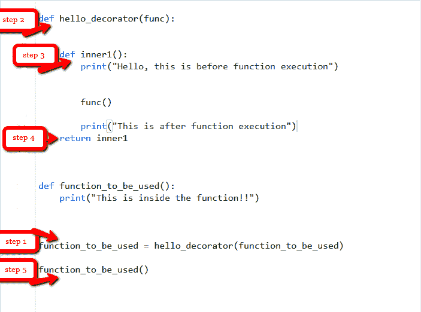

# Python 中的装饰者

> 原文:[https://www.geeksforgeeks.org/decorators-in-python/](https://www.geeksforgeeks.org/decorators-in-python/)

[](https://www.geeksforgeeks.org/function-decorators-in-python-set-1-introduction/)**装饰器是 Python 中非常强大和有用的工具，因为它允许程序员修改函数或类的行为。装饰器允许我们包装另一个函数，以便扩展包装函数的行为，而无需永久修改它。但是在深入探讨装饰师之前，让我们了解一些概念，这些概念在学习装饰师时会派上用场。**

### **第一类对象
在 Python 中，函数是 [**第一类对象**](https://www.geeksforgeeks.org/first-class-functions-python/) ，这意味着 Python 中的函数可以用作或作为参数传递。
**一级功能属性:****

*   **函数是对象类型的一个实例。**
*   **您可以将函数存储在变量中。**
*   **您可以将函数作为参数传递给另一个函数。**
*   **您可以从函数返回函数。**
*   **您可以将它们存储在数据结构中，如哈希表、列表等**

**为了更好地理解，请考虑以下示例。**

****例 1:** 将功能作为对象处理。**

## **蟒蛇 3**

```py
# Python program to illustrate functions
# can be treated as objects
def shout(text):
    return text.upper()

print(shout('Hello'))

yell = shout

print(yell('Hello'))
```

****输出:****

```py
HELLO
HELLO
```

**在上面的例子中，我们已经将函数调用分配给了一个变量。这将不会调用该函数，取而代之的是，它接受一个调用所引用的函数对象，并创建一个指向它的第二个名称。**

****示例 2:** 将函数作为参数传递**

## **蟒蛇 3**

```py
# Python program to illustrate functions
# can be passed as arguments to other functions
def shout(text):
    return text.upper()

def whisper(text):
    return text.lower()

def greet(func):
    # storing the function in a variable
    greeting = func("""Hi, I am created by a function passed as an argument.""")
    print (greeting)

greet(shout)
greet(whisper)
```

****输出:****

```py
HI, I AM CREATED BY A FUNCTION PASSED AS AN ARGUMENT.
hi, i am created by a function passed as an argument.
```

**在上面的例子中，greet 函数采用另一个函数作为参数(在这种情况下是大喊大叫)。然后在函数 greet 中调用作为参数传递的函数。**

****示例 3:** 从另一个函数返回函数。**

## **蟒蛇 3**

```py
# Python program to illustrate functions
# Functions can return another function

def create_adder(x):
    def adder(y):
        return x+y

    return adder

add_15 = create_adder(15)

print(add_15(10))
```

****输出:****

```py
25
```

**在上面的例子中，我们在另一个函数内部创建了一个函数，然后返回了在内部创建的函数。
以上三个例子描绘了理解装饰者需要的重要概念。看完之后，现在让我们深入了解一下装饰师。**

## **装饰者**

**如上所述，装饰器用于修改函数或类的行为。在 Decorators 中，函数被当作另一个函数的参数，然后在包装函数中调用。**

****装饰器语法:****

```py
@gfg_decorator
def hello_decorator():
    print("Gfg")

'''Above code is equivalent to -

def hello_decorator():
    print("Gfg")

hello_decorator = gfg_decorator(hello_decorator)'''
```

**在上面的代码中，gfg_decorator 是一个可调用函数，会在一些可调用函数的上面添加一些代码，hello_decorator 函数并返回包装函数。**

****装饰者可以修改**行为 **:****

## **蟒蛇 3**

```py
# defining a decorator
def hello_decorator(func):

    # inner1 is a Wrapper function in
    # which the argument is called

    # inner function can access the outer local
    # functions like in this case "func"
    def inner1():
        print("Hello, this is before function execution")

        # calling the actual function now
        # inside the wrapper function.
        func()

        print("This is after function execution")

    return inner1

# defining a function, to be called inside wrapper
def function_to_be_used():
    print("This is inside the function !!")

# passing 'function_to_be_used' inside the
# decorator to control its behaviour
function_to_be_used = hello_decorator(function_to_be_used)

# calling the function
function_to_be_used()
```

****输出:****

```py
Hello, this is before function execution
This is inside the function !!
This is after function execution
```

**让我们看看上面代码的行为，当调用“function _ to _ be _ used”时，它是如何一步一步运行的。**

**
**

**让我们跳到另一个例子，在这个例子中，我们可以使用装饰器很容易地找到函数的执行时间。**

## **蟒蛇 3**

```py
# importing libraries
import time
import math

# decorator to calculate duration
# taken by any function.
def calculate_time(func):

    # added arguments inside the inner1,
    # if function takes any arguments,
    # can be added like this.
    def inner1(*args, **kwargs):

        # storing time before function execution
        begin = time.time()

        func(*args, **kwargs)

        # storing time after function execution
        end = time.time()
        print("Total time taken in : ", func.__name__, end - begin)

    return inner1

# this can be added to any function present,
# in this case to calculate a factorial
@calculate_time
def factorial(num):

    # sleep 2 seconds because it takes very less time
    # so that you can see the actual difference
    time.sleep(2)
    print(math.factorial(num))

# calling the function.
factorial(10)
```

****输出:****

```py
3628800
Total time taken in :  factorial 2.0061802864074707
```

## **如果一个函数返回了什么，或者一个参数被传递给了这个函数，该怎么办？**

**在上面所有的例子中，函数没有返回任何东西，所以没有任何问题，但是人们可能需要返回值。**

## **蟒蛇 3**

```py
def hello_decorator(func):
    def inner1(*args, **kwargs):

        print("before Execution")

        # getting the returned value
        returned_value = func(*args, **kwargs)
        print("after Execution")

        # returning the value to the original frame
        return returned_value

    return inner1

# adding decorator to the function
@hello_decorator
def sum_two_numbers(a, b):
    print("Inside the function")
    return a + b

a, b = 1, 2

# getting the value through return of the function
print("Sum =", sum_two_numbers(a, b))
```

****输出:****

```py
before Execution
Inside the function
after Execution
Sum = 3
```

**在上面的例子中，您可能会注意到内部函数的参数有很大的不同。内部函数将参数作为*args 和**kwargs，这意味着位置参数的元组或关键字参数的字典可以传递任意长度。这使得它成为一个通用的装饰器，可以装饰一个具有任意数量参数的函数。**

## **链接装饰者**

**简单来说[链接装饰器](https://www.geeksforgeeks.org/chain-multiple-decorators-in-python/)意味着用多个装饰器装饰一个功能。**

****示例:****

## **蟒蛇 3**

```py
# code for testing decorator chaining
def decor1(func):
    def inner():
        x = func()
        return x * x
    return inner

def decor(func):
    def inner():
        x = func()
        return 2 * x
    return inner

@decor1
@decor
def num():
    return 10

print(num())
```

****输出:****

```py
400
```

**上面的例子类似于调用函数–**

```py
decor1(decor(num))
```