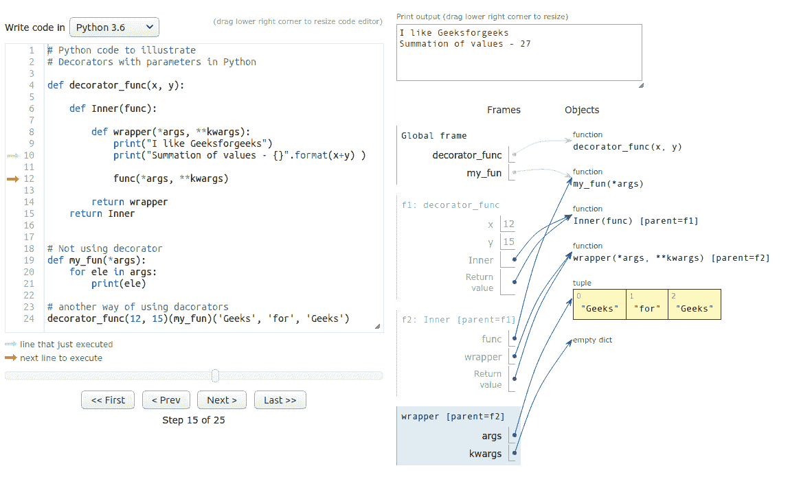
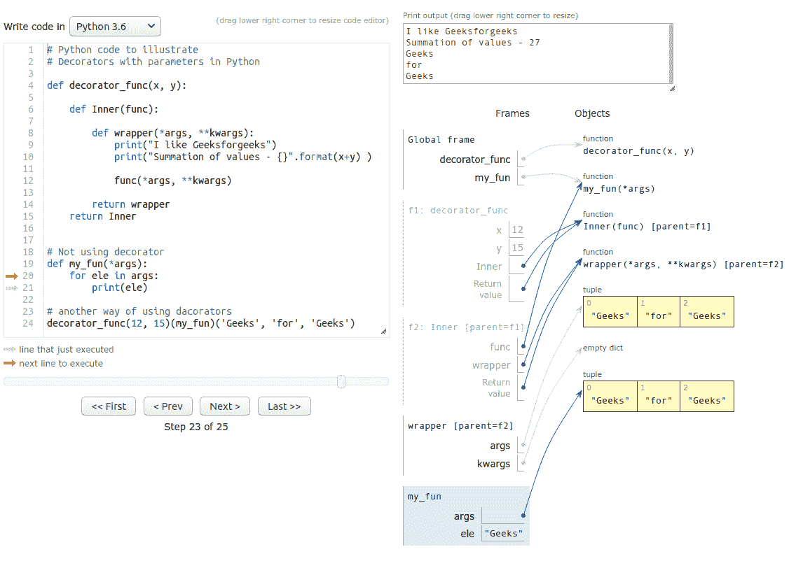

# Python 中带参数的装饰器

> 原文:[https://www . geesforgeks . org/decorator-with-parameters-in-python/](https://www.geeksforgeeks.org/decorators-with-parameters-in-python/)

**先决条件:**Python 中的[装饰者](https://www.geeksforgeeks.org/decorators-in-python/)、[功能装饰者](https://www.geeksforgeeks.org/function-decorators-in-python-set-1-introduction/)

我们知道[装饰器](https://www.geeksforgeeks.org/decorators-in-python/)是 Python 中非常强大和有用的工具，因为它允许程序员修改函数或类的行为。在本文中，我们将借助多个示例来了解带有参数 的***装饰者。
Python 函数是一级公民，这意味着函数可以像对象一样对待。*** 

*   可以将函数赋给变量，即它们可以被引用。
*   函数可以作为参数传递给另一个函数。
*   函数可以从函数中返回。

带参数的装饰器类似于普通的装饰器。

## 带有参数的装饰器的语法:

```py
@decorator(params)
def func_name():
    ''' Function implementation'''
```

**以上代码相当于**

```py
def func_name():
    ''' Function implementation'''

func_name = (decorator(params))(func_name)
"""
```

当执行从左到右开始时**装饰器(参数)**被调用，它返回一个函数对象 **fun_obj** 。使用 fun_obj 进行调用 **fun_obj(fun_name)** 。在内部函数中，执行所需的操作并返回实际的函数引用，该引用将被分配给 **func_name** 。现在，可以使用 **func_name()** 调用应用了装饰器的函数。

**如何实现带参数的装饰器**

## 蟒蛇 3

```py
def decorators(*args, **kwargs):
    def inner(func):
        '''
           do operations with func
        '''
        return func
    return inner #this is the fun_obj mentioned in the above content

@decorators(params)
def func():
    """
         function implementation
    """
```

这里**参数**也可以为空。

**先观察这些:**

## 蟒蛇 3

```py
# Python code to illustrate
# Decorators basic in Python

def decorator_fun(func):
  print("Inside decorator")

  def inner(*args, **kwargs):
    print("Inside inner function")
    print("Decorated the function")
    # do operations with func

    func()

  return inner

@decorator_fun
def func_to():
    print("Inside actual function")

func_to()
```

**另一种方式:**

## 蟒蛇 3

```py
# Python code to illustrate
# Decorators with parameters in Python

def decorator_fun(func):
  print("Inside decorator")

  def inner(*args, **kwargs):
    print("Inside inner function")
    print("Decorated the function")

    func()

  return inner

def func_to():
    print("Inside actual function")

# another way of using decorators
decorator_fun(func_to)()
```

**输出:**

```py
Inside decorator
Inside inner function
Decorated the function
Inside actual function
```

我们再来看另一个例子:

**示例#1:**

## 蟒蛇 3

```py
# Python code to illustrate
# Decorators with parameters in Python

def decorator(*args, **kwargs):
    print("Inside decorator")

    def inner(func):

        # code functionality here
        print("Inside inner function")
        print("I like", kwargs['like'])

        func()

    # returning inner function   
    return inner

@decorator(like = "geeksforgeeks")
def my_func():
    print("Inside actual function")
```

**输出:**

```py
Inside decorator
Inside inner function
I like geeksforgeeks
Inside actual function
```

**例 2:**

## 蟒蛇 3

```py
# Python code to illustrate
# Decorators with parameters in Python

def decorator_func(x, y):

    def Inner(func):

        def wrapper(*args, **kwargs):
            print("I like Geeksforgeeks")
            print("Summation of values - {}".format(x+y) )

            func(*args, **kwargs)

        return wrapper
    return Inner

# Not using decorator
def my_fun(*args):
    for ele in args:
        print(ele)

# another way of using decorators
decorator_func(12, 15)(my_fun)('Geeks', 'for', 'Geeks')
```

**输出:**

```py
I like Geeksforgeeks
Summation of values - 27
Geeks
for
Geeks
```

这个例子还告诉我们，外部函数参数可以被封闭的内部函数访问。

**示例#3:**

## 蟒蛇 3

```py
# Python code to illustrate
# Decorators with parameters in Python  (Multi-level Decorators)

def decodecorator(dataType, message1, message2):
    def decorator(fun):
        print(message1)
        def wrapper(*args, **kwargs):
            print(message2)
            if all([type(arg) == dataType for arg in args]):
                return fun(*args, **kwargs)
            return "Invalid Input"
        return wrapper
    return decorator

@decodecorator(str, "Decorator for 'stringJoin'", "stringJoin started ...")
def stringJoin(*args):
    st = ''
    for i in args:
        st += i
    return st

@decodecorator(int, "Decorator for 'summation'\n", "summation started ...")
def summation(*args):
    summ = 0
    for arg in args:
        summ += arg
    return summ

print(stringJoin("I ", 'like ', "Geeks", 'for', "geeks"))
print()
print(summation(19, 2, 8, 533, 67, 981, 119))
```

**输出:**

```py
Decorator for 'stringJoin'
Decorator for 'summation'

stringJoin started ...
I like Geeksforgeeks

summation started ...
1729
```

**1。室内装饰**



**2。功能内**



**注意:**图像快照使用 PythonTutor 拍摄。