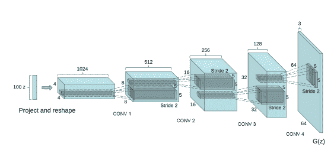
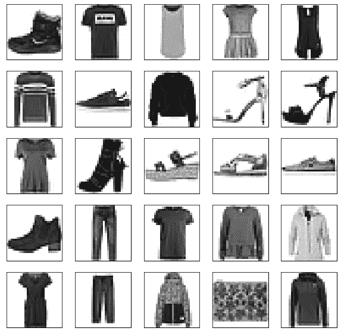
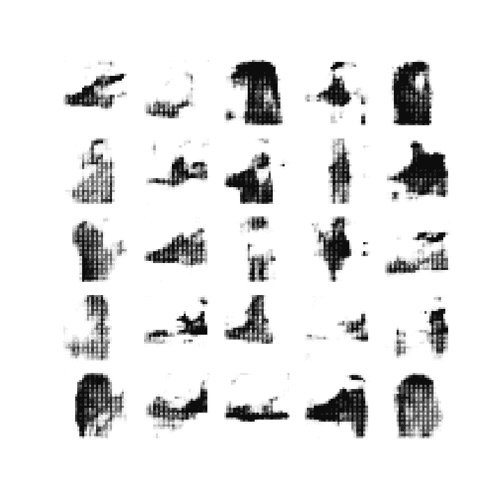
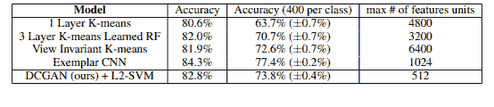

# 带 Keras 的深度卷积 GAN

> 原文:[https://www . geeksforgeeks . org/deep-卷积-gan-wit-keras/](https://www.geeksforgeeks.org/deep-convolutional-gan-with-keras/)

深度卷积神经网络是由麻省理工学院和脸书人工智能研究所的一名研究员提出的。它广泛应用于许多基于卷积的生成技术中。本文的重点是使训练 GANs 稳定。因此，他们在计算机视觉问题上提出了一些架构上的改变。在本文中，我们将在时尚 MNIST 数据集上使用 DCGAN 来生成与服装相关的图像。

**架构**:



DCGAN 架构的生成器采用 100 个均匀生成的值，使用正态分布作为输入。首先，它将维度更改为 4x4x1024，并以 1/2 的步幅分 4 次执行分数步进卷积(这意味着每次应用时，它都会将图像维度加倍，同时减少输出通道的数量)。生成的输出的维数为(64，64，3)。生成器中提出了一些体系结构上的变化，例如移除所有完全连接的层，使用批处理规范化，这有助于稳定训练。在本文中，作者在生成器的所有层中使用了 ReLU 激活函数，但输出层除外。我们将以类似的指导方针实现生成器，但不是完全相同的架构。

这里鉴别器的作用是确定图像是来自真实数据集还是生成器。鉴别器可以简单地设计成类似于执行图像分类任务的卷积神经网络。然而，本文的作者建议对鉴别器架构进行一些更改。代替完全连接的层，他们仅使用带有 LeakyReLU 的交错卷积作为激活函数，生成器的输入是来自数据集或生成图像的单个图像，输出是确定图像是真实的还是生成的分数**。**

**实施:**

在本节中，我们将讨论 DCGAN 在 keras 中的实现，因为我们的数据集在时尚 MNIST 数据集，该数据集包含 1 个颜色通道的大小(28，28)的图像，而不是 3 个颜色通道的大小(64，64)。因此，我们需要在架构上做一些改变，我们将在进行的过程中讨论这些改变。

*   第一步，我们需要导入必要的类，如 TensorFlow、keras、matplotlib 等。我们将使用 TensorFlow 版本 2。这个版本的 tensorflow 提供了对 Keras 库的内置支持，作为其默认的高级应用编程接口。

```py
# code % matplotlib inline
import tensorflow as tf
from tensorflow import keras
import numpy as np
import matplotlib.pyplot as plt
from tqdm import tqdm
from IPython import display

# Check tensorflow version
print('Tensorflow version:', tf.__version__)
```

*   现在我们加载时尚 MNIST 数据集，好的方面是数据集可以从 tf.keras.datasets API 导入。因此，我们不需要通过复制文件来手动加载数据集。该数据集包含 60k 个训练图像和 10k 个测试图像，每个维度(28，28，1)。由于每个像素的值都在(0，255)范围内，我们将这些值除以 255 来对其进行归一化。

```py
(x_train, y_train), (x_test, y_test) = tf.keras.datasets.fashion_mnist.load_data()
x_train = x_train.astype(np.float32) / 255.0
x_test = x_test.astype(np.float32) / 255.0
x_train.shape, x_test.shape
```

```py
((60000, 28, 28), (10000, 28, 28))
```

*   现在在下一步，我们将可视化一些来自时尚 MNIST 数据库的图像，我们使用 matplotlib 库。

```py
# We plot first 25 images of training dataset
plt.figure(figsize =(10, 10))
for i in range(25):
    plt.subplot(5, 5, i + 1)
    plt.xticks([])
    plt.yticks([])
    plt.grid(False)
    plt.imshow(x_train[i], cmap = plt.cm.binary)
plt.show()
```



原创时尚 MNIST 图片

*   现在，我们定义训练参数，如批次大小，并将数据集划分为批次大小，并通过随机采样训练数据来填充这些批次大小。

```py
# code
batch_size = 32
# This dataset fills a buffer with buffer_size elements,
# then randomly samples elements from this buffer, 
# replacing the selected elements with new elements.
def create_batch(x_train):
  dataset = tf.data.Dataset.from_tensor_slices(x_train).shuffle(1000)
  # Combines consecutive elements of this dataset into batches.

  dataset = dataset.batch(batch_size, drop_remainder = True).prefetch(1)
  # Creates a Dataset that prefetches elements from this dataset
  return dataset
```

*   现在，我们定义生成器体系结构，该生成器体系结构采用大小为 100 的向量，首先将其整形为(7，7，128)向量，然后结合批处理归一化应用转置卷积。该生成器的输出是维度(28，28，1)的训练图像。

```py
# code
num_features = 100

generator = keras.models.Sequential([
    keras.layers.Dense(7 * 7 * 128, input_shape =[num_features]),
    keras.layers.Reshape([7, 7, 128]),
    keras.layers.BatchNormalization(),
    keras.layers.Conv2DTranspose(
        64, (5, 5), (2, 2), padding ="same", activation ="selu"),
    keras.layers.BatchNormalization(),
    keras.layers.Conv2DTranspose(
        1, (5, 5), (2, 2), padding ="same", activation ="tanh"),
])
generator.summary()
```

```py
Model: "sequential"
_________________________________________________________________
Layer (type)                 Output Shape              Param #   
=================================================================
dense (Dense)                (None, 6272)              633472    
_________________________________________________________________
reshape (Reshape)            (None, 7, 7, 128)         0         
_________________________________________________________________
batch_normalization (BatchNo (None, 7, 7, 128)         512       
_________________________________________________________________
conv2d_transpose (Conv2DTran (None, 14, 14, 64)        204864    
_________________________________________________________________
batch_normalization_1 (Batch (None, 14, 14, 64)        256       
_________________________________________________________________
conv2d_transpose_1 (Conv2DTr (None, 28, 28, 1)         1601      
=================================================================
Total params: 840, 705
Trainable params: 840, 321
Non-trainable params: 384
_________________________________________________________________
```

*   现在，我们定义了鉴别器体系结构，鉴别器使用 1 个颜色通道获取 28*28 大小的图像，并从数据集或生成的图像中输出代表图像的标量值。

```py
discriminator = keras.models.Sequential([
    keras.layers.Conv2D(64, (5, 5), (2, 2), padding ="same", input_shape =[28, 28, 1]),
    keras.layers.LeakyReLU(0.2),
    keras.layers.Dropout(0.3),
    keras.layers.Conv2D(128, (5, 5), (2, 2), padding ="same"),
    keras.layers.LeakyReLU(0.2),
    keras.layers.Dropout(0.3),
    keras.layers.Flatten(),
    keras.layers.Dense(1, activation ='sigmoid')
])
discriminator.summary()
```

```py
Model: "sequential_1"
_________________________________________________________________
Layer (type)                 Output Shape              Param #   
=================================================================
conv2d (Conv2D)              (None, 14, 14, 64)        1664      
_________________________________________________________________
leaky_re_lu (LeakyReLU)      (None, 14, 14, 64)        0         
_________________________________________________________________
dropout (Dropout)            (None, 14, 14, 64)        0         
_________________________________________________________________
conv2d_1 (Conv2D)            (None, 7, 7, 128)         204928    
_________________________________________________________________
leaky_re_lu_1 (LeakyReLU)    (None, 7, 7, 128)         0         
_________________________________________________________________
dropout_1 (Dropout)          (None, 7, 7, 128)         0         
_________________________________________________________________
flatten (Flatten)            (None, 6272)              0         
_________________________________________________________________
dense_1 (Dense)              (None, 1)                 6273      
=================================================================
Total params: 212, 865
Trainable params: 212, 865
Non-trainable params: 0
_________________________________________________________________
```

*   现在我们需要编译我们的 DCGAN 模型(生成器和鉴别器的组合)，我们将首先编译鉴别器并将其训练设置为 False，因为我们首先要训练生成器。

```py
# compile discriminator using binary cross entropy loss and adam optimizer
discriminator.compile(loss ="binary_crossentropy", optimizer ="adam")
# make  discriminator no-trainable as of  now
discriminator.trainable = False
# Combine both generator and discriminator
gan = keras.models.Sequential([generator, discriminator])
# compile generator using binary cross entropy loss and adam optimizer

gan.compile(loss ="binary_crossentropy", optimizer ="adam")
```

*   现在，我们为这个 GAN 模型定义了训练过程，我们将使用之前导入的 tqdm 包。，这个包有助于可视化培训。

```py
seed = tf.random.normal(shape =[batch_size, 100])

def train_dcgan(gan, dataset, batch_size, num_features, epochs = 5):
    generator, discriminator = gan.layers
    for epoch in tqdm(range(epochs)):
        print()
        print("Epoch {}/{}".format(epoch + 1, epochs))

        for X_batch in dataset:
            # create a random noise of sizebatch_size * 100
            # to passit into the generator
            noise = tf.random.normal(shape =[batch_size, num_features])
            generated_images = generator(noise)

            # take batch of generated image and real image and
            #  use them to train  the discriminator
            X_fake_and_real = tf.concat([generated_images, X_batch], axis = 0)
            y1 = tf.constant([[0.]] * batch_size + [[1.]] * batch_size)
            discriminator.trainable = True
            discriminator.train_on_batch(X_fake_and_real, y1)

            # Here we will be training our GAN model, in this step
            #  we pass noise that uses geeneratortogenerate the image
            #  and pass it with labels as [1] So, it can fool the discriminatoe
            noise = tf.random.normal(shape =[batch_size, num_features])
            y2 = tf.constant([[1.]] * batch_size)
            discriminator.trainable = False
            gan.train_on_batch(noise, y2)

            # generate images for the GIF as we go
            generate_and_save_images(generator, epoch + 1, seed)

    generate_and_save_images(generator, epochs, seed)
```

*   现在我们定义一个函数，它从生成器生成并保存图像(在训练期间)。稍后我们将使用这些生成的图像绘制 GIF。

```py
# code
def generate_and_save_images(model, epoch, test_input):
  predictions = model(test_input, training = False)

  fig = plt.figure(figsize =(10, 10))

  for i in range(25):
      plt.subplot(5, 5, i + 1)
      plt.imshow(predictions[i, :, :, 0] * 127.5 + 127.5, cmap ='binary')
      plt.axis('off')

  plt.savefig('image_epoch_{:04d}.png'.format(epoch))
```

*   现在，我们需要训练模型，但在此之前，我们还需要创建成批的训练数据，并添加一个表示颜色映射数量的维度。

```py
# reshape to add a color map
x_train_dcgan = x_train.reshape(-1, 28, 28, 1) * 2\. - 1.
# create batches
dataset = create_batch(x_train_dcgan)
# callthe training function with 10 epochs and record time %% time
train_dcgan(gan, dataset, batch_size, num_features, epochs = 10)
```

```py
0%|          | 0/10 [00:00<?, ?it/s]
Epoch 1/10

 10%|?         | 1/10 [01:04<09:39, 64.37s/it]
Epoch 2/10

 20%|??        | 2/10 [02:10<08:39, 64.99s/it]
Epoch 3/10

 30%|???       | 3/10 [03:14<07:33, 64.74s/it]
Epoch 4/10

 40%|????      | 4/10 [04:19<06:27, 64.62s/it]
Epoch 5/10

 50%|?????     | 5/10 [05:23<05:22, 64.58s/it]
Epoch 6/10

 60%|??????    | 6/10 [06:27<04:17, 64.47s/it]
Epoch 7/10

 70%|???????   | 7/10 [07:32<03:13, 64.55s/it]
Epoch 8/10

 80%|????????  | 8/10 [08:37<02:08, 64.48s/it]
Epoch 9/10

 90%|????????? | 9/10 [09:41<01:04, 64.54s/it]
Epoch 10/10

100%|??????????| 10/10 [10:46<00:00, 64.61s/it]
CPU times: user 7min 4s, sys: 33.3 s, total: 7min 37s
Wall time: 10min 46s
```

*   现在我们将定义一个函数，该函数接受保存的图像并将其转换为 GIF。我们从[这里](https://www.tensorflow.org/tutorials/generative/dcgan#create_a_gif)使用这个功能

```py
import imageio
import glob

anim_file = 'dcgan_results.gif'

with imageio.get_writer(anim_file, mode ='I') as writer:
  filenames = glob.glob('image*.png')
  filenames = sorted(filenames)
  last = -1
  for i, filename in enumerate(filenames):
    frame = 2*(i)
    if round(frame) > round(last):
      last = frame
    else:
      continue
    image = imageio.imread(filename)
    writer.append_data(image)
  image = imageio.imread(filename)
  writer.append_data(image)
display.Image(filename = anim_file)
```



生成的图像结果

**结果与结论:**

*   为了评估 DCGANs 为监督任务学习的表示的质量，作者在 ImageNet-1k 上训练模型，然后使用来自所有层的鉴别器卷积特征，最大化汇集每个层表示以产生 4 × 4 空间网格。这些特征然后被展平并连接以形成 28672 维向量，并且在它们之上训练正则化的线性 L2-SVM 分类器。然后，在 CIFAR-10 数据集上评估该模型，但不在其上进行训练。该模型报告的准确率为 82 %，这也显示了模型的鲁棒性。



*   在街景房号数据集上，它实现了 22%的验证损失，这是新的最先进的，甚至鉴别器架构，当监督训练为有线电视新闻网模型时，验证损失比它更大。

**参考文献:**

*   [**DCGAN 纸**](https://arxiv.org/abs/1511.06434)