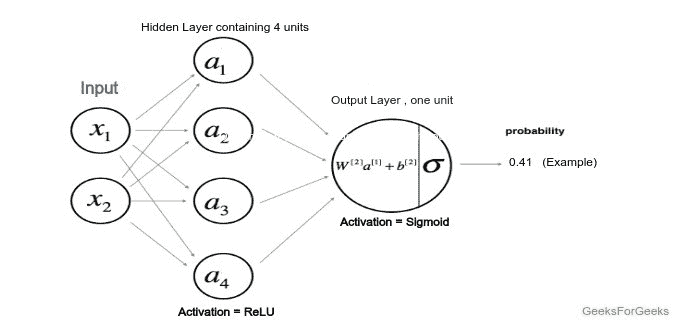
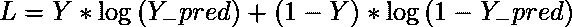
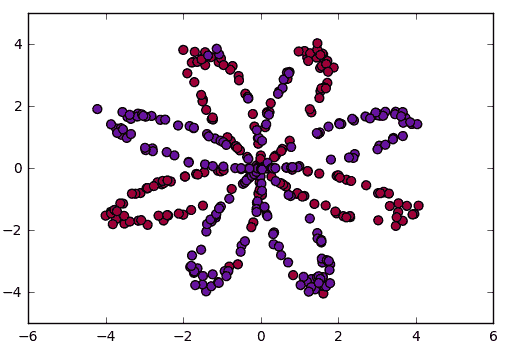
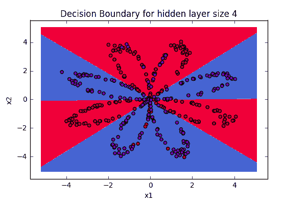

# 从零开始正向和反向传播的深度神经网络——Python

> 原文:[https://www . geesforgeks . org/deep-neural-net-with-forward-and-back-propagation-从头开始-python/](https://www.geeksforgeeks.org/deep-neural-net-with-forward-and-back-propagation-from-scratch-python/)

本文旨在从头实现一个深度神经网络。我们将实现一个深度神经网络，它包含一个具有四个单元和一个输出层的隐藏层。实施将从零开始，并将实施以下步骤。
**算法:**

```py
1\. Visualizing the input data
2\. Deciding the shapes of Weight and bias matrix
3\. Initializing matrix, function to be used
4\. Implementing the forward propagation method
5\. Implementing the cost calculation
6\. Backpropagation and optimizing
7\. prediction and visualizing the output

```

**模型的架构:**
模型的架构由下图定义，其中隐藏层使用双曲正切作为激活函数，而输出层作为分类问题使用 sigmoid 函数。



模型架构

**权重和偏差:**
将用于两个层的权重和偏差必须首先声明，并且其中权重将被随机声明，以避免所有单元的输出相同，而偏差将被初始化为零。计算将从零开始，根据下面给出的规则进行，其中 W1、W2 和 b1、b2 分别是第一层和第二层的权重和偏差。这里 A 代表特定层的激活。

<center>
![ \begin{array}{c} z^{[1]}=W^{[1]} x+b^{[1]} \\ a^{[1](i)}=\tanh \left(z^{[1]}\right) \\ z^{[2]}=W^{[2]} a^{[1]}+b^{[2]} \\ \hat{y}=a^{[2]}=\sigma\left(z^{[2]}\right) \\ y_{\text {prediction}}=\left\{\begin{array}{ll} 1 & \text { if } a^{[2]}>0.5 \\ 0 & \text { otherwise } \end{array}\right. \end{array}](img/1f9c7dce26cd096e1462f139d65b58c1.png "Rendered by QuickLaTeX.com")</center>

**Cost Function:**
The cost function of the above model will pertain to the cost function used with logistic regression. Hence, in this tutorial we will be using the cost function:

<center>

</center>

**Code: Visualizing the data**

```py
# Package imports
import numpy as np
import matplotlib.pyplot as plt
# here planar_utils.py can be found on its github repo
from planar_utils import plot_decision_boundary, sigmoid, load_planar_dataset
# Loading the Sample data
X, Y = load_planar_dataset()

# Visualize the data:
plt.scatter(X[0, :], X[1, :], c = Y, s = 40, cmap = plt.cm.Spectral);
```



**代码:初始化权重和偏差矩阵**
这里是隐藏单元的数量是 4，所以，W1 权重矩阵将是形状(4，特征数量)和偏差矩阵将是形状(4，1)，广播后将根据上述公式加到权重矩阵中。W2 也是如此。

```py
# X --> input dataset of shape (input size, number of examples)
# Y --> labels of shape (output size, number of examples)

W1 = np.random.randn(4, X.shape[0]) * 0.01
b1 = np.zeros(shape =(4, 1))

W2 = np.random.randn(Y.shape[0], 4) * 0.01
b2 = np.zeros(shape =(Y.shape[0], 1))
```

**代码:前向传播:**
现在我们将使用 W1、W2 和偏置 b1、b2 执行前向传播。在此步骤中，相应的输出在定义为 forward_prop 的函数中计算。

```py
def forward_prop(X, W1, W2, b1, b2):

    Z1 = np.dot(W1, X) + b1
    A1 = np.tanh(Z1)
    Z2 = np.dot(W2, A1) + b2
    A2 = sigmoid(Z2)

    # here the cache is the data of previous iteration
    # This will be used for backpropagation
    cache = {"Z1": Z1,
             "A1": A1,
             "Z2": Z2,
             "A2": A2}

    return A2, cache
```

**编码:定义成本函数:**

```py
# Here Y is actual output
def compute_cost(A2, Y):
    m = Y.shape[1]
    # implementing the above formula
    cost_sum = np.multiply(np.log(A2), Y) + np.multiply((1 - Y), np.log(1 - A2))
    cost = - np.sum(logprobs) / m

    # Squeezing to avoid unnecessary dimensions
    cost = np.squeeze(cost)
    return cost
```

**代码:最终反向传播函数:**
这是一个非常关键的步骤，因为它涉及大量线性代数，用于实现深层神经网络的反向传播。求导数的公式可以用线性代数的一些数学概念推导出来，我们在这里不做推导。请记住，dZ、dW、db 是层的成本函数加权和、权重、偏差的导数。

```py
def back_propagate(W1, b1, W2, b2, cache):

    # Retrieve also A1 and A2 from dictionary "cache"
    A1 = cache['A1']
    A2 = cache['A2']

    # Backward propagation: calculate dW1, db1, dW2, db2. 
    dZ2 = A2 - Y
    dW2 = (1 / m) * np.dot(dZ2, A1.T)
    db2 = (1 / m) * np.sum(dZ2, axis = 1, keepdims = True)

    dZ1 = np.multiply(np.dot(W2.T, dZ2), 1 - np.power(A1, 2))
    dW1 = (1 / m) * np.dot(dZ1, X.T)
    db1 = (1 / m) * np.sum(dZ1, axis = 1, keepdims = True)

    # Updating the parameters according to algorithm
    W1 = W1 - learning_rate * dW1
    b1 = b1 - learning_rate * db1
    W2 = W2 - learning_rate * dW2
    b2 = b2 - learning_rate * db2

    return W1, W2, b1, b2
```

**代码:训练定制模型**现在我们将使用上面定义的功能训练模型，可以根据处理单元的便利性和能力来放置时代。

```py
# Please note that the weights and bias are global 
# Here num_iteration is epochs
for i in range(0, num_iterations):

        # Forward propagation. Inputs: "X, parameters". return: "A2, cache".
        A2, cache = forward_propagation(X, W1, W2, b1, b2)

        # Cost function. Inputs: "A2, Y". Outputs: "cost".
        cost = compute_cost(A2, Y)

        # Backpropagation. Inputs: "parameters, cache, X, Y". Outputs: "grads".
        W1, W2, b1, b2 = backward_propagation(W1, b1, W2, b2, cache)

        # Print the cost every 1000 iterations
        if print_cost and i % 1000 == 0:
            print ("Cost after iteration % i: % f" % (i, cost))
```

**使用学习的参数**
输出在训练模型后，获取权重并使用上面的正向传播函数预测结果，然后使用这些值绘制输出图。您将获得类似的输出。



可视化数据的边界

**结论:**
深度学习是一个权力被那些触及基础的人抓住的世界，所以，试着把基础发展得如此强大，以至于之后，你可能会成为一个新的模型架构的开发者，这可能会彻底改变社区。