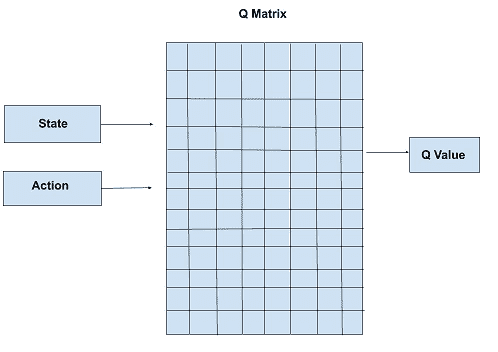
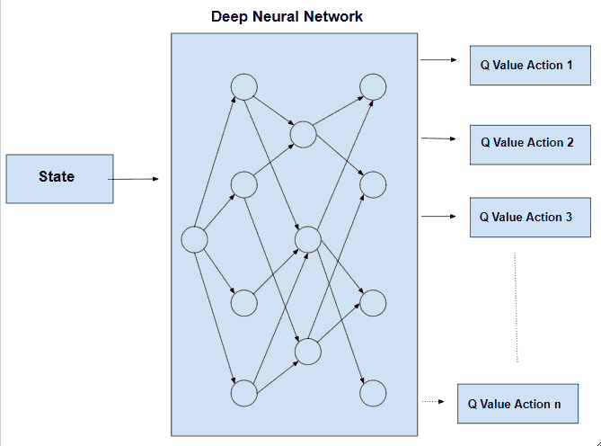
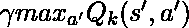
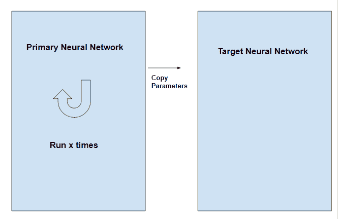

# 深度 Q 学习

> 原文:[https://www.geeksforgeeks.org/deep-q-learning/](https://www.geeksforgeeks.org/deep-q-learning/)

**先决条件:** [问学](https://www.geeksforgeeks.org/q-learning-in-python/)

Q-Learning 的过程为工作代理创建了一个精确的矩阵，它可以“参考”这个矩阵，以使其长期回报最大化。尽管这种方法本身并没有错，但它只适用于非常小的环境，并且当环境中的状态和动作数量增加时，它很快就失去了可行性。

上述问题的解决方案来自于认识到矩阵中的值仅具有相对重要性，即这些值仅相对于其他值具有重要性。因此，这种思维将我们引向**深度 Q 学习**，它使用[深度神经网络](https://www.geeksforgeeks.org/introduction-deep-learning/)来逼近这些值。只要保持相对重要性，这种近似的价值就不会受到伤害。

深度 Q 学习的基本工作步骤是将初始状态输入神经网络，并将所有可能动作的 Q 值作为输出返回。

问学和深度问学的区别可以说明如下:-





**伪码:**

```py
Initialize  for all pairs (s,a)
s = initial state
k = 0
while(convergence is not achieved)
{
    simulate action a and reach state s'
    if(s' is a terminal state)
    {
        target = R(s,a,s')
    }
    else
    {
        target = R(s,a,s') + 
    }

    s = s'
}

```

注意，在方程 **target = R(s，a，s)+**中，术语
是一个可变项。因此，在这个过程中，神经网络的目标是可变的，不像其他典型的深度学习过程，目标是固定的。

这个问题通过用两个神经网络代替一个来解决。一个神经网络用于调整网络的参数，另一个用于计算目标，并且具有与第一网络相同的体系结构，但是具有冻结的参数。在主网络中迭代 x 次后，参数被复制到目标网络。

