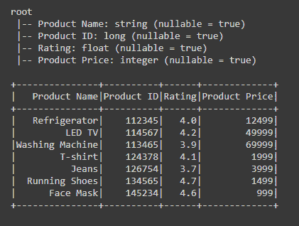

# 用结构字段和结构类型定义数据框架模式

> 原文:[https://www . geesforgeks . org/defining-data frame-schema-with-structure field-and-structure type/](https://www.geeksforgeeks.org/defining-dataframe-schema-with-structfield-and-structtype/)

在本文中，我们将学习如何用结构字段和结构类型定义数据框架模式。

*   结构类型和结构字段用于定义数据框的架构或其部分。这定义了每个列的名称、数据类型和可空标志。
*   结构类型对象是结构字段对象的集合。它是一个内置数据类型，包含结构字段列表。

> **语法:**
> 
> *   pyspark . SQL . types . structure type(字段=无)
> *   pyspark . SQL . types . structure field(名称，数据类型，可空=True)
> 
> **参数:**
> 
> *   字段–结构字段列表。
> *   名称–列的名称。
> *   数据类型——数据类型，如整数、字符串、浮点等。
> *   可空–字段是否为空/无。

为了定义模式，我们必须使用 StructType()对象，在该对象中，我们必须定义或传递 StructField()，该对象包含列的名称、列的数据类型和可空标志。我们可以写:-

```
schema = StructType([StructField(column_name1,datatype(),nullable_flag),
            StructField(column_name2,datatype(),nullable_flag),
            StructField(column_name3,datatype(),nullable_flag)
            ])
```

**示例 1:用带有结构类型和结构字段的模式定义数据框。**

## 计算机编程语言

```
# importing necessary libraries
from pyspark.sql import SparkSession
from pyspark.sql.types import StructType, StructField, IntegerType, LongType, StringType, FloatType

# function to create SparkSession
def create_session():
    spk = SparkSession.builder \
        .master("local") \
        .appName("Product_mart.com") \
        .getOrCreate()
    return spk

# function to create dataframe
def create_df(spark, data, schema):
    df1 = spark.createDataFrame(data, schema)
    return df1

if __name__ == "__main__":

    # calling function to create SparkSession
    spark = create_session()

    input_data = [("Refrigerator", 112345, 4.0, 12499),
                  ("LED TV", 114567, 4.2, 49999),
                  ("Washing Machine", 113465, 3.9, 69999),
                  ("T-shirt", 124378, 4.1, 1999),
                  ("Jeans", 126754, 3.7, 3999),
                  ("Running Shoes", 134565, 4.7, 1499),
                  ("Face Mask", 145234, 4.6, 999)]

    # defining schema for the dataframe with
    # StructType and StructField
    schm = StructType([
        StructField("Product Name", StringType(), True),
        StructField("Product ID", LongType(), True),
        StructField("Rating", FloatType(), True),
        StructField("Product Price", IntegerType(), True),
    ])

    # calling function to create dataframe
    df = create_df(spark, input_data, schm)

    # visualizing dataframe and it's schema
    df.printSchema()
    df.show()
```

**输出:**



在上面的代码中，我们使可空标志=真。使其为真的用途是，如果在创建数据框时任何字段值为空/无，则数据框也将以无值创建。

**示例 2:用嵌套结构类型定义数据框模式。**

## 计算机编程语言

```
# importing necessary libraries
from pyspark.sql import SparkSession
from pyspark.sql.types import StructType, StructField, IntegerType, LongType, StringType, FloatType

# function to create SparkSession
def create_session():
    spk = SparkSession.builder \
        .master("local") \
        .appName("Product_mart.com") \
        .getOrCreate()
    return spk

# function to create dataframe
def create_df(spark, data, schema):
    df1 = spark.createDataFrame(data, schema)
    return df1

if __name__ == "__main__":

    # calling function to create SparkSession
    spark = create_session()

    input_data = [(("Refrigerator", 112345), 4.0, 12499),
                  (("LED TV", 114567), 4.2, 49999),
                  (("Washing Machine", 113465), 3.9, 69999),
                  (("T-shirt", 124378), 4.1, 1999),
                  (("Jeans", 126754), 3.7, 3999),
                  (("Running Shoes", 134565), 4.7, 1499),
                  (("Face Mask", 145234), 4.6, 999)]

    # defining schema for the dataframe using
    # nested StructType
    schm = StructType([
        StructField('Product', StructType([
            StructField('Product Name', StringType(), True),
            StructField('Product ID', LongType(), True),
        ])),

        StructField('Rating', FloatType(), True),
        StructField('Price', IntegerType(), True)])

    # calling function to create dataframe
    df = create_df(spark, input_data, schm)

    # visualizing dataframe and it's schema
    df.printSchema()
    df.show(truncate=False)
```