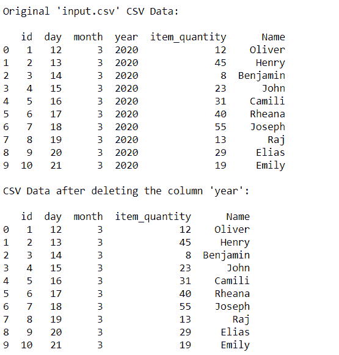
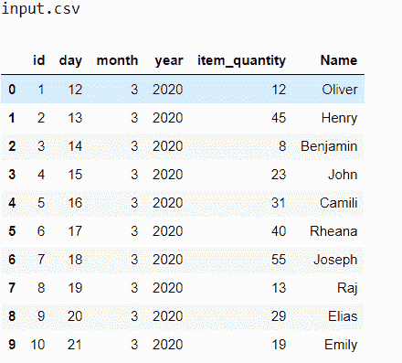
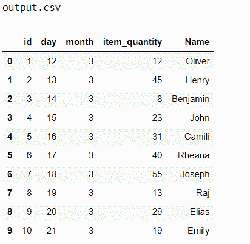

# 删除 Python 中的一个 CSV 列

> 原文:[https://www . geesforgeks . org/delete-a-CSV-column-in-python/](https://www.geeksforgeeks.org/delete-a-csv-column-in-python/)

**逗号分隔值(CSV)** 文件是一个用逗号分隔各个值的文本文件。文件的每一行都是 CSV 格式的数据记录。这种格式用于表格数据、行和列，就像电子表格一样。CSV 文件按行存储数据，每行中的值用逗号(分隔符)分隔，也称为分隔符。

在 python 中，有两种方法可以完全从 CSV 中移除列。现在让我们把重点放在技术上:

1.  带熊猫库— drop()或 pop()
2.  没有熊猫图书馆

这里，使用了一个简单的 CSV 文件，即； [**输入**](https://www.kaggle.com/k00012/input-csv)

<figure class="table">

| 身份证明（identification） | 天 | 月 | 年 | 项目 _ 数量 | 名字 |
| one | Twelve | three | Two thousand and twenty | Twelve | 奥利弗 |
| Two | Thirteen | three | Two thousand and twenty | Forty-five | 亨利 |
| three | Fourteen | three | Two thousand and twenty | eight | 本杰明 |
| four | Fifteen | three | Two thousand and twenty | Twenty-three | 约翰 |
| five | Sixteen | three | Two thousand and twenty | Thirty-one | 卡米里 |
| six | Seventeen | three | Two thousand and twenty | Forty | 丽安娜 |
| seven | Eighteen | three | Two thousand and twenty | Fifty-five | 约瑟 |
| eight | Nineteen | three | Two thousand and twenty | Thirteen | 统治 |
| nine | Twenty | three | Two thousand and twenty | Twenty-nine | 伊莱亚斯（希伯来先知） |
| Ten | Twenty-one | three | Two thousand and twenty | Nineteen | 埃米莉 |

</figure>

**方法 1:** 利用熊猫库

Python 是进行数据分析的优秀语言，主要是因为以数据为中心的 Python 包的奇妙生态系统。 **熊猫** 就是其中之一，它让数据的导入和分析变得更加容易。熊猫包括一个**拖放功能**，用于从 CSV 文件中移除行或列。Pandas**Pop()**方法在大多数数据结构中都很常见，但Pop()方法与其余方法略有不同。在堆栈中，pop 不需要任何参数，每次都会弹出最后一个元素。但是 pandas pop 方法可以从数据框中输入一列，然后直接弹出。

**例 1:使用** [**下降()**](https://www.geeksforgeeks.org/how-to-drop-one-or-multiple-columns-in-pandas-dataframe/)

```py
data.drop( labels=None, axis=0, index=None, columns=None, level=None, inplace=False,errors='raise')
```

1.  进口熊猫
2.  读取 CSV 文件
3.  使用 drop()函数从 CSV 文件中删除行或列
4.  打印数据

## 蟒蛇 3

```py
# import pandas with shortcut 'pd'
import pandas as pd  

# read_csv function which is used to read the required CSV file
data = pd.read_csv('input.csv')

# display 
print("Original 'input.csv' CSV Data: \n")
print(data)

# drop function which is used in removing or deleting rows or columns from the CSV files
data.drop('year', inplace=True, axis=1)

# display 
print("\nCSV Data after deleting the column 'year':\n")
print(data)
```

**输出:**



**例 2:使用** [**pop()**](https://www.geeksforgeeks.org/python-pandas-dataframe-pop/)

我们可以使用 panda pop()方法，通过将列命名为参数来从 CSV 中移除列。

1.  进口熊猫
2.  读取 CSV 文件
3.  使用 pop()函数从 CSV 文件中删除行或列
4.  打印数据

## 蟒蛇 3

```py
# import pandas with shortcut 'pd'
import pandas as pd

# read_csv function which is used to read the required CSV file
data = pd.read_csv('input.csv')

# display
print("Original 'input.csv' CSV Data: \n")
print(data)

# pop function which is used in removing or deleting columns from the CSV files
data.pop('year')

# display
print("\nCSV Data after deleting the column 'year':\n")
print(data)
```

**输出:**


**方法 2:** 利用 CSV 文库

**例 3:使用** [**CSV 读写**](https://www.geeksforgeeks.org/working-csv-files-python/)

1.  打开输入 CSV 文件作为源
2.  读取源 CSV 文件
3.  结果是打开输出 CSV 文件
4.  使用索引将源 CSV 数据放入结果 CSV 中

## 蟒蛇 3

```py
# import csv
import csv

# open input CSV file as source
# open output CSV file as result
with open("input.csv", "r") as source:
    reader = csv.reader(source)

    with open("output.csv", "w") as result:
        writer = csv.writer(result)
        for r in reader:

            # Use CSV Index to remove a column from CSV
            #r[3] = r['year']
            writer.writerow((r[0], r[1], r[2], r[4], r[5]))
```

**输出:**

 