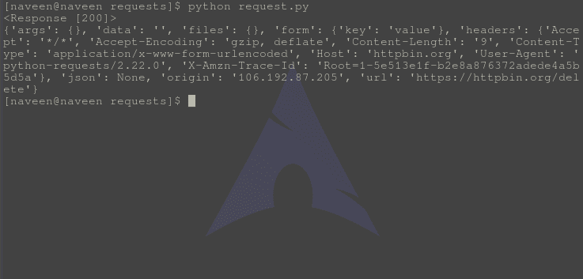

# DELETE 方法- Python 请求

> 原文:[https://www . geesforgeks . org/delete-method-python-requests/](https://www.geeksforgeeks.org/delete-method-python-requests/)

请求库是 Python 向指定网址发出 HTTP 请求的重要方面之一。本文围绕如何使用 **requests.delete()** 方法对指定的网址发出删除请求展开。在检查 DELETE 方法之前，让我们弄清楚什么是 Http DELETE 请求–

#### 删除 Http 方法

DELETE 是万维网使用的 HTTP 支持的请求方法。DELETE 方法删除指定的资源。与 PUT 请求一样，您需要为此操作指定一个特定的资源。如果响应包括描述状态的实体，则成功响应应为 200(确定)，如果动作尚未实施，则为 202(已接受)，如果动作已实施，但响应不包括实体，则为 204(无内容)。
删除操作的 URI 示例

```
http://www.example.com/articles/12345
```

#### 如何通过 Python 请求发出删除请求

Python 的 requests 模块提供了一个名为 **delete()** 的内置方法，用于向指定的 URI 发出 delete 请求。

**语法–**

```
requests.delete(url, params={key: value}, args)

```

**示例–**

出于示例目的，让我们尝试向 httpbin 的 API 发出请求。

```
import requests

# Making a DELETE request
r = requests.delete('https://httpbin.org / delete', data ={'key':'value'})

# check status code for response received
# success code - 200
print(r)

# print content of request
print(r.json())
```

将此文件保存为 request.py 并通过终端运行，

```
python request.py
```

**输出–**



#### 带有 DELETE 请求的高级

DELETE 方法请求源服务器删除由请求-URI 标识的资源。该方法可能会被原始服务器上的人工干预(或其他方式)覆盖。即使从源服务器返回的状态代码表明操作已经成功完成，也不能保证客户端操作已经执行。但是，服务器不应该指示成功，除非在给出响应时，它打算删除资源或将其移动到不可访问的位置。