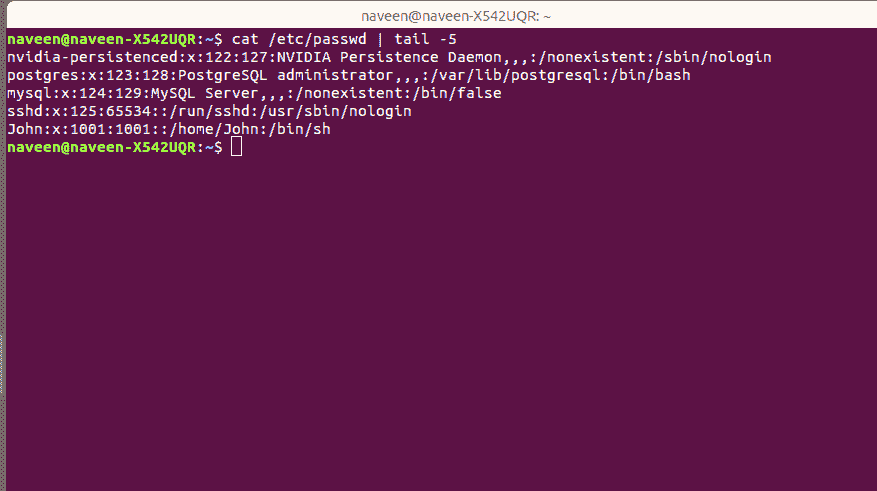
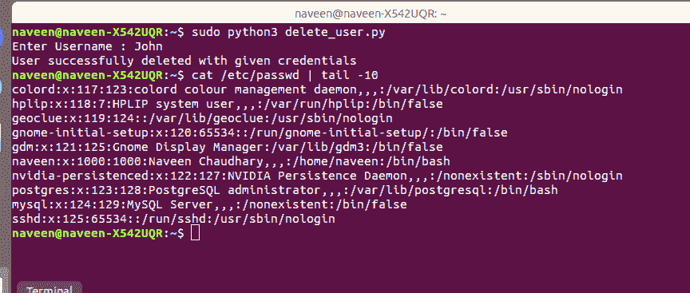

# 使用 Python 脚本删除 Linux 中的用户

> 原文:[https://www . geesforgeks . org/deleting-a-user-in-Linux-using-python-script/](https://www.geeksforgeeks.org/deleting-a-user-in-linux-using-python-script/)

通过 python 脚本从系统或服务器中删除用户是一项非常简单的任务。您只需要传递用户的用户名，脚本就会删除该用户的详细信息和所有文件。这个 python 脚本使用 **userdel** Linux 命令删除用户。如果你还记得 userdel 命令，你可以直接使用它，但是如果你不记得，那么脚本就很容易删除用户。

我们将要构建的脚本将要求删除用户的用户名，如下所示:

**输入:**

```
Enter Username: John
```

**输出:**

```
User successfully deleted with given credentials
```

在运行脚本之前，我们将首先向用户展示我们想要删除的内容。
`cat /etc/paswd`会列出你系统或服务器上的所有用户。**约翰**是我们将要删除的用户。



下面的 Python 代码是我们将用于我们的目的的脚本。

```
import os
import subprocess
import sys
import getpass

def delete_user():
     username = input("Enter Username : ")

     try:
         output = subprocess.run(['userdel', username ])
         if output.returncode == 0:
             print("User successfully deleted with given credentials")

     except:
         print(f"Failed to delete user.")
         sys.exit(1)

delete_user()
```


运行脚本后，它会提示我们要删除的用户名，输入用户名后，同一用户将从系统中删除。



之后，如果我们通过键入`cat/etc/passwd`来检查，我们可以看到用户“约翰”不再在该列表中。所以我们已经成功删除了我们的用户。