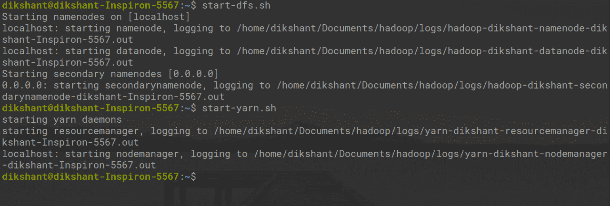
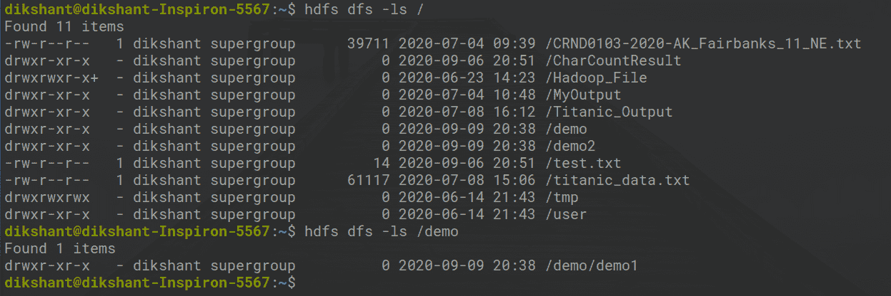
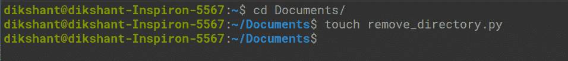
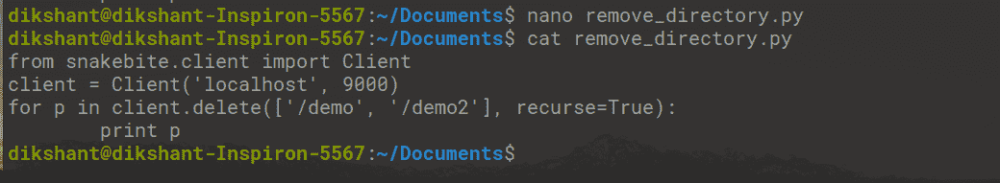
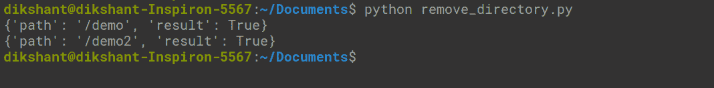
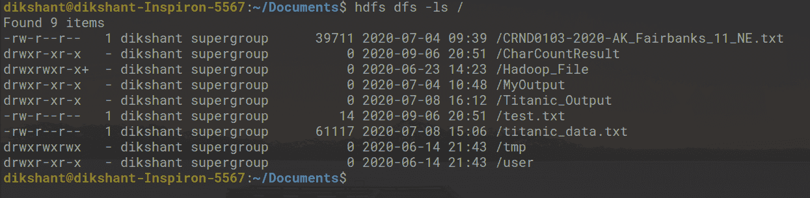

# 使用蟒蛇咬伤删除 HDFS 文件

> 原文:[https://www . geesforgeks . org/deleting-files-in-HDFS-using-python-snake bite/](https://www.geeksforgeeks.org/deleting-files-in-hdfs-using-python-snakebite/)

**先决条件:** [Hadoop 安装](https://www.geeksforgeeks.org/how-to-install-hadoop-in-linux/)[HDFS](https://www.geeksforgeeks.org/hadoop-hdfs-hadoop-distributed-file-system/)

**蟒蛇蛇咬**是一个非常受欢迎的蟒蛇库，我们可以用它来和 HDFS 人交流。使用蛇咬包提供的 python 客户端库，我们可以轻松编写适用于 HDFS 的 Python 代码。它使用*原型*消息与名称节点直接通信。python 客户端库直接与 HDFS 一起工作，无需对 hdfs dfs 进行系统调用。*蛇咬伤不支持蟒蛇 3* 。

**删除文件和目录**

在 Python 中，有一个名为 delete()的方法，通过它我们可以轻松删除 HDFS 的多个文件或目录。我们将使用 python 客户端库来执行删除。所以，让我们从动手开始。

所有的 Hadoop 守护程序都应该运行。您可以在以下命令的帮助下启动 Hadoop 守护程序。

```py
start-dfs.sh             // start your namenode datanode and secondary namenode

start-yarn.sh            // start resourcemanager and nodemanager

```



**任务:递归删除 HDFS 上可用的文件和目录(在我的例子中，我正在删除“/demo/demo1”和“/demo2”目录)。**

**第 1 步:**借助下面的命令，让我们看看在 HDFS 可用的文件和目录。

```py
hdfs dfs -ls /

```

在上面的命令**中，hdfs dfs** 特别用于与 Hadoop 分布式文件系统通信。 **-ls / '** 用于列出根目录中存在的文件。我们也可以在 HDFS 手动检查文件。



**第 2 步:**在本地目录中创建一个文件，在所需位置使用名称 **remove_directory.py** 。

```py
cd Documents/                  # Changing directory to Documents(You can choose as per your requirement)

touch remove_directory.py      # touch command is used to create file in linux enviournment. 

```



**第三步:**在**remove _ directory . py**python 文件中编写以下代码。

## 计算机编程语言

```py
# importing the package
from snakebite.client import Client

# the below line create client connection to the HDFS NameNode
client = Client('localhost', 9000)

# The /demo/demo1 and /demo2 directory's will be removed from HDFS 
for p in client.delete(['/demo', '/demo2'], recurse=True):
    print p
```

在上面的程序中 **recurse=True** 声明目录将被递归删除意味着如果目录不是空的并且它包含一些子目录，那么那些子目录也将被删除。在我们的例子中 **/demo1** 将首先被删除，然后 **/demo** 目录将被删除。

**客户端()方法说明:**

Client()方法可以接受下面列出的所有参数:

*   **主机(字符串):**名称节点的 IP 地址。
*   **端口(int):**Namenode 的 RPC 端口。
*   **Hadoop _ version(int):**Hadoop 协议版本(默认为:9)
*   **使用 _ 垃圾桶(布尔值):**删除文件时使用垃圾桶。
*   **有效 _ 使用(字符串):**HDFS 操作的有效用户(默认用户为当前用户)。



如果找不到我们指定的文件名，delete()方法将抛出 **FileNotFoundException** 。如果目录包含一些子目录并且**递归=真**没有被提及**目录异常**将被 delete()方法抛出。

**第 4 步:**运行 **remove_directory.py** 文件，观察结果。

```py
python remove_directory.py  // this will remove directory's recursively as mentioned in delete() argument

```



上图**“结果”:True** 表示我们已经成功删除了目录。

**步骤 5:** 我们可以手动或使用下面的命令检查目录是否被删除。

```py
hdfs dfs -ls /

```



现在我们可以看到/demo 和/demo2 在 HDFS 不再提供。