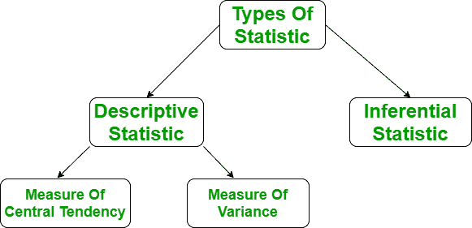
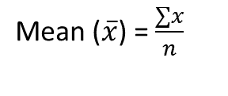
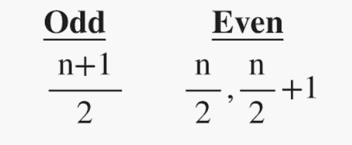
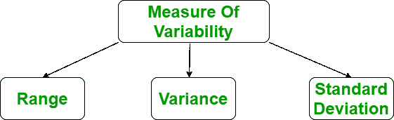
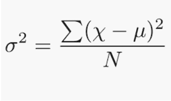
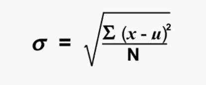

# 描述性统计

> 原文:[https://www.geeksforgeeks.org/descriptive-statistic/](https://www.geeksforgeeks.org/descriptive-statistic/)

在描述性统计中，我们借助各种有代表性的方法来描述我们的数据，如使用图表、图形、表格、excel 文件等。在描述性统计中，我们以某种方式描述我们的数据，并以有意义的方式呈现它，以便于理解。大多数情况下，它是在小数据集上执行的，这种分析有助于我们根据当前的发现预测一些未来的趋势。用来描述数据集的一些度量是中心趋势的度量和可变性或离散性的度量。

**描述性统计的类型:**

*   中心趋势的度量
*   可变性的度量



**中心趋势的度量:**
用单值表示整套数据。它给了我们中心点的位置。衡量中心趋势的主要方法有三种:

*   均值
*   方式
*   中位数


1.  **Mean:**

    它是观察的总和除以观察的总数。它也被定义为平均值，即总和除以计数。

    

    其中，n =术语数量
    **Python 代码在 Python 中查找平均值**

    ```py
    import numpy as np

    # Sample Data
    arr = [5, 6, 11]      
    # Mean
    mean = np.mean(arr)      

    print("Mean = ", mean)
    ```

    **输出:**

    ```py
    Mean =  7.333333333333333

    ```

2.  **模式:**
    是给定数据集中出现频率最高的值。如果所有数据点的频率相同，数据集可能没有模式。此外，如果遇到两个或更多具有相同频率的数据点，我们可以有多个模式。

**python 中查找模式的代码**

```py
from scipy import stats

# sample Data
arr =[1, 2, 2, 3]     

# Mode
mode = stats.mode(arr)      
print("Mode = ", mode)
```

**输出:**

```py
Mode =  ModeResult(mode=array([2]), count=array([2]))
```

9.  **Median:**
    It is the middle value of the data set. It splits the data into two halves. If the number of elements in the data set is odd then the centre element is median and if it is even then the median would be the average of two central elements.

    

    其中，n =术语数量
    **Python 代码查找中位数**

    ```py
    import numpy as np

    # sample Data
    arr =[1, 2, 3, 4]    

    # Median
    median = np.median(arr)   

    print("Median = ", median)
    ```

    **输出:**

    ```py
    Median =  2.5

    ```

    **可变性的度量:**
    可变性的度量被称为数据的传播或我们的数据分布得有多好。最常见的可变性度量是:

    *   范围
    *   差异
    *   Standard deviation

        

        1.  **Range:**

            范围描述了我们数据集中最大和最小数据点之间的差异。范围越大，数据传播越广，反之亦然。

            > 范围=最大数据值–最小数据值

            **Python 代码查找范围**

            ```py
            import numpy as np

            # Sample Data
            arr = [1, 2, 3, 4, 5]     

            #Finding Max
            Maximum = max(arr)          
            # Finding Min 
            Minimum = min(arr) 

            # Difference Of Max and Min          
            Range = Maximum-Minimum     
            print("Maximum = {}, Minimum = {} and Range = {}".format(
                    Maximum, Minimum, Range))
            ```

            **输出:**

            ```py
            Maximum = 5, Minimum = 1 and Range = 4
            ```

        2.  **Variance:**
            It is defined as an average squared deviation from the mean. It is being calculated by finding the difference between every data point and the average which is also known as the mean, squaring them, adding all of them and then dividing by the number of data points present in our data set.

            

            其中 N =项数
            u =平均值
            **Python 代码求方差**

            ```py
            import statistics 

            # sample data 
            arr = [1, 2, 3, 4, 5]     
            # variance
            print("Var = ", (statistics.variance(arr)))     
            ```

            **输出:**

            ```py
            Var =  2.5
            ```

        3.  **Standard Deviation:**
            It is defined as the square root of the variance. It is being calculated by finding the Mean, then subtract each number from the Mean which is also known as average and square the result. Adding all the values and then divide by the no of terms followed the square root.

            

            其中 N =项数
            u =平均值
            **执行标准差的 Python 代码:**

            ```py
            import statistics 

            # sample data 
            arr = [1, 2, 3, 4, 5]     
            # Standard Deviation
            print("Std = ", (statistics.stdev(arr)))    
            ```

            **输出:**

            ```py
            Std = 1.5811388300841898
            ```

**参考文献:**
[大数据维基百科](https://en.wikipedia.org/wiki/Big_data)
[公式](https://www.mathsduck.co.uk/)