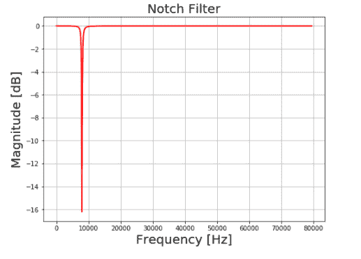
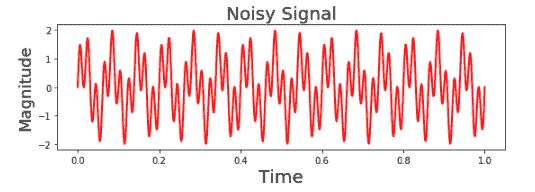
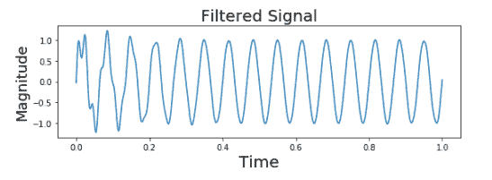

# 用 Python 设计 IIR 陷波滤波器对信号进行去噪

> 原文:[https://www . geeksforgeeks . org/design-an-IIR-陷波滤波器去噪-信号使用-python/](https://www.geeksforgeeks.org/design-an-iir-notch-filter-to-denoise-signal-using-python/)

IIR 代表无限脉冲响应，它是许多线性时不变系统的显著特征之一，其特点是具有**脉冲响应 h(t)/h(n)** ，该脉冲响应在某一点后不变为零，而是无限延续。

## **什么是 IIR 陷波滤波器？**

陷波滤波器是一种带阻滤波器，具有非常窄的阻带和两个通带，它实际上从输入信号中高度衰减/消除了特定的频率分量，而其他频率的幅度或多或少保持不变。

**规格如下:**

*   产生被 50 Hz 电力线频率破坏的 15 Hz 信号。
*   采样频率:1 千赫

**进场:**

**步骤 1:** 导入所有必需的库。

## 蟒蛇 3

```
from scipy import signal
import matplotlib.pyplot as plt
import numpy as np
```

**步骤 2:** 定义 IIR 带通陷波滤波器的规格

## 蟒蛇 3

```
# Create/view notch filter
samp_freq = 1000  # Sample frequency (Hz)
notch_freq = 50.0  # Frequency to be removed from signal (Hz)
quality_factor = 20.0  # Quality factor
```

**第三步:**

## 蟒蛇 3

```
# Design a notch filter using signal.iirnotch
b_notch, a_notch = signal.iirnotch(notch_freq, quality_factor, samp_freq)

# Compute magnitude response of the designed filter
freq, h = signal.freqz(b_notch, a_notch, fs=samp_freq)
```

**第四步:**

## 蟒蛇 3

```
fig = plt.figure(figsize=(8, 6))

# Plot magnitude response of the filter
plt.plot(freq*samp_freq/(2*np.pi), 20 * np.log10(abs(h)),
         'r', label='Bandpass filter', linewidth='2')

plt.xlabel('Frequency [Hz]', fontsize=20)
plt.ylabel('Magnitude [dB]', fontsize=20)
plt.title('Notch Filter', fontsize=20)
plt.grid()
```

**输出:**



**第五步:**

## 蟒蛇 3

```
# Create and view signal that is a mixture 
# of two different frequencies
f1 = 15  # Frequency of 1st signal in Hz
f2 = 50  # Frequency of 2nd signal in Hz

# Set time vector
# Generate 1000 sample sequence in 1 sec
n = np.linspace(0, 1, 1000)
```

**第六步:**

## 蟒蛇 3

```
# Generate the signal containing f1 and f2
noisySignal = np.sin(2*np.pi*15*n) + np.sin(2*np.pi*50*n) + \
    np.random.normal(0, .1, 1000)*0.03
```

**第七步:**

## 蟒蛇 3

```
# Plotting
fig = plt.figure(figsize=(8, 6))
plt.subplot(211)
plt.plot(n, noisySignal, color='r', linewidth=2)
plt.xlabel('Time', fontsize=20)
plt.ylabel('Magnitude', fontsize=18)
plt.title('Noisy Signal', fontsize=20)
```

**输出:**



**第八步:**

## 蟒蛇 3

```
# Apply notch filter to the noisy signal using signal.filtfilt
outputSignal = signal.filtfilt(b_notch, a_notch, noisySignal)
```

**第九步:**

## 蟒蛇 3

```
# Plot notch-filtered version of signal
plt.subplot(212)

# Plot output signal of notch filter
plt.plot(n, outputSignal)
plt.xlabel('Time', fontsize=20)
plt.ylabel('Magnitude', fontsize=18)
plt.title('Filtered Signal', fontsize=20)
plt.subplots_adjust(hspace=0.5)
fig.tight_layout()
plt.show()
```

**输出:**



**下面是实现:**

## 蟒蛇 3

```
from scipy import signal
import matplotlib.pyplot as plt
import numpy as np

# Create/view notch filter
samp_freq = 1000  # Sample frequency (Hz)
notch_freq = 50.0  # Frequency to be removed from signal (Hz)
quality_factor = 20.0  # Quality factor

# Design a notch filter using signal.iirnotch
b_notch, a_notch = signal.iirnotch(notch_freq, quality_factor, samp_freq)

# Compute magnitude response of the designed filter
freq, h = signal.freqz(b_notch, a_notch, fs=samp_freq)

fig = plt.figure(figsize=(8, 6))

# Plot magnitude response of the filter
plt.plot(freq*samp_freq/(2*np.pi), 20 * np.log10(abs(h)),
         'r', label='Bandpass filter', linewidth='2')
plt.xlabel('Frequency [Hz]', fontsize=20)
plt.ylabel('Magnitude [dB]', fontsize=20)
plt.title('Notch Filter', fontsize=20)
plt.grid()

# Create and view signal that is a mixture of two different frequencies
f1 = 15  # Frequency of 1st signal in Hz
f2 = 50  # Frequency of 2nd signal in Hz
# Set time vector
n = np.linspace(0, 1, 1000)  # Generate 1000 sample sequence in 1 sec

# Generate the signal containing f1 and f2
noisySignal = np.sin(2*np.pi*15*n) + np.sin(2*np.pi*50*n) + \
    np.random.normal(0, .1, 1000)*0.03

# Plotting
fig = plt.figure(figsize=(8, 6))
plt.subplot(211)
plt.plot(n, noisySignal, color='r', linewidth=2)
plt.xlabel('Time', fontsize=20)
plt.ylabel('Magnitude', fontsize=18)
plt.title('Noisy Signal', fontsize=20)

# Apply notch filter to the noisy signal using signal.filtfilt
outputSignal = signal.filtfilt(b_notch, a_notch, noisySignal)

# Plot notch-filtered version of signal
plt.subplot(212)

# Plot output signal of notch filter
plt.plot(n, outputSignal)
plt.xlabel('Time', fontsize=20)
plt.ylabel('Magnitude', fontsize=18)
plt.title('Filtered Signal', fontsize=20)
plt.subplots_adjust(hspace=0.5)
fig.tight_layout()
plt.show()
```

**输出:**

  