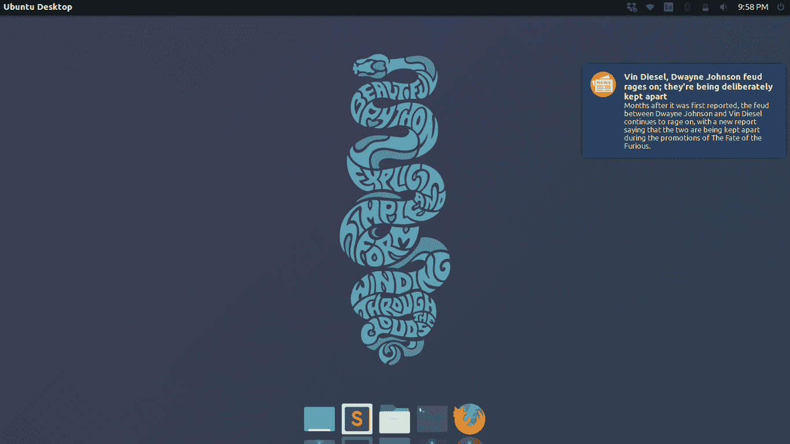

# Python 中的桌面通知程序

> 哎哎哎:# t0]https://www . geeksforgeeks . org/desktop 通告程序 python/

本文演示了如何使用 Python 创建一个简单的**桌面通知程序**应用程序。

桌面通知程序是一个简单的应用程序，它在桌面上以弹出消息的形式产生通知消息。

**通知内容**

在本文使用的示例中，将作为通知出现在桌面上的内容是当天的**头条新闻**。

因此，为了获取头条新闻，我们将使用这个 Python 脚本来抓取新闻标题:

```
import requests
import xml.etree.ElementTree as ET

# url of news rss feed
RSS_FEED_URL = "http://www.hindustantimes.com/rss/topnews/rssfeed.xml"    

def loadRSS():
    '''
    utility function to load RSS feed
    '''
    # create HTTP request response object
    resp = requests.get(RSS_FEED_URL)

    # return response content
    return resp.content

def parseXML(rss):
    '''
    utility function to parse XML format rss feed
    '''
    # create element tree root object
    root = ET.fromstring(rss)

    # create empty list for news items
    newsitems = []

    # iterate news items
    for item in root.findall('./channel/item'):
        news = {}

        # iterate child elements of item
        for child in item:

            # special checking for namespace object content:media
            if child.tag == '{http://search.yahoo.com/mrss/}content':
                news['media'] = child.attrib['url']
            else:
                news[child.tag] = child.text.encode('utf8')
        newsitems.append(news)

    # return news items list
    return newsitems

def topStories():
    '''
    main function to generate and return news items
    '''
    # load rss feed
    rss = loadRSS()

    # parse XML
    newsitems = parseXML(rss)
    return newsitems
```

这是一个简单的 Python 脚本，可以解析 XML 格式的新闻标题。

**注:**要了解 XML 解析是如何工作的，请参考本文:[Python 中的 XML 解析](https://www.geeksforgeeks.org/xml-parsing-python/)

由上述 Python 脚本生成的示例新闻项目如下所示:

```
{'description': 'Months after it was first reported, the feud between Dwayne Johnson and 
                 Vin Diesel continues to rage on, with a new report saying that the two are 
                 being kept apart during the promotions of The Fate of the Furious.',
 'link': 'http://www.hindustantimes.com/hollywood/vin-diesel-dwayne-johnson-feud-rages-
on-they-re-being-kept-apart-for-fast-8-tour/story-Bwl2Nx8gja9T15aMvcrcvL.html',
 'media': 'http://www.hindustantimes.com/rf/image_size_630x354/HT/p2/2017/04/01/Pictures
/_fbcbdc10-1697-11e7-9d7a-cd3db232b835.jpg',
 'pubDate': b'Sat, 01 Apr 2017 05:22:51 GMT ',
 'title': "Vin Diesel, Dwayne Johnson feud rages on; they're being deliberately kept apart"} 
```

将此 Python 脚本保存为 [**topnews.py**](https://github.com/nikhilkumarsingh/Desktop-Notifier-Example/blob/master/topnews.py) (因为我们在桌面通知应用程序中以此名称导入它)。

**安装**

现在，为了创建桌面通知程序，需要安装第三方 Python 模块 **notify2** 。

您可以使用简单的画中画命令安装 **notify2** :

```
pip install notify2 
```

### 

桌面通告程序应用程序

现在，我们为桌面通知程序编写 Python 脚本。

考虑下面的代码:

```
import time
import notify2
from topnews import topStories

# path to notification window icon
ICON_PATH = "put full path to icon image here"

# fetch news items
newsitems = topStories()

# initialise the d-bus connection
notify2.init("News Notifier")

# create Notification object
n = notify2.Notification(None, icon = ICON_PATH)

# set urgency level
n.set_urgency(notify2.URGENCY_NORMAL)

# set timeout for a notification
n.set_timeout(10000)

for newsitem in newsitems:

    # update notification data for Notification object
    n.update(newsitem['title'], newsitem['description'])

    # show notification on screen
    n.show()

    # short delay between notifications
    time.sleep(15)
```

让我们试着一步一步分析上面的代码:

*   Before we can send any notifications, we need to initialize a D-Bus connection. D-Bus is a message bus system, a simple way for applications to talk to one another. So, D-Bus connection for notify2 in current Python script is initialized using:

    ```
    notify2.init("News Notifier") 
    ```

    这里，我们传递的唯一参数是**应用名称**。您可以设置任意的应用名称。

*   Now, we create a notification object, **n** using:

    ```
    n = notify2.Notification(None, icon = ICON_PATH) 
    ```

    上述方法的一般语法是:

    ```
    notify2.Notification(summary, message='', icon='') 
    ```

    在这里，

    *   **总结:**标题文字
    *   **消息:**正文
    *   **图标:**图标图像的路径

    目前我们已经将**汇总**设置为**无**，并将 **ICON_PATH** 作为 **icon** 参数通过。

    **注意:**需要传递图标图像的完整路径。

*   You can optionally set the urgency level of notifications using **set_urgency** method:

    ```
    n.set_urgency(notify2.URGENCY_NORMAL) 
    ```

    可用的常数有:

    *   通知 2。紧急 _ 低
    *   通知 2。紧急 _ 正常
    *   通知 2。紧急 _ 关键
*   另一个可选工具是 **set_timeout** 方法，使用该方法，您可以显式设置显示持续时间，单位为毫秒，如下所示:

    ```
    n.set_timeout(10000) 
    ```

*   现在，当我们逐一遍历每个新闻项目时，我们需要使用**更新**方法:

    ```
    n.update(newsitem['title'], newsitem['description'])
    ```

    用新的**摘要**和**消息**更新通知对象
*   要显示通知，只需像这样调用通知对象的 **show()** 方法:

    ```
    n.show() 
    ```

运行 Python 脚本时桌面的示例屏幕截图:



此桌面通知程序应用程序的 Github 存储库:[桌面-通知程序-示例](https://github.com/nikhilkumarsingh/Desktop-Notifier-Example)

本博客由[尼克尔·库马尔](https://www.facebook.com/nikhilksingh97)投稿。如果你喜欢极客博客并想投稿，你也可以用 contribute.geeksforgeeks.org 写一篇文章或者把你的文章邮寄到 contribute@geeksforgeeks.org。看到你的文章出现在极客博客主页上，帮助其他极客。

如果你发现任何不正确的地方，或者你想分享更多关于上面讨论的话题的信息，请写评论。