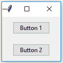
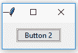

# 在 Tkinter | Python 中破坏()方法

> 原文:[https://www . geesforgeks . org/destroy-method-in-tkinter-python/](https://www.geeksforgeeks.org/destroy-method-in-tkinter-python/)

[Tkinter](https://www.geeksforgeeks.org/python-gui-tkinter/) 支持多种方法执行各种任务。它还提供了一些通用的方法。

`**destroy()**`是一个通用的小部件方法，也就是说，我们可以在任何可用的小部件以及主 tkinter 窗口中使用这个方法。

**语法:**

```
widget_object = Widget(parent, command = widget_class_object.destroy)

```

该方法可与()方法后的[一起使用。](https://www.geeksforgeeks.org/python-after-method-in-tkinter/)

**代码#1:** 销毁()方法作为命令传递

```
# importing only those functions
# which are needed
from tkinter import * 
from tkinter.ttk import *

# creating tkinter window
root = Tk()

# Creating button. In this destroy method is passed
# as command, so as soon as button 1 is pressed root
# window will be destroyed
btn1 = Button(root, text ="Button 1", command = root.destroy)
btn1.pack(pady = 10)

# Creating button. In this destroy method is passed
# as command, so as soon as button 2 is pressed
# button 1 will be destroyed
btn2 = Button(root, text ="Button 2", command = btn1.destroy)
btn2.pack(pady = 10)

# infinite loop
mainloop()
```

**输出:**


正如您可能观察到的，在上面的代码中，在按钮-2 中传递的命令是销毁按钮-1，所以只要您按下按钮-2，按钮-2 就会被销毁。


**代码#2:** 用 after()方法销毁()方法

```
# importing only those functions
# which are needed
from tkinter import * 
from tkinter.ttk import *

# creating tkinter window
root = Tk()

# Creating button. In this destroy method is passed
# as command, so as soon as button 1 is pressed root
# window will be destroyed
btn1 = Button(root, text ="Button 1")
btn1.pack(pady = 10)

# Creating button. In this destroy method is passed
# as command, so as soon as button 2 is pressed
# button 1 will be destroyed
btn2 = Button(root, text ="Button 2")
btn2.pack(pady = 10)

# after method destroying button-1
# and button-2 after certain time
btn1.after(3000, btn1.destroy)
btn2.after(6000, btn2.destroy)

# infinite loop
mainloop()
```

**输出:**
从输出中你可能会看到两个小部件都在某个时间限制后被销毁，只有根窗口会留空。

<video class="wp-video-shortcode" id="video-298287-1" width="665" height="373" preload="metadata" controls=""><source type="video/mp4" src="https://media.geeksforgeeks.org/wp-content/uploads/20190429231129/ice_video_20190429-230659_edit_0.mp4?_=1">[https://media.geeksforgeeks.org/wp-content/uploads/20190429231129/ice_video_20190429-230659_edit_0.mp4](https://media.geeksforgeeks.org/wp-content/uploads/20190429231129/ice_video_20190429-230659_edit_0.mp4)</video>

**注意:**还有另一种方法`**quit()**`不破坏小部件，但退出 tcl/tk 解释器，即停止**主循环()**。