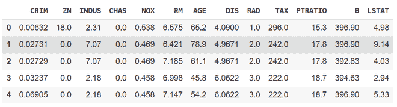
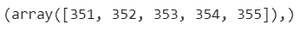
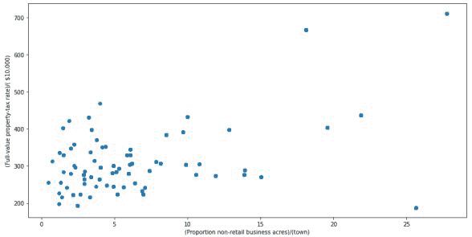

# 使用 Python 检测并移除异常值

> 原文:[https://www . geeksforgeeks . org/使用 python 检测并移除异常值/](https://www.geeksforgeeks.org/detect-and-remove-the-outliers-using-python/)

异常值是一个数据项/对象，它与其他(所谓的正常)对象有很大的偏差。它们可能是由测量或执行错误引起的。离群点检测的分析被称为离群点挖掘。检测异常值的方法有很多种，去除过程和从熊猫的数据框中去除数据项是一样的。

这里 pandas 数据框用于一种更现实的方法，因为在真实世界项目中需要检测在数据分析步骤中引起的异常值，同样的方法可以用于列表和系列类型的对象。

### 数据集:

所使用的数据集是波士顿住房数据集，因为它是在 sklearn 库中预加载的。

## 蟒蛇 3

```
# Importing
import sklearn
from sklearn.datasets import load_boston
import pandas as pd
import matplotlib.pyplot as plt

# Load the dataset
bos_hou = load_boston()

# Create the dataframe
column_name = bos_hou.feature_names
df_boston = pd.DataFrame(bos_hou.data)
df_boston.columns = column_name
df_boston.head()
```

**输出:**



数据集的一部分

## **检测异常值**

可以使用可视化、在数据集上实现数学公式或使用统计方法来检测异常值。所有这些都将在下面讨论。

### 1.形象化

**例 1:使用** [**箱线图**](https://www.geeksforgeeks.org/box-plot-visualization-with-pandas-and-seaborn/)

它只需一个简单的方框和触须，就能有效地捕获数据摘要。Boxplot 使用第 25、50 和 75 个百分位数汇总样本数据。只需查看数据集的箱线图，就可以了解数据集(四分位数、中位数和异常值)。

## 蟒蛇 3

```
# Box Plot
import seaborn as sns
sns.boxplot(df_boston['DIS'])
```

**输出**:


箱线图- DIS 列

在上图中，可以清楚地看到 10 以上的值是异常值。

## 蟒蛇 3

```
# Position of the Outlier
print(np.where(df_boston['DIS']>10))
```

**输出:**



离群指数

**例 2:使用**[](https://www.geeksforgeeks.org/matplotlib-pyplot-scatter-in-python/)****散点。****

**当您有成对的数字数据时，或者当您的因变量对于每个读取的自变量有多个值时，或者当试图确定两个变量之间的关系时，使用它。在利用散点图的过程中，还可以将其用于异常值检测。**

**绘制散点图需要两个相互关联的变量。因此，这里使用了“每个城镇非零售商业用地的比例”和“每万美元的全值财产税税率”，它们的列名分别是“INDUS”和“tax”。**

## **蟒蛇 3**

```
# Scatter plot
fig, ax = plt.subplots(figsize = (18,10))
ax.scatter(df_boston['INDUS'], df_boston['TAX'])

# x-axis label
ax.set_xlabel('(Proportion non-retail business acres)/(town)')

# y-axis label
ax.set_ylabel('(Full-value property-tax rate)/( $10,000)')
plt.show()
```

****输出**:**

**

散点图** 

**看图可以总结出大部分的数据点都在图的左下角但是准确的点很少；与此相对的是图的右上角。右上角的那些点可以视为异常值。**

**使用近似值可以说所有那些 x>20 和 y>600 的数据点都是异常值。下面的代码可以获取满足这些条件的所有点的准确位置。**

## **蟒蛇 3**

```
# Position of the Outlier
print(np.where((df_boston['INDUS']>20) & (df_boston['TAX']>600)))
```