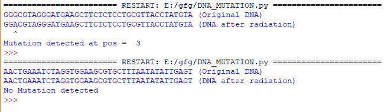

# 使用 Python 检测突变

> 原文:[https://www.geeksforgeeks.org/detect-mutation-using-python/](https://www.geeksforgeeks.org/detect-mutation-using-python/)

**先决条件:**[Python 中的随机数](https://www.geeksforgeeks.org/random-numbers-in-python/)

下面的文章描述了如何使用 Python 来检测突变的脱氧核糖核酸链。

### 使用的功能

1.  **generateDNASequence():** 此方法使用 DNA 碱基 A、C、G、T 的列表生成长度为 40 个字符的随机 DNA 链。此方法返回生成的 DNA 链。
2.  **applyGammaRadiation():** 该方法以上述方法生成的 DNA 链为输入参数，然后仅当同样随机生成的突变概率在 50%以上时，在随机位置改变该链。选定位置的脱氧核糖核酸碱基必须不同于它被取代的脱氧核糖核酸碱基。这种方法返回改变的脱氧核糖核酸链。
3.  **检测突变():**该方法以原始和改变的脱氧核糖核酸链为输入，检查两个字符串是否改变。如果字符串被改变，它会返回改变的 DNA 碱基的位置

### 入门指南

遵循以下步骤来实现我们所需的功能:

*   导入随机库
*   generateDNASequence()函数用于生成 DNA 链。DNA 链是通过从可用选项列表中随机选择字符生成的。当字符串长度变为 40 时，循环完成，DNA 链返回。
*   applyGammaRadiation()的功能是改变 DNA 链。突变的可能性是随机产生的。如果随机产生突变的可能性大于 50，则发生突变，否则不发生突变。如果发生突变，突变的位置是随机选择的。
*   接下来，将脱氧核糖核酸链中的字符转换为列表。
*   获取突变位置的字符。由于提取的字符应该不同于替换它的字符，我们从可用选项列表中删除提取的字符，以选择另一个字符来代替它。从列表中选择新的字符或脱氧核糖核酸碱基。
*   原始的脱氧核糖核酸链字符再次被添加到新的列表中。新的碱基/字符被设置在突变的位置。
*   使用 join()将 cl 列表中的字符再次转换为字符串。这是新变异的 DNA 串。
*   如果没有发生突变，原始 dna 和突变 DNA 是一样的。
*   最终变异/未变异的 DNA 被返回。
*   然后使用 detectMutation()函数检测突变。在这个函数中，x 和 y 将 dna 和 cdna 中的每个字符进行逐个字符的比较。如果同一索引处的字符匹配，则计数增加。如果不匹配，环路就会断开。
*   计数值指向突变位置之前的索引。如果计数=40，则意味着 2 条链的所有特征都匹配，因此没有突变。如果计数小于 40，则意味着发生了突变。

下面是实现。

## 蟒蛇 3

```
# import random library
import random

# function to generate dna strands
def generateDNASequence():

    # list of available DNA bases
    l = ['C', 'A', 'G', 'T']
    res = ""
    for i in range(0, 40):
        # creating the DNA strand by appending 
        # random characters from the list
        res = res + random.choice(l)
    return res

# function to alter dna strands
def applyGammaRadiation(dna):

    # possibility of mutation is generated randomly
    pos = random.randint(1, 100)
    cdna = ''

    # list of available DNA bases
    l = ['C', 'A', 'G', 'T']

    # if the possibility of mutation generated randomly
    # is >50 then mutation happens
    if(pos > 50):

        # the position where mutation will take place
        # is chosen randomly
        changepos = random.randint(0, 39)
        dl = []

        # the characters in DNA strand is converted to list
        dl[:0] = dna

        # the character at the determined mutation position 
        # is fetched.
        ch = "" + dl[changepos]

        # since the fetched character should be different from 
        # the one replacing it we remove the fetched character
        # from the list of available choices for choosing another
        # character in its place
        l.remove(ch)

        # the new character or DNA base is chosen from the list
        ms = random.choice(l)
        cl = []

        # DNA strand characters are again appended to a new list
        cl[:0] = dna

        # the new base in the mutated position is set
        cl[changepos] = ms

        # the characters in the cl list is converted to string again
        # this is the new mutated DNA string
        cdna = ''.join([str(e) for e in cl])

    # if possibility of mutation is less than 50% then no 
    # mutation happens
    else:

        # if no mutation occurs original dna is same as mutated dna
        cdna = dna
    return cdna

# function to detect mutation
def detectMutation(dna, cdna):
    count = 0

    # x and y take each character in dna and cdna
    # for character by character comparison
    for x, y in zip(dna, cdna):

        # if the character at the same index match
        # then the count is increased
        if x == y:
            count = count + 1

        # incase of mismatch the loop is broken
        else:
            break

    # the count value points to the index before the 
    # position of mutation
    return count

dna = generateDNASequence()
print(dna+" (Original DNA)")
cdna = applyGammaRadiation(dna)
print(cdna+" (DNA after radiation)")
count = detectMutation(dna, cdna)

# if count=40 it means all the characters of the 2 strands match
# hence no mutation
if count == 40:
    print("No Mutation detected")

# if count is less than 40
# it means mutation has occurred
else:

    # ^ denotes the position of mutation
    pos = "^"
    print(pos.rjust(count+1))
    print("Mutation detected at pos = ", (count+1))
```

**输出**

